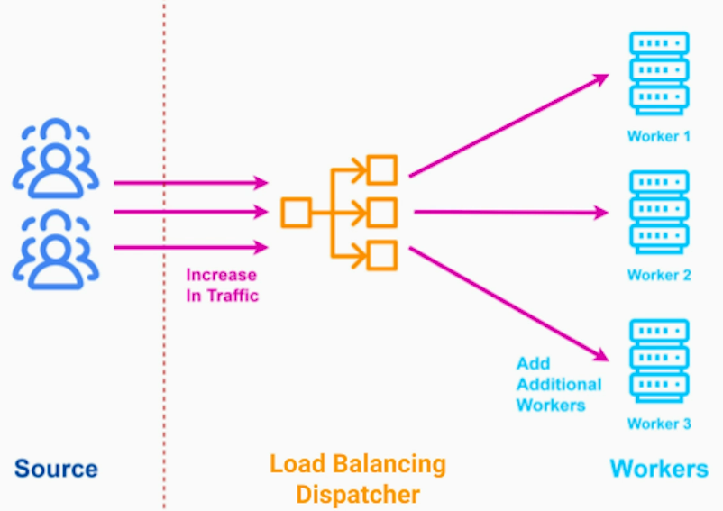
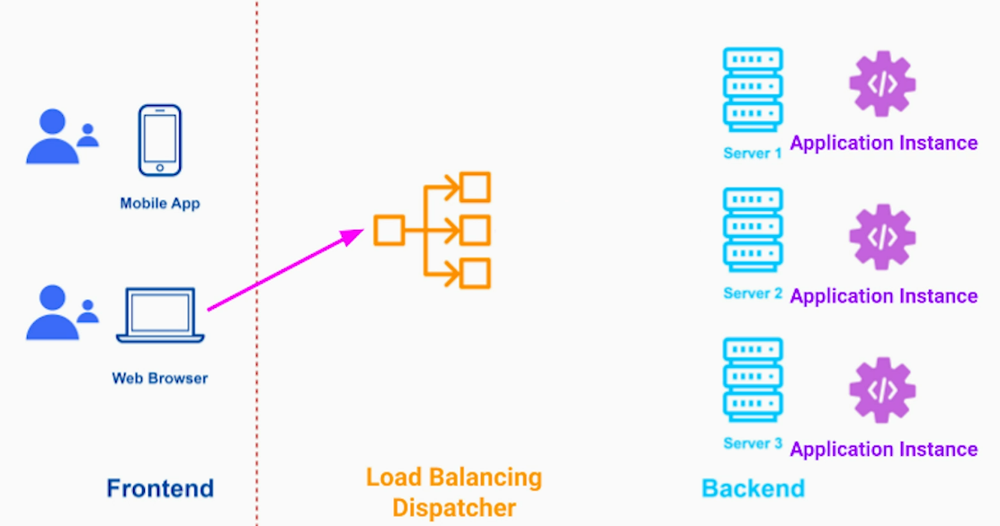
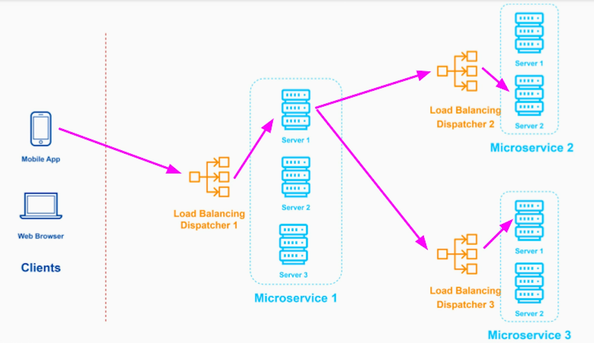
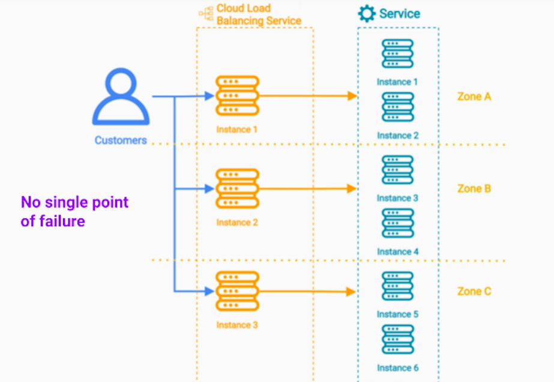
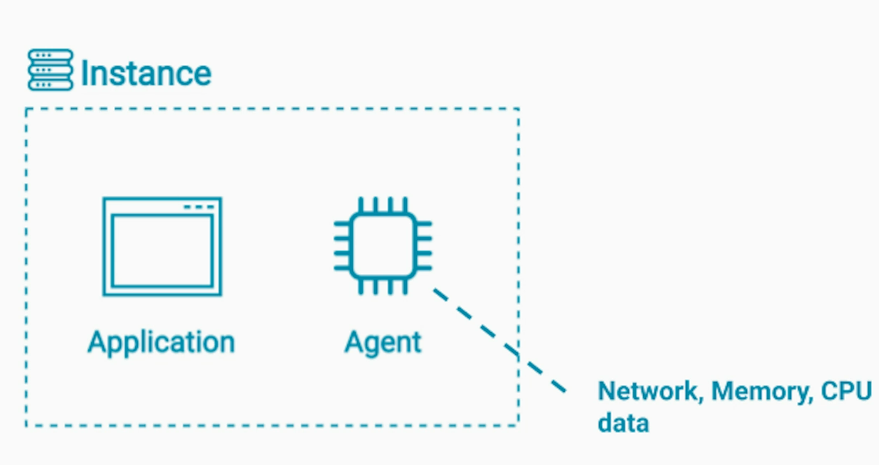
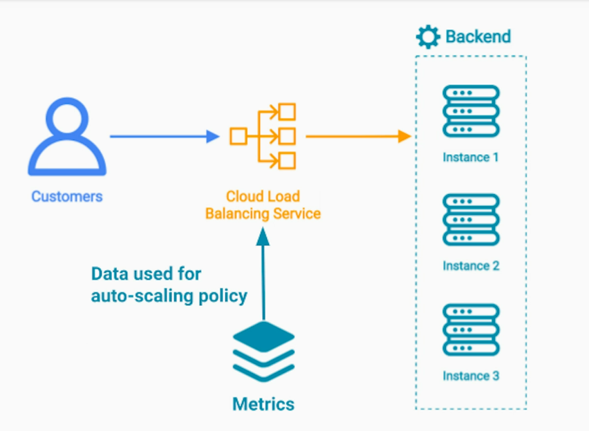
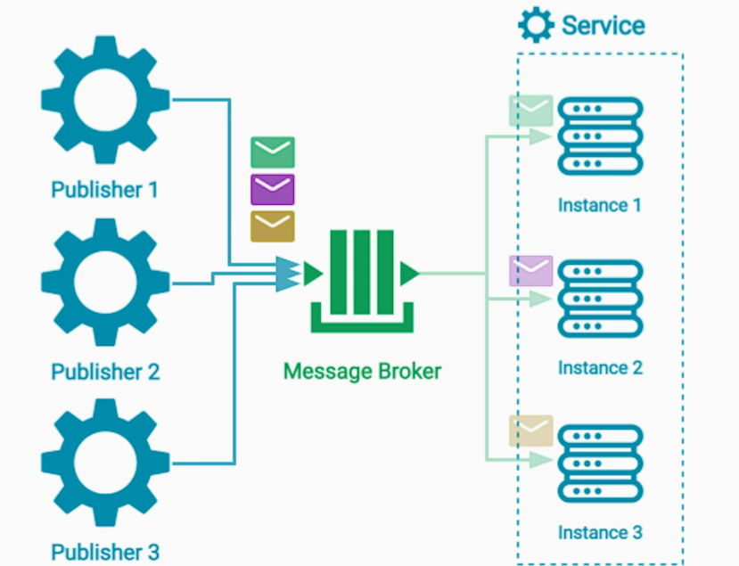

# Introduction
Scalability patterns enable us;
- Handle billions of requests/day
- Process petabytes of data
- Save costs

# Load Balancing Pattern
## Goal
Helps us take advantage of "infinite" access to cloud computers

## Components 
- Source
- Dispatcher
- Workers

Load balancing pattern puts a dispatcher between the source of the data / network requests to our system and the workers that process that data and send back a response.

A basic use case of this pattern is to load balance Http requests from the front-end to the backend;

Similarly, in multi-service architecture, such as n-tier architecture / microservices architecture, we can deploy each service as a group of identical application instances. This allows each service to scale independently.

## Implementation Techniques
### 1. Cloud Load Balancing Service
Provided by cloud providers - typically, it has proprietary implementation.

#### Implementation Considerations
##### Load Balancing - Routing algorithms
Which algorithm to use for routing requests to workers? 
1. Round-robin - works for stateless application, not advisable where an active session between client and server has to be 
maintained. Variant is Weighted round robin

2. Sticky session / session affinity - this is achieved by cookie. Cookie is generated and sent by server when a session is created. Client is expected to send a cookie in every request to the LB. Another way is using client's IP address. 

Sticky session works well only for relatively short sessions, otherwise it can disproportionately overload a server instance.

3. Least Connections  - Ideal for tasks having long term connections. E.g.; SQL, LDAP. Another variants are Weighted response
time and Agent Based Policy (provides auto-scaling based on multiple metrics collected from servers) 

##### Auto-scaling 
Agents (special processes) running on cloud instances collect real-time data such as CPU, memory, network utilization. 

Using this data, we can define auto-scaling policies and used by cloud based load balancer to auto-scale services;

1. Scale up / Scale down - Vertical scaling - increasing / reducing computing capacity of instances 
2. Scale out / Scale in - Horizontal scaling - increasing / reducing number of instances 

##### HAProxy / Nginx vs Cloud Load Balancing Service
What does the Cloud Load Balancing Service offer that a simple Software Load Balancer (such as HAProxy or Nginx) running on a single cloud virtual machine doesn't?
1. Auto-scaling
2. Distributed system running in different isolation zones

### 2. Message Broker / Distributed Message Queue

Implementation Notes;
1. The main purpose of a message broker is NOT load balancing
2. But in the right use case, it can do a very good job of load balancing - The right use case would be where a communication between publisher and consumer is one-directional and asynchronous. 

# Pipes and Filters Pattern
See https://github.com/maulikdave-fh/cpsa/blob/main/3-Architecture%20Patterns.md#pipes-and-filters

