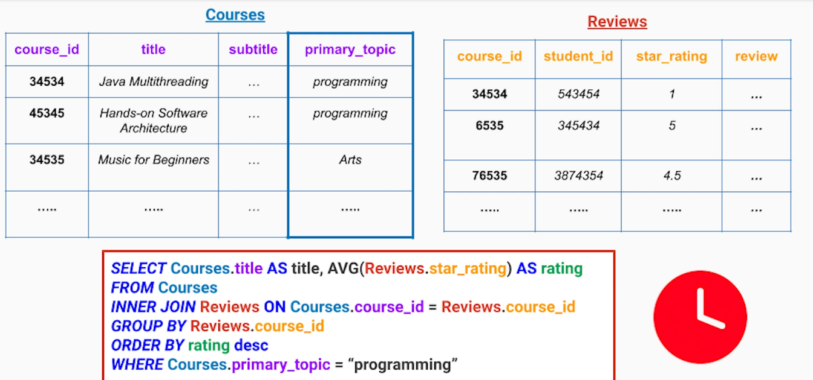
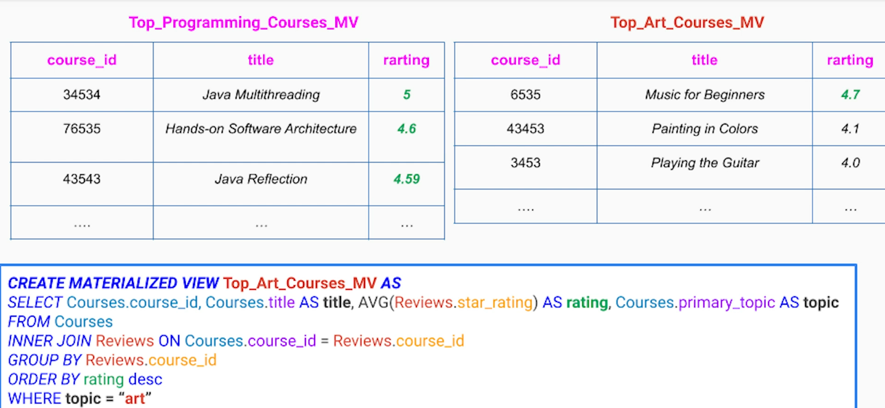
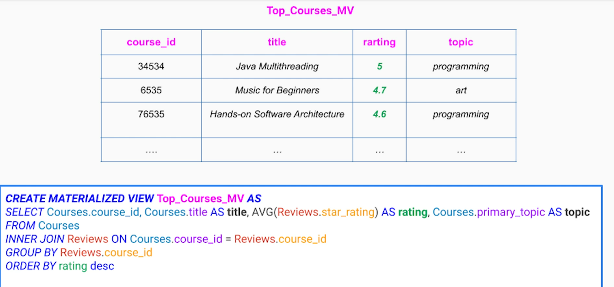
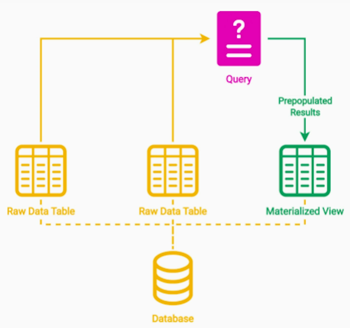
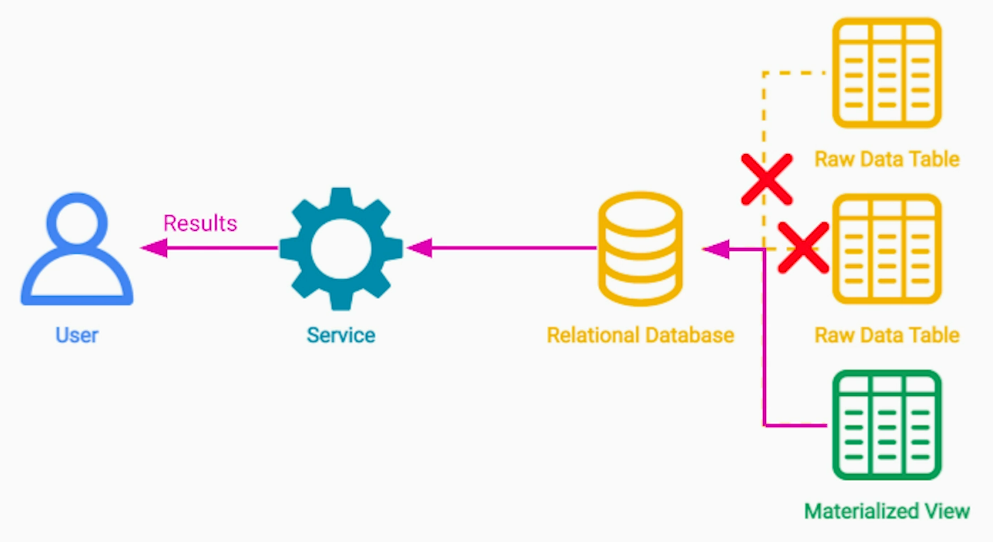
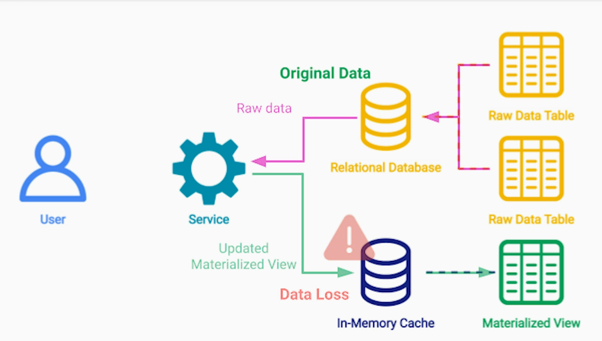
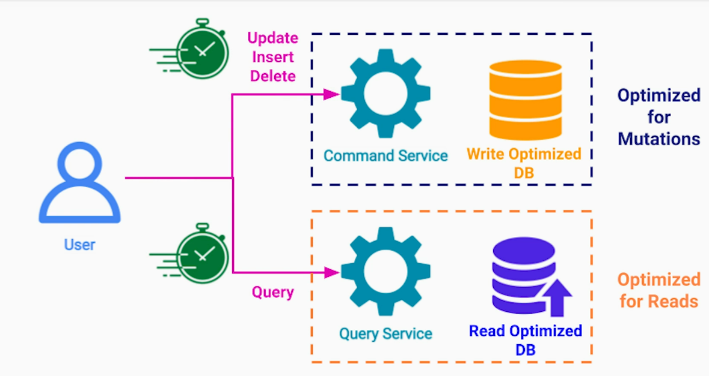
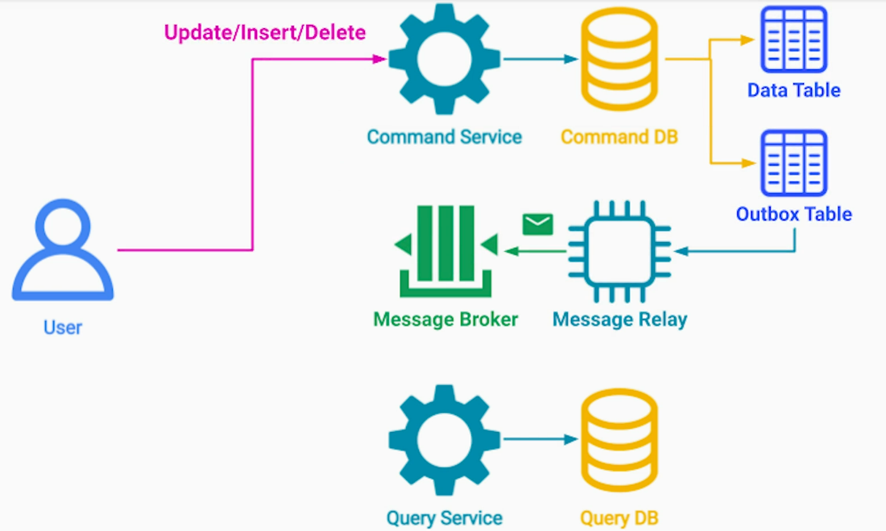
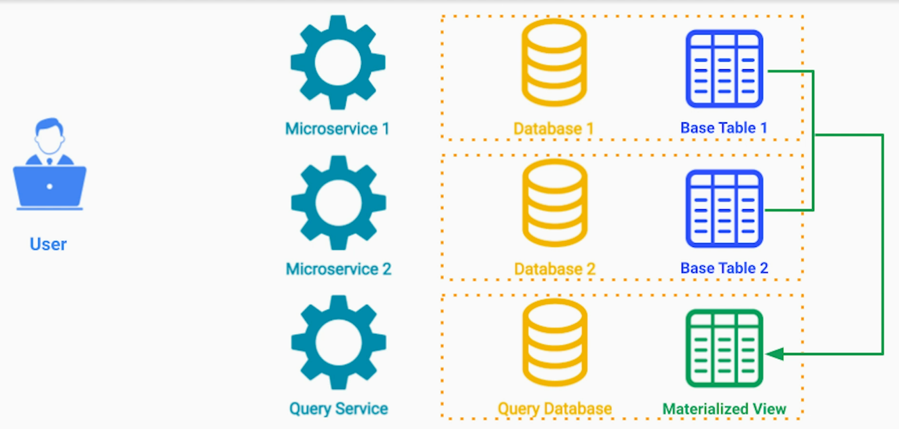

# 1. Materialized View Pattern
## Problem 
- Low efficiency and performance of key database queries that span across multiple tables
- High processing (CPU utilization) cost 

## Solution
Read-only materialized view table, containing long query result. The view can be;
- **With a filter on Topic, if we have handful of topics**

To present top programming courses to students looking for programming courses, we can fire following simple query;
select title from Top_Programming_Courses_MV

- **Without filter on Topic**

Simple query as below can help retrieve the top courses. This query is lot faster and cheaper (lower CPU utilization) to perform repeatedly;
select title from Top_Courses_MV where topic="programming"

## Considerations
1. Additional space for materialized view
Trade-offs 
- additional space for high performance
- in the cloud - cost for high performance - benefit has to outweigh the cost
2. Where to store the materialized view?
- Option 1 : in the same database as the original data but in a separate table. Beneficial if the database supports materialized view feature out-of-the-box. If underlying database supports materialized view, leverage it. It is more optimized to take just diff (deltas only from raw table(s) to materialized view)
- Option 2 : Store in separate, read-optimized database such as in-memory cache.

For in-memory materialized view;
- The most popular fully in-memory NoSQL database is Redis.
- Memcached is another in-memory key/value store that many companies use.
- Other not fully in-memory but still very good options for the use case are Cassandra, DynamoDB and similar databases in that category.

# 2. CQRS Pattern

1. Command DB - optimized for write operations - select appropriate technology / database for write operations. I.e.; No
indexing, RDBMS, etc
2. Query DB - optimized for read operations - indexing, NoSQL, etc
3. Supports eventual consistency between command and query DBs - may not be a good choice for financial transactions
4. Combine this pattern with Transactional Outbox Pattern to ensure that the update is delivered to Query service 
via Message Broker

Additional notes - https://github.com/maulikdave-fh/notes/blob/main/msa_eda/5-Event_Driven_Microservices_Design_Patterns.md#cqrs-pattern

# 3. CQRS + Materialized View for Microservices Architecture
## Problem
No join operation for data belonging to different microservices

## Solution

## Notes
By using;
- **Materialized View**, we place the joined data in a separate table
- **CQRS**, we store the materialized view in separate database. Each behind its own microservice
- **Event-Driven Architecture**, we keep the external materialized view up-to-date with the original data

