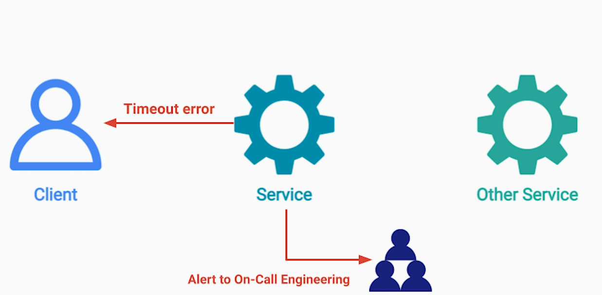

# 1. The Saga Pattern
https://github.com/maulikdave-fh/notes/blob/main/msa_eda/5-Event_Driven_Microservices_Design_Patterns.md#saga-pattern

# 2. Transactional Outbox Pattern
It addresses reliability concern for Event driven architecture. 

## Problem Statement
We have a service (example, User Service in Job Search App) that needs to update its database and also publish an event to trigger the next operation in another service. 


```
   void addUser(User user) [
        Connection connection = db.connect();
        // Following 2 are non-atomic operation. And there is no concept of Transaction between
        // a database and a message broker
        connection.insert(user, "UsersTable");
        // What if service crashes here, before sending a message to the message broker?
        messageBroker.send(new NewUser(user,...));
   }
```

## Solution
Inside our database, we add another table, say Outbox table. Instead of sending an event to message broker, we write a message to this Outbox table by clubbing it together as a database transaction along with user insert.


Additionally, we add another service, Message Relay Service (MRS). This service monitors the Outbox table for updates. As soon as new message appears in the table, it takes it and sends it to the message broker. Then is marks the message as SENT or simply deletes it.


## Issues & Considerations
1. Possibility of Duplicate Events
What if the MRS crashed immediately after sending a message to the message broker? The message in the Outbox table will be read again when MRS instance comes back / other MRS instance reads the message from the Outbox table. 

Use At-least once pattern - i.e.; MRS puts a message at least once in the queue. If the consumer services have idempotent operations, we don't need any special handling. Otherwise, following considerations are needed;
- use message Id for each message in the Outbox table, so consumer services can ignore message(s) that were already processed


2. What if our microservices uses database (say NoSQL DB) that doesn't have Transaction support? 
Solved by adding fields to the original database document - this is an atomic operation. 
Add outbox attribute to the object;
```
    {
        user_id : "...."
        user_name : "...."
        user_email: "....'
        outbox: [...]
    }
```
MRS can periodically run a query to check if "outbox" attribute is present in any of the user's document


3. Ordering of Events
To maintain sequence of delivery by MRS to the message broker, put sequence counter for each entry in the Outbox table

4. MRS demonstrates Side-car pattern. MRS runs on the same host as a service.

5. Technology like Debezium can be used by MRS to watch changes in the outbox table. More about Debezium;
**Debezium**
Streams changes from your database.

Debezium is an open source distributed platform for change data capture (CDC). Start it up, point it at your databases, 
and your apps can start responding to all of the inserts, updates, and deletes that other apps commit to your databases. 
Debezium is durable and fast, so your apps can respond quickly and never miss an event, even when things go wrong. 


# 3. Event Sourcing Pattern
https://github.com/maulikdave-fh/notes/blob/main/msa_eda/5-Event_Driven_Microservices_Design_Patterns.md#event-sourcing-pattern

# 4. Throttling & Rate Limiting Pattern
## Problem
- Potential over consumption of resources in our system
**Simple Cloud System**

Once one or more services are over consumed / slow to respond, we are at risk to violate SLA for other clients. This may have financial implications. 

Another scenario - if we respond to this sudden traffic spike and auto-scale, it will cost us more than what we anticipated.


- Over consumption of external APIs - we may end-up with a huge bill at the end of the month


## Solution
Set a rate limit on API calls from client


Throttling - setting a limit on;
1. Number of Requests
2. Amount of data 
can be sent / received per unit of time

**Server Side Throttling** - Where we are the service provider and we want to protect our system. HTTP error code 429 - Too Many Requests


**Client side throttling** - where we are the client and calling an external system - apply throttling from over-spending


### What should we do if a client exceeds a set limit?
There are few strategies that we can adopt based on a use case;
1. **Drop Requests**


2. **Queue up requests and process them later**
Queue up requests and process them when we have capacity. This way we degrade the service to client that exceed the limit that we set for them.
A particular client is trying to perform frequent trades - too frequent for us to allow it


In that case, we simply queue the requests in FIFO order in a message broker or a log


And then execute those trades, at a pace that doesn't exceed the limit set.


3. **Reduce Quality / Limit Bandwidth**
In certain use cases, we cannot drop requests or queue the requests. For example, a video / audio streaming service. 


## Additional Considerations
### Throttling on API basis (global) / User basis
API level throttling ensures that our system doesn't go over number of requests that we have budgeted for. The downside is that one client can suddenly consume entire limit and we are not able to serve other clients.

On the other hand, we can have per user limit. This way, we can guarantee that each user gets fair-share of our resources and their level of service is isolated and independent from other users. But it is harder to manage if we continue to get new user registrations. Also, it is harder to manage if we have service based on user tier (free, basis, premium, for example) where different user gets different quotas based on their tier.

#### Multi-service throttling (External vs. Service Level)


## Notes
There are some basic throttling settings you can have in load balancers to limit the number of connects to a given server.

However, in most cases, more advanced per-client/API throttling is done either using API Gateways, Firewalls, or 
the services directly.
- https://docs.aws.amazon.com/waf/latest/developerguide/waf-rule-statement-type-rate-based.html
- https://docs.aws.amazon.com/apigateway/latest/developerguide/api-gateway-request-throttling.html

# 5. Retry Pattern
## Problem
In cloud env, software / hardware / network errors can happen at anytime. This can introduce delays, timeouts, failures that we don't have any control over.

What should we do if we get error from the service we are calling or the service call times out?

The error could be of 2 types;
1. **User error** - 403 Not authorized. In case of user errors, we should propagate it to the user to help user correct it
2. **System error** - 503 errors. Here we need to try our best to hide the error from the user and see if we can recover.

## Solution
One way to recover from system errors is to use the retry pattern.

Using retry pattern, we simply resend the request to the same server.

## Important Considerations
### What errors to retry?
Retry when we believe that the error is short, temporary and recoverable. E.g.; HTTP 503 - service unavailable

If we resend the request after a short delay, our request may get routed to one of the available instances. 


### What delay / backoff strategy to use?
If we are not careful about delay/backoff between subsequent retries, we may cause **Retry Storm**. Retry storm is a situation that can cause **unrecoverable cascading failure** in the system

The delay between subsequent retries allow the faulty service to fully recover.

**Delay Strategies**
1. **Fixed Delay** between every subsequent requests

2. **Incremental Delay**

3. **Exponential Backoff**


### Adding randomization / Jitter between retries


This ensures that not all services instances of a calling service are sending retries at the same time.

If they do, the traffic will look like following;


Adding randomization, spreads the traffic evenly giving higher chance for faulty service to recover


### How many times / how long to retry?
Say after retrying for 1 sec if we still cannot recover, we send an appropriate response to user. At the same time, we notify engineers on call because we no longer can hide from users due to the non-transient error. 


### Idempotent Requests
Only retry for idempotent operations. We don't want to retry payment requests because we may end-up billing user twice. 

### Where to implement the retry logic?
**Option 1 - Shared Lib**


**Option 2 - Ambassador Pattern**


# 6. Circuit Breaker
## Problem
Imagine that ImageService is down and our engineers are working on it. The service won't be available anytime soon. 


Knowing that the last N requests to the ImageService failed in last one minute;
- should we keep retrying and holding the user? OR
- save resources and NOT retry?

**Retry Pattern** is **optimistic** approach - first request failed, but next will succeed

## Solution
**Circuit Breaker** is **pessimistic** approach - since first few requests failed, next will also fail.
Have one circuit breaker per external service. Circuit is closed in its normal operation.


**Open state**


**Half open state**
The small percentage of the requests are allowed to pass through - it acts as a sample to probe the state of the ImageService. If the success rate is high enough, the state changes to closed state.


## States


## Important Considerations
### What to do with the outgoing request to the external service when the Circuit Breaker is open?
1. Drop it (with proper logging)
2. Log and Replay - an engineer can replay the request manually or some other service can replay it later once the shipping service is available


### What response should we provide to the caller?
1. Fail silently - empty response


2. Best Effort


### Separate circuit breaker for every external service

### Replace the half-open with asynchronous pings / health checks to the external service


This variation has few benefits;
1. No real requests involved wasting user's time when circuit breaker is in half-open state
2. Small requests compared to real requests

Need to decide on frequency of the pings though. 

### Where to implement the Circuit Breaker?
We can either have a shared library or can go with the Ambassador pattern. 

# 7. Dead Letter Queue (DLQ)
## Definition
A special queue in a message broker for the messages that could not be delivered to their destination - allows normal queues in healthy state. This can happen due to multiple reasons - queue is full, message is rejected because of its size, target queue doesn't exist, consumer is not able to parse the message

## Ways for messages to get into DLQ
1. Programmatic publishing
If the OrderService doesn't know what queue it should publish the message to, it  can publish it to DLQ. Similarly, if consumers don't know how to handle a particular message, they can publish it to DLQ & remove it from the original queue.


2. To configure the message broker to automatically move problematic messages from original queue
If the queue doesn't exist


Or the message has been in a queue for too long - may indicate that consumers keep crashing while trying to consume the message.

## Important Notes
1. It is important to add information about the reason for the failure to the message that gets into the DLQ. Typically, it is done by including error details header - it should contain error code / stack trace / message that explains the error

2. We need aggressive monitoring and alerting on the DLQ - messages in DLQ indicate an issue


Once the issue is resolved, we can use a tool to republish the message. Alternatively, message can be processed manually for one-off issue


