# 1. Sidecar Pattern
## Problem
Each service has its core business logic. On top it, each service has some additional functionalities as well that are not directly related to its business. Many of these additional functionalities are needed by multiple services and not just by one.

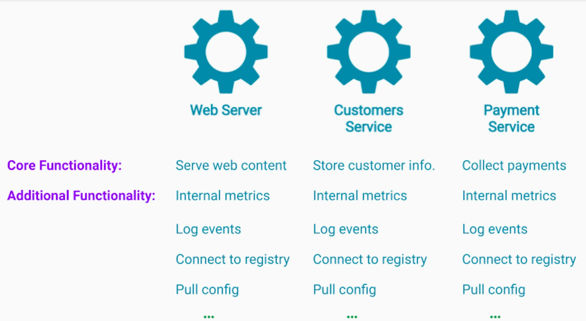

Library approach means more efforts & cost especially in polyglot system - less scalable.
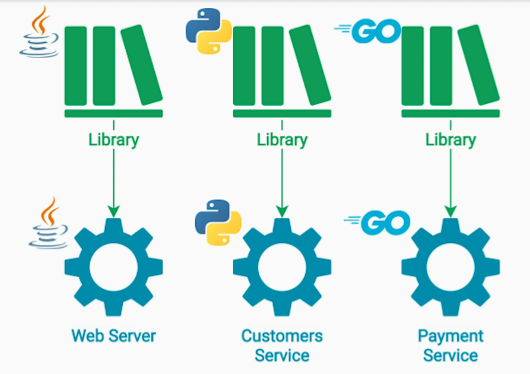

Deploying each of these functionalities as its own service may seem like an overkill.

## Solution
The sidecar runs as a separate process or container inside the same server instance.
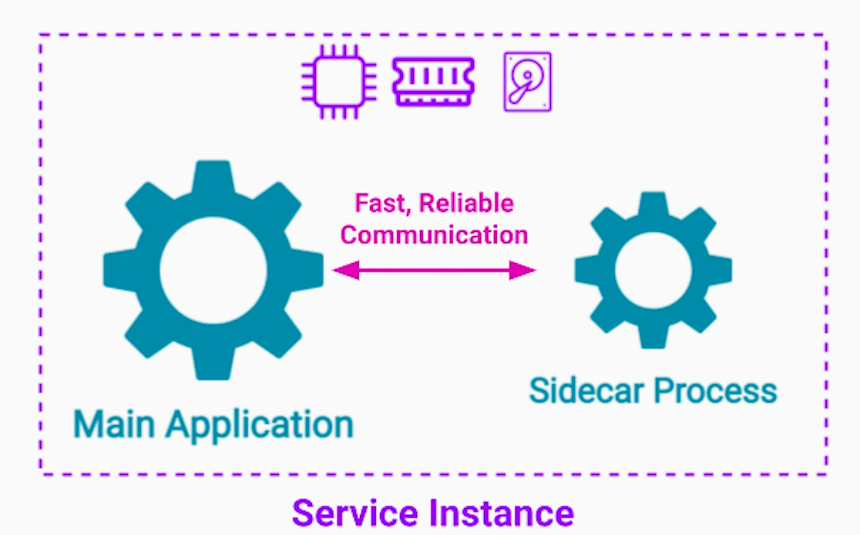

Since the main service and the sidecar are running on the same machine, they both have access to the same file-system, CPU, memory. This makes reporting of metrics (CPU / memory / network utilization), reading of log files and updating main service's config files easier without the need of any network communication.
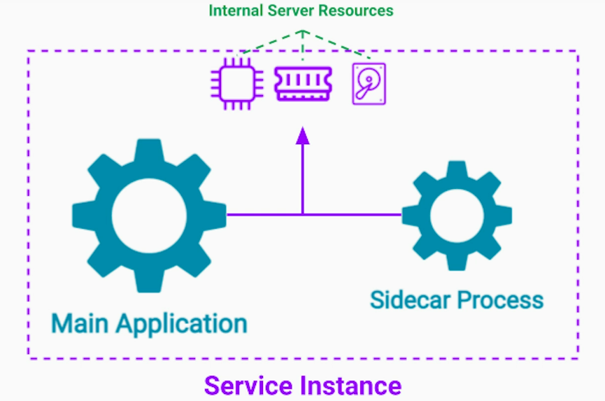

Since the sidecar component is isolated, it allows us to build it using only one language. The business service and the sidecar can be tested and deployed independent of each other.
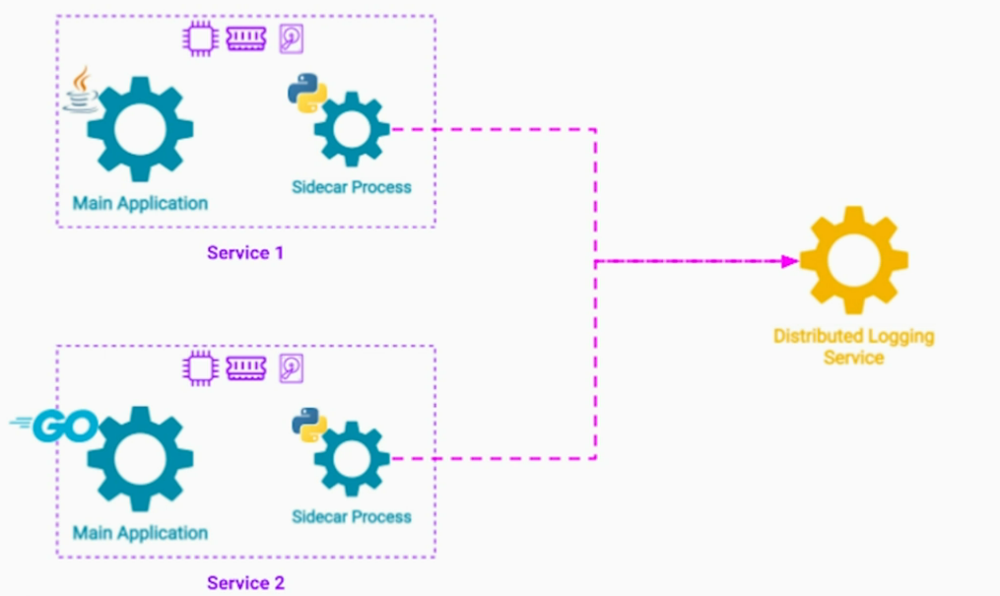

## Special case - Ambassador Pattern
Here the main service only contains business logic. Other complex functionalities (network comms, security, etc) are taken care by the ambassador (proxy).
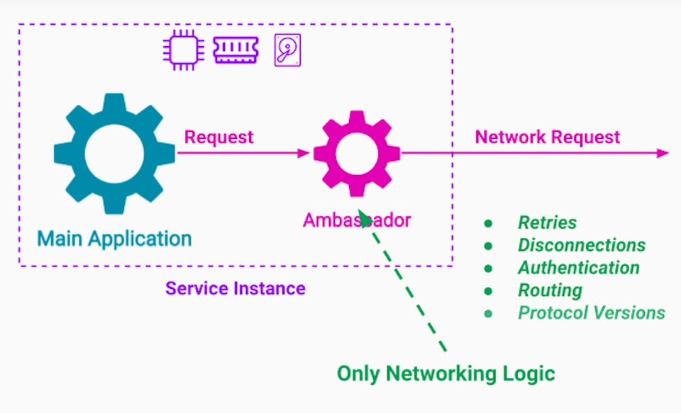

We can tap into the network data, instrument it for traceability. 

## Summary
Sidecar pattern extends the functionality of a service
- No need to **re-implement** in every programming language
- No need to **deploy** as a service on additional hardware

Sidecar benefits;
- **Isolation** between the sidecar and the core application
- Has **access** to the same **resources**
- **Low overhead** of inter-process communication

# 2. Anti-corruption Layer/Adapter Pattern
## Problem
Corruption of a new part of the system with old-system APIs and data models. This typically happens when migrating from monolith to microservices architecture
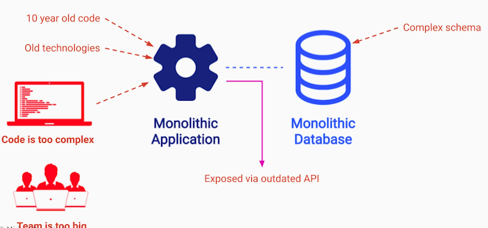

## Solution
Introduce an anti-corruption layer that isolates a new service from legacy APIs and models. This layer takes care of transforming data between new service and legacy system.
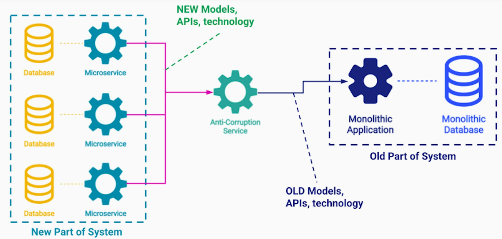

## Scenarios
1. The anti-corruption layer is temporary until all migration is done
2. The anti-corruption layer is  permanent where we cannot remove the legacy system completely
 **Banking System Example**
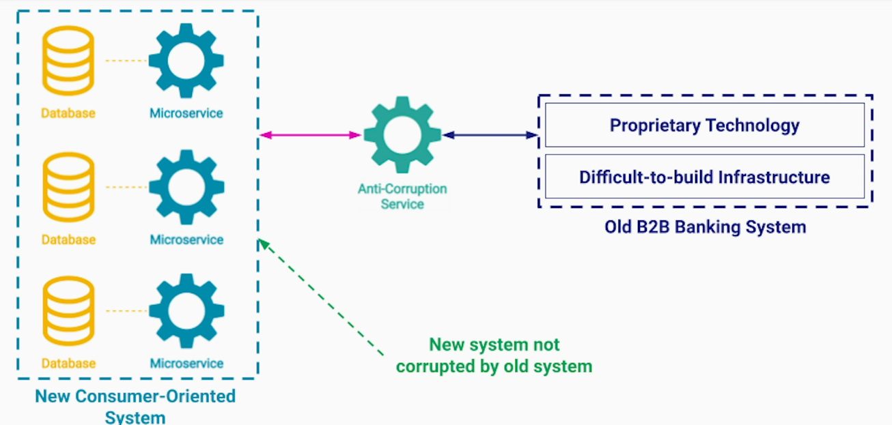

## Overheads
1. Same overheads as any other service - development, testing, scalability
2. Increased latency
3. Additional cost if using cloud env

# 3. Backends for Frontends Pattern
## Problem
In following diagram, backend service serves a frontend code (static and dynamic) to the clients. It also fetches any additional data from various microservices.
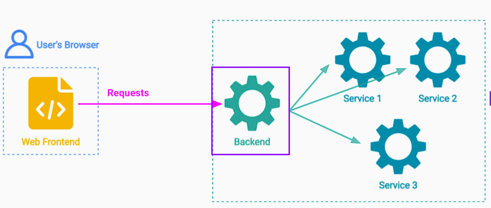

As the system grows, adds more features, the frontend code becomes more complex. At some point, we may also introduce a new type of frontend, say mobile device platforms.
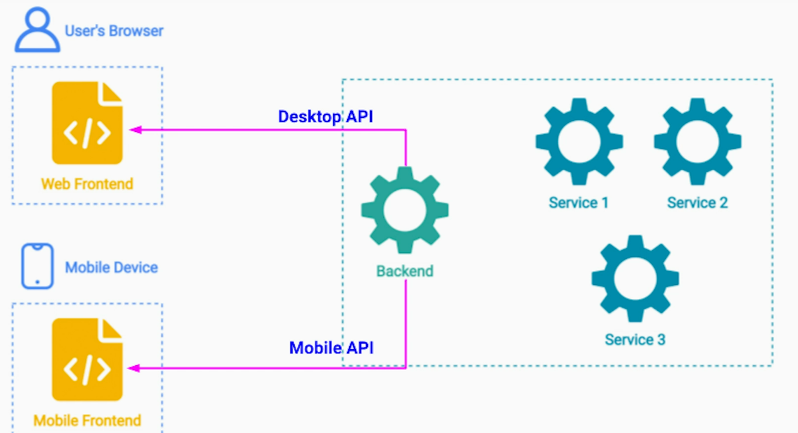
Mobile apps will have totally different API needs to leverage mobile platform capabilities.

Typically, an organization will have one team working on the backend service and will have separate teams working on each frontend. This organizational separation creates tight coupling among teams and reduces org scalability - slows down development.
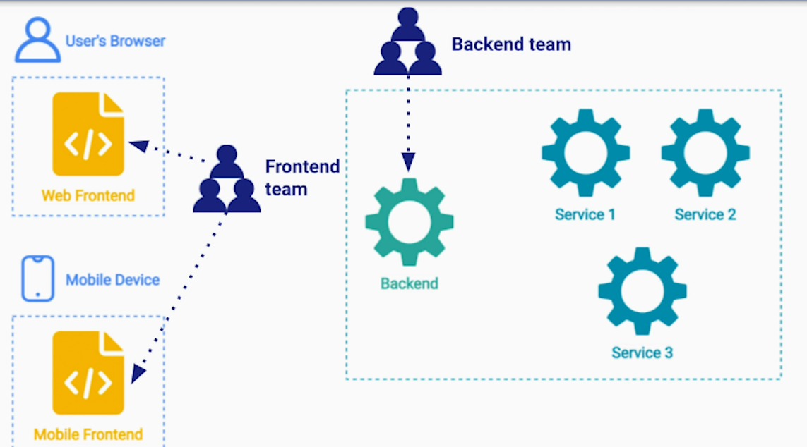

## Solution
Split the backend service into multiple services based on number of frontends your system needs to support. This makes each code base smaller and less resource intensive. Also, each backend is optimized for the frontend it serves giving better UX to our users. 

Client teams (Android, iOS, Web) are part of BFF service teams - full-stack team. This allows each team to make their releases independently. 
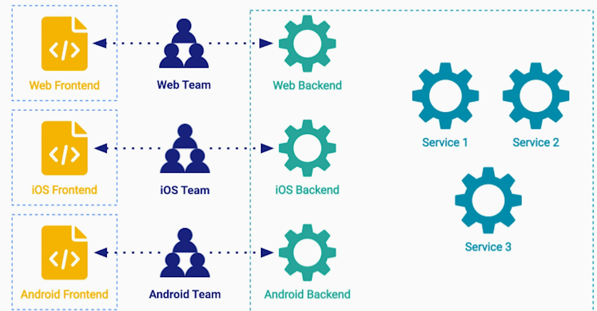

## Challenges
1. Shared functionality among BFFs - have a separate service for shared functionality with clear scope and team ownership
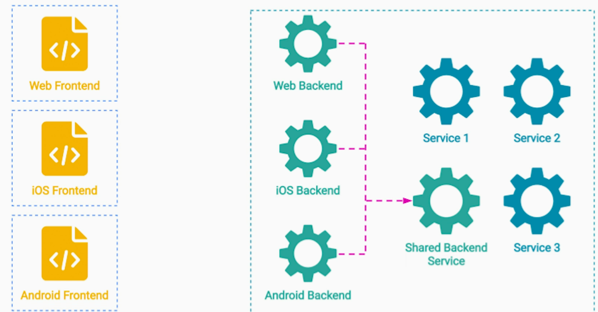

2. Granularity of BFFs depends on your features and UX

## Request Routing
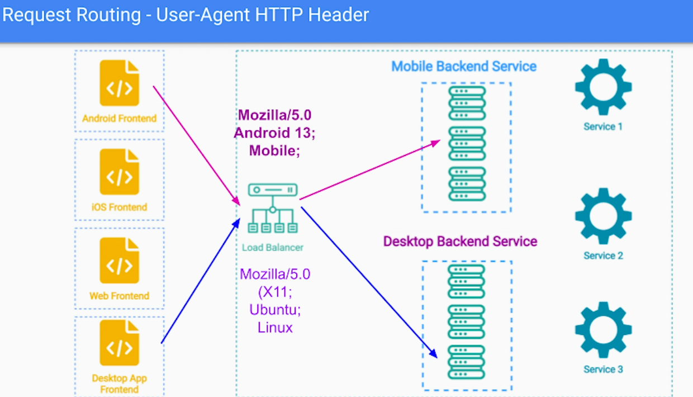

