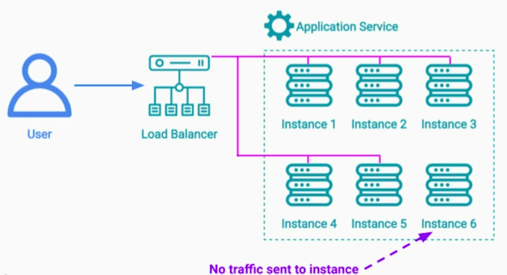

There is no value in "theorizing" about highly scalable / fault tolerant architectures without knowing how to;
1. Deploy
2. Upgrade
3. Test
them in production

# 1. Rolling Deployment Pattern
## Problem
Typical production deployment includes **taking a downtime** and upgrading all the instances with a new version. If something goes during deployment or after deployment, we downgrade to a previous version.

What if our business doesn't allow us to take downtime? What if we need to make an emergency release during busy hours?

## Solution
Use rolling deployment pattern. Simplicity of this pattern makes it the most popular deployment pattern in the industry.
Bring-down one instance from the cluster

Deploy a new version on the instance

Test it out

Apply a new version to the remaining instances one-by-one

## Benefit
1. No system downtime
2. No additional hardware
3. We can quickly rollback if something goes wrong

## Downsides
No isolation between old version and new version of app our app. 
- So there is a risk that a new deployed version may start cascading failures bringing down the entire service
- 2 versions in production as the same time - potential incompatibility

# 2. Blue-Green Deployment Pattern
## Problem
Downsides of rolling deployment pattern

## Solution
There are 2 identical environments in production
- Blue - where old version is running
- Green - where a new version is deployed

After we verify that new version is running fine, the traffic is diverted to green env using load balancer. 

During this transition, if we notice errors, we redirect traffic back to blue env.

If there no issues after diverting all traffic to green env, we decommission blue env or keep it as new green env if we make very frequent releases.

## Benefits
1. Equal number of servers for blue and green envs - no cascading failures
2. Only one version of software in prod - gives the same experience to our users..except for may be a very short period during the transition 

## Downsides
1. We need twice as many servers as we normally need - the cost may not be too high if use the servers only during the release

# 3. Canary Release Pattern
Borrows some element from rolling deployment and some from Blue-Green Deployment pattern to get best of both worlds.

We dedicate a small subset of existing group of servers & update them with a new version of a service

Once canary version is deployed, we can either continue sending a normal traffic to it or  we can start by directing only specific traffic to canary servers. This can be achieved by configuring a load balancer to inspect an origin of the requests. 

During this time, we monitor a performance of the canary version & compare it in real-time with a performance of the rest of the servers. This can go on for hours or even days.

Once we gain enough confidence and we see no degradation in functionality and performance, we can proceed with the release and update the rest of the servers with a new version using rolling deployment pattern.

## Benefits
1. Safest - most risk free because we monitor the canary version for longer duration before switching to it completely
2. Ability direct select users to canary servers helps minimize the damage. If something goes wrong, no impact on real users.

## Challenges
1. Setting clear success criteria for automated release and monitoring - otherwise an engineer will have to look at a lot of graphs on dozens of dashboards for hours

