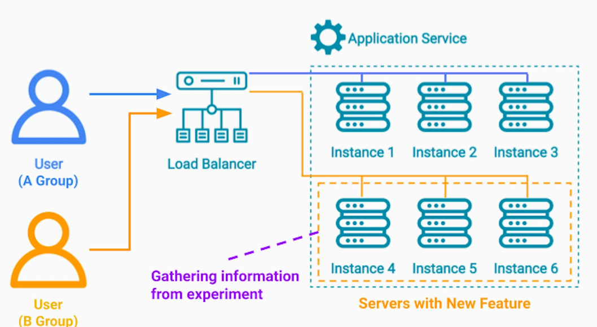
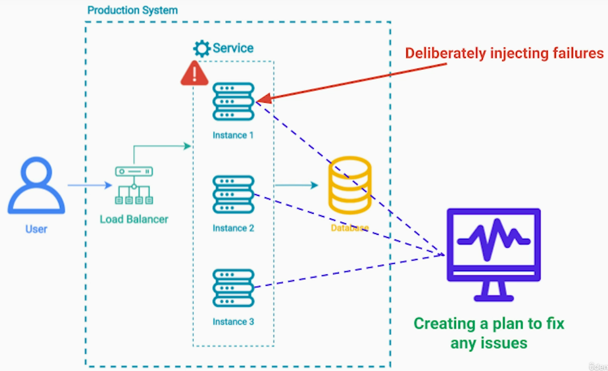
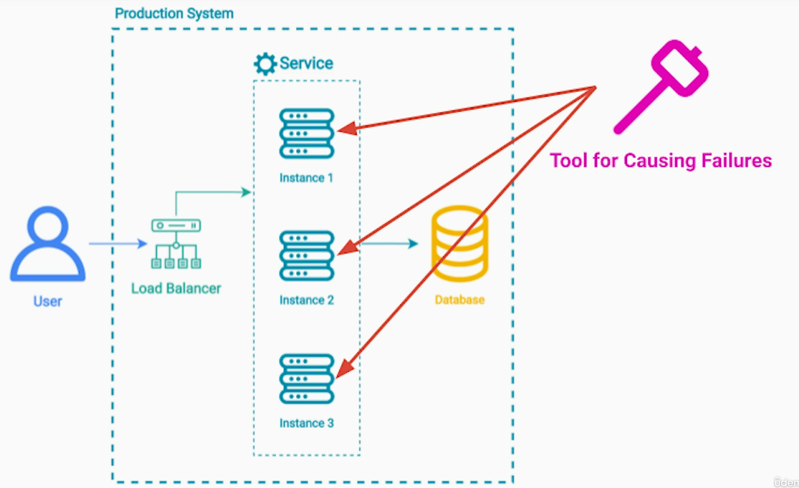
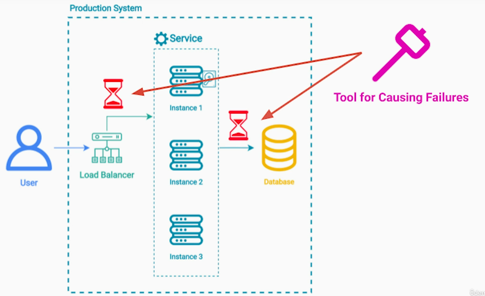
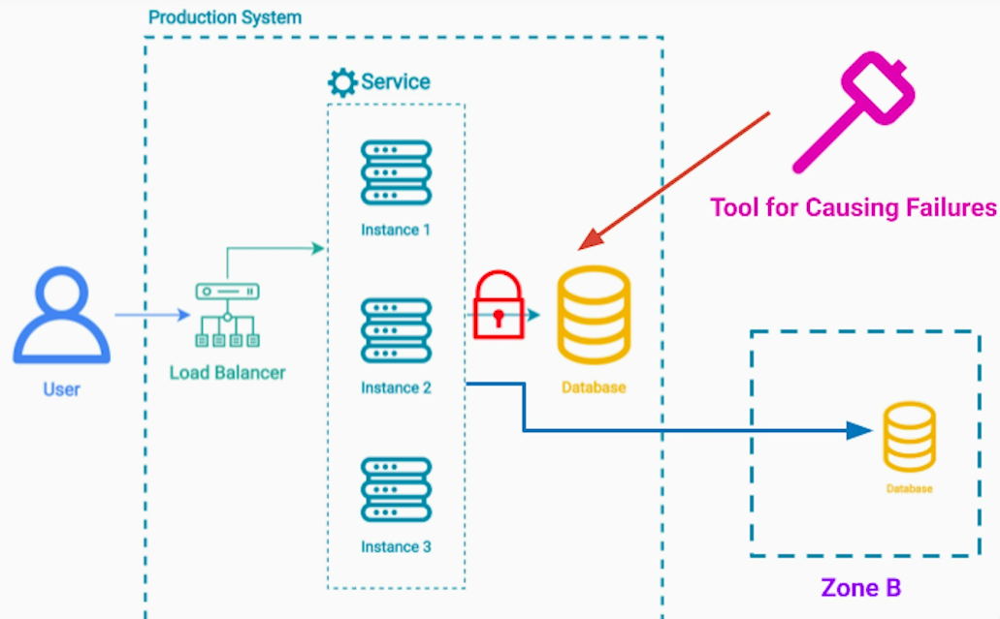
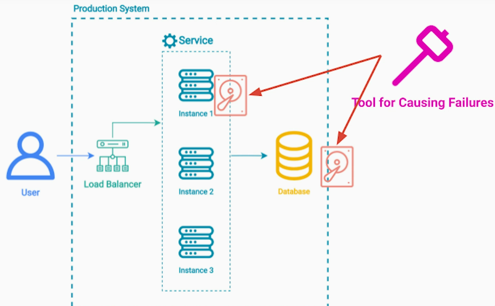
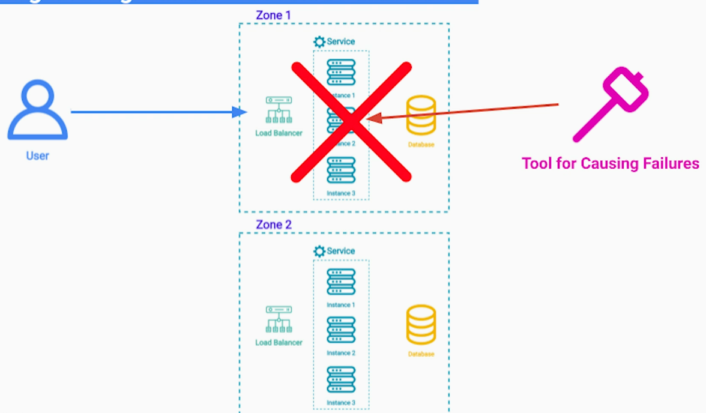

# 1. A/B Testing
It is similar to canary deployment but with different purpose.

Purpose of a canary release is to safely release a new version to entire group of the servers.

The purpose of A/B testing is to test new features on a portion of our **real users** in prod. This information that we gather from this comparision helps our business dev or product team towards a future work 

Unlike canary release, once the A/B testing is finish, we revert back to a previous version.

## Important Notes
1. Users don't know that they are part of an experiment
- This gets us genuine data
2. All of us take part in A/B Testing as users (without knowing it)
3. Duration of the experiment depends on the use-case

# 2. Chaos Engineering Production Testing Pattern
## Problem
During development phase, we put in lot of efforts for unit, integration and functional testing.

But in distributed system, in cloud, failures are inevitable. Infra can break - servers can lose power, n/w switches can break down, storage disk can fail, data center lost to natural disaster, etc. 

Additionally, If we depend on 3rd party APIs, they can have their own outages. And we cannot do much about it.

Also, the system may see sudden spike in traffic due to external event(s). E.g.; sudden spike in trading due to new economic policy.

## Motivation
1. We don't about those issues until they actually happen
2. When they do happen, it may be too late
3. Those issues are very rare - but results can be catastrophic

**Solution of Chaos Engineering** embracing the inherent chaos in a cloud-based distributed system

## Strategy
Systematically and deliberately inject failures and we monitor our systems to see how our systems responds. If the system didn't respond as we expected, we create a plan to fix it 

## Benefits
1. Force engineers to think about the rate failures during development
2. Test the ability of the development team to;
- Monitor
- Recognize outages
- Analyze logs
- Discover production issues
3. Overtime 
- The system becomes more resilient and reliable
- The dev team becomes more proficient in monitoring and fixing prod issues

## Need for a Tool
Take bias human factor out of the equation - for that we need tool for causing the failures

For example; Chaos Monkey
- randomly shutdown cloud instances
- latency injection  between multiple services or a service and its database

- temporarily restrict access to database and test if our system can gracefully failover to the database's replica in a different zone  or region

- resource exhaustion - we can deliberately fill-up a disk space on a particular instance or a database & see how our system behaves

we can even go as far as disabling an entire zone or region

## Production Test Steps
1. Before any test, we need to measure the baseline
2. Then we construct the hypothesis to formalize a desired correct behaviour that we expect from the system
3. Failure injection
4. Monitor the systems for predefined period of time
5. We document all of our finding during the test
6. Restore the system to its original state
7. Fix the issues identified to improve resiliency of our system

**Key is continuous testing**

## Important Considerations while running the tests
1. Minimize the "blast radius" of failures
- make sure that the negative impact to real uses is minimal

2. Staying with our "error budget" - this is one of the reasons we should never promise 100% availability to users - it leaves room for;
- Unexpected
- Deliberate failures

## Summary
### Chaos Engineering pattern;
1. Increases confidence
2. Protects production against critical failures

### Allows finding;
1. Single point of failure
2. Scalability issues
3. Performance bottlenecks

### Ensures that real failures are dealt with gracefully

