## Motivation - Why we need Threads?
### 1. Responsiveness - Concurrency
- It is particularly critical in the apps with UI. For example, movie player - it shows series of images, plays audio and responds to user inputs as well (play / pause / etc)
- Responsiveness can be achieved by using multiple threads, with a separate thread for each task. Generally, very hard to achieve otherwise.
- **Concurrency == Multi-tasking** - Achieved by multi-tasking between threads - computer creates an illusion that tasks are running in parallel
- **We don't need multiple cores to achieve concurrency**

### 2. Performance - Parallelism
- We can create an illusion of multiple tasks executing in parallel using just a single core
- With multiple cores, we can truely run multiple tasks completely in parallel
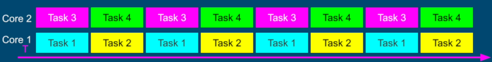
- Completing complex task much faster
- Finish more work in the same period of time

## About Threads
What threads are and where they live?
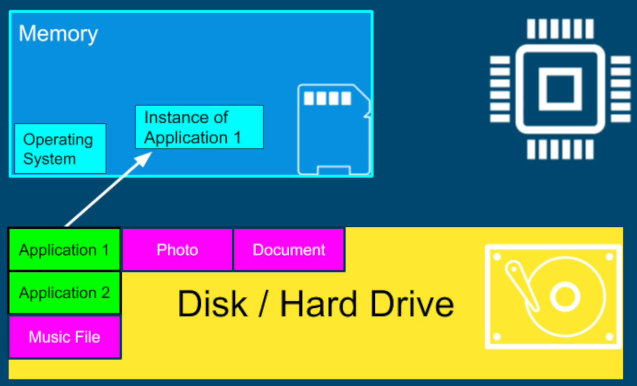

**Single Threaded Application Process** - sometimes called application context. Each process is completely isolated from other processes running on the same computer.
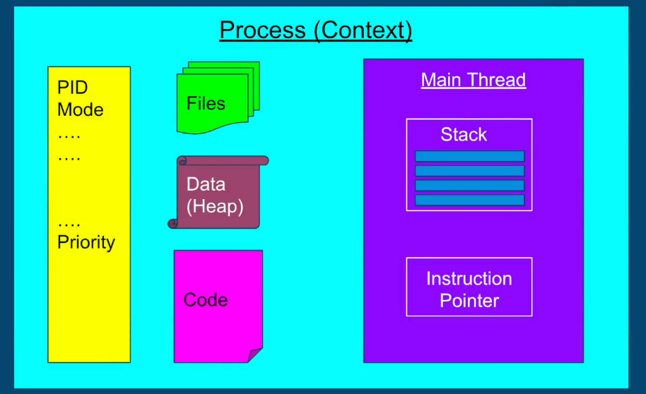

**Multi Threaded Application Process** - each thread has its own stack and an instruction pointer. All the other components in the process are shared by all threads
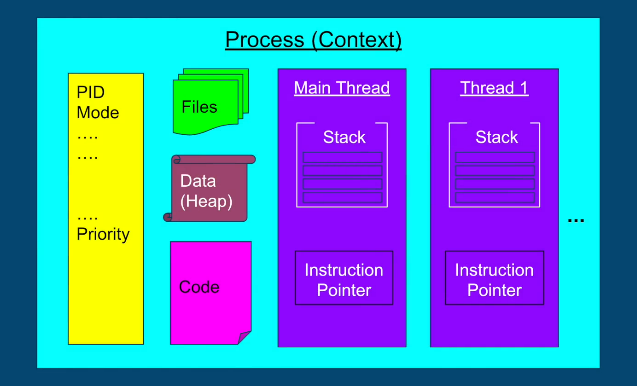

**What the thread contains**
- **Stack** - region in memory, where local variables are stored, and passed into functions
- **Instruction Pointer** - Address of the next instruction to execute
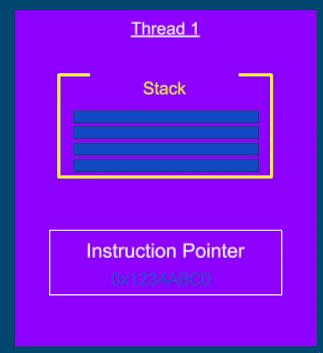

Each thread is executing a different instruction in a different function in a any given moment. 

## Context Switching
A computer will have multiple processes running - way more than number of cores. Each process will have one or more threads. These threads are competing with each other to be executed on the CPU.

OS will run one thread at a time on the CPU.

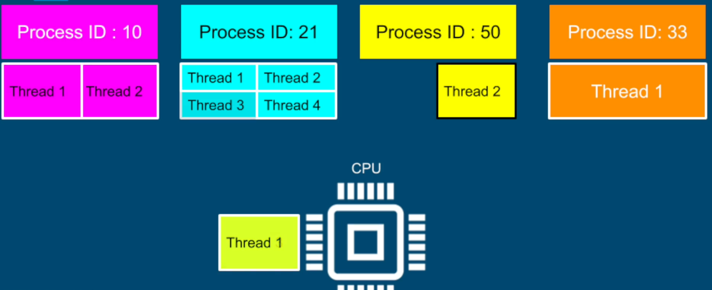

The act of;
1. Stopping thread 1
2. Schedule thread 1 out
3. Schedule thread 2 in
4. Start thread 2
is called a context switching.

### Cost of Context Switch
1. **Context switch is costly, and is the price of multitasking (concurrency).**. Same as we humans when we multitask - takes time to focus.
2. Each thread consumes resources in the CPU and memory
3. When we switch to a different thread
- store data for one thread
- restore data for another thread

### Key Takeaways
1. Too many threads - **Thrashing**, spending more time in management (like performing context switches) than real productive work
2. Context switching between threads from the same process is cheaper than context switch between different processes because threads consume less resources than processes

## Thread Scheduling
Say we are doing our homework in a text editor while listening to our favorite music. 
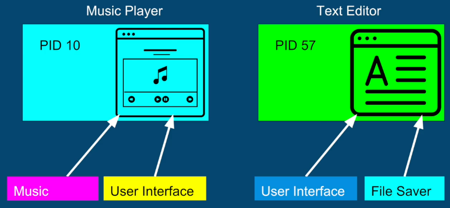

Let's assume that we have 1 core and there are 4 threads of 2 processes to be scheduled.
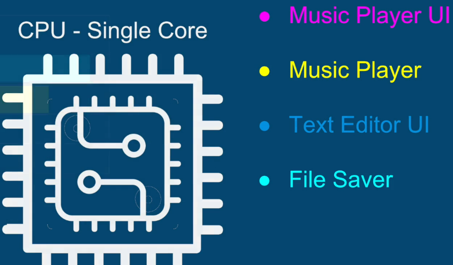

Assuming arrival order of the tasks and their corresponding length of execution (number of instructions?) is given, who runs first?
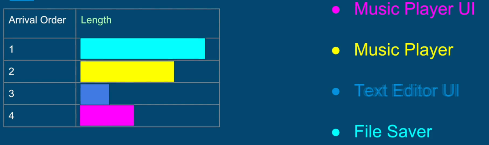

### Option 1 - First Come First Serve
Sounds fair but long running tasks will not allow other tasks to run causing **starvation**. E.g; UI thread will unresponsive if some long running tasks is going on.

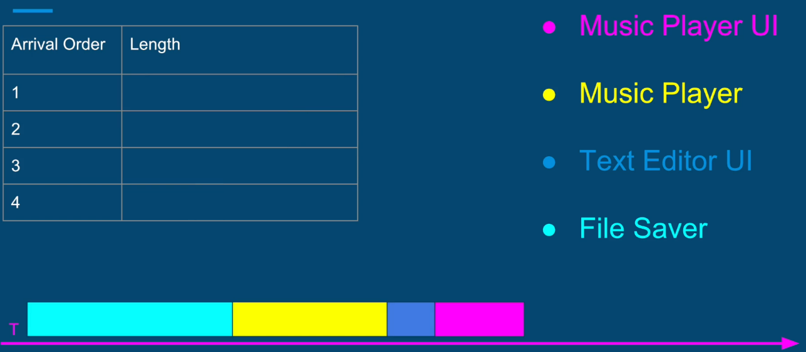

### Option 2 - Shortest Task First
If we keep getting UI tasks (which are shorter), the longer tasks that involve computations will never be executed.

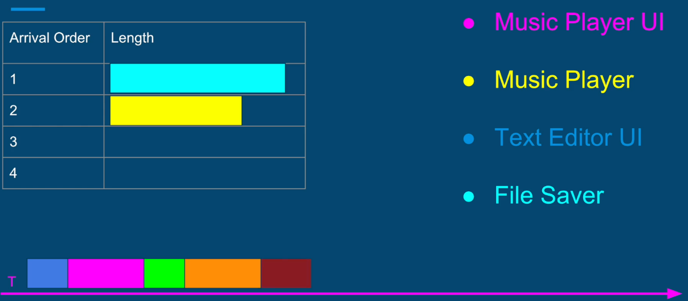

### How it really works?
This is how it generally works in the most OS.

The OS divides time into moderately sized pieces called Epochs. In each Epoch, OS allocates different time-slice for each thread. Notice that not all threads get to run or complete in each Epoch.

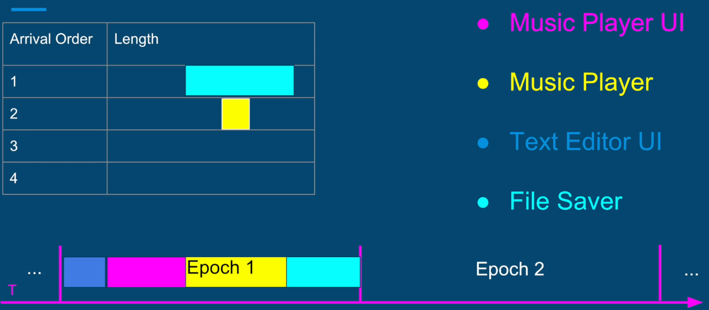

#### Dynamic Priority

**Dynamic Priority = Static Priority + Bonus** - bonus can be negative
1. Static priority is set by developer pro grammatically
2. Bonus is **adjusted** by the OS in every Epoch, for each thread
3. Using dynamic priority, 
- OS will give preference for interactive threads (such as UI threads)
- OS will give preference to threads that did not complete in the last Epochs, or did not get enough time to run preventing Starvation

## Threads vs. Processes
### Prefer Multi-Threaded Architecture if
1. Threads / Tasks share a lot of data
2. Threads are much faster to create and destroy - switching between threads of the same process is faster (shorted context switches)

### Prefer Multi-Process Architecture if
1. Security and stability are of higher importance
2. Tasks are unrelated to each other

