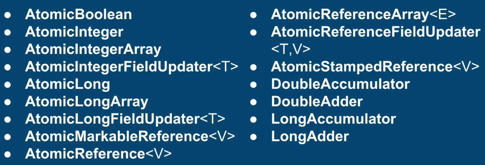

1. Majority of multi-threaded programming is still done with Locks (synchronized, ReentrantLock, ReentrantReadWriteLock...)
2. Most of the concurrency problems are easier and safer to solve with locks
3. Locks have great hardware and software support

## What's wrong with Locks?
1. Deadlocks 
- deadlocks are generally unrecoverable
- can bring application to a complete halt
- more locks you have in your application, higher the chances of deadlock
2. Slow Critical Section
- multiple threads using the same lock
- one thread can hold lock for very long - can slow down all the other threads
- all threads become as slow as the slowest thread
3. Thread Not Releasing a lock (Kill Tolerance)
- Thread dies, gets interrupted or forgets to release a lock
- Leaves all thread hanging forever
- Unrecoverable, just like a deadlock
- To avoid it, developers need to write a more complex code - wrap every critical block with try-finally, use tryLock, etc
4. Performance Overhead
- ThreadA acquires a lock
- ThreadB tries to acquire a lock and gets blocked
- ThreadB is scheduled out (context switch)
- ThreadB is scheduled back (context switch)

## Lock Free Techniques
### Why did we need locks?
1. Multiple threads accessing shared resource
2. At least one thread is modifying the shared resources
3. And the operation was non-atomic - for example; count++

### Lock Free Solution
1. Utilize operations which are guaranteed to be single hardware instruction
2. A single hardware instruction is
- atomic by definition
- thread safe

#### Atomic Instructions
1. Read / Assignment on all primitive types (except for long and double)
2. Read / Assignment on all references
3. Read / Assignment on ```volatile``` long and double

#### AtomicX Classes
1. Classes located in ```java.util.concurrent.atomic``` package
2. Internally uses Unsafe class which provides access to low level, native methods
3. Utilize platform specific implementation of atomic operations



```
    int intialValue = 0;
    AtomicInteger atomicInteger = new AtomicInteger(intialValue);
    
    // atomically increment the integer by one
    atomicInteger.incrementAndGet(); // return the new value. Similar to ++count
    atomicInteger.getAndIncrement(); // return the provious value. Similar to count++
    
    // atomically decrement the integer by one
    atomicInteger.decrementAndGet(); // return the new value. Similar to --count
    atomicInteger.getAndDecrement(); // return the provious value. Similar to count--
    
    int delta = 5; // delta can be -ve, so we can achieve addition and substraction using following methods.
    // atomically add any integer
    atomicInteger.addAndGet(delta); // return the new value
    atomicInteger.getAndAdd(delta); // return the provious value
```

##### AtomicInteger
**Pros**
1. Simplicity
2. No need for locks or synchronization
3. No race conditions or data races

**Cons**
1. Only the operation itself atomic
2. There is still a race condition between 2 separate atomic  operations

## Summary
1. AtomicInteger is a great tool for concurrent counting, without the complexity of using lock
2. It is on par and sometimes more performant than a regular integer with a lock as protection


