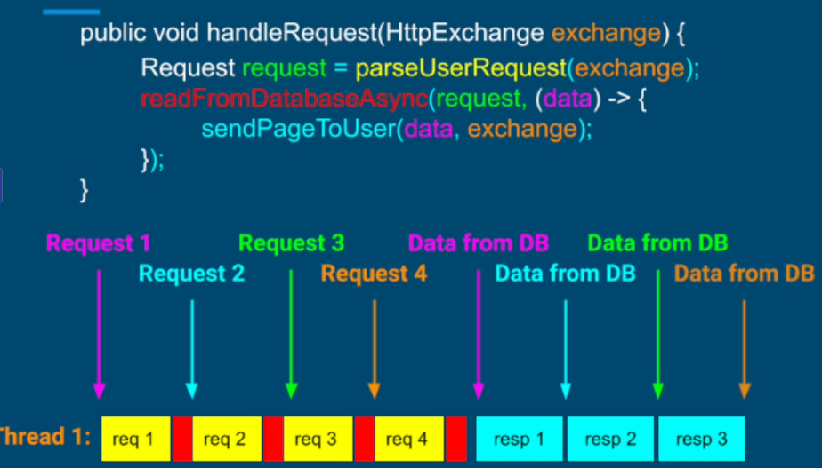
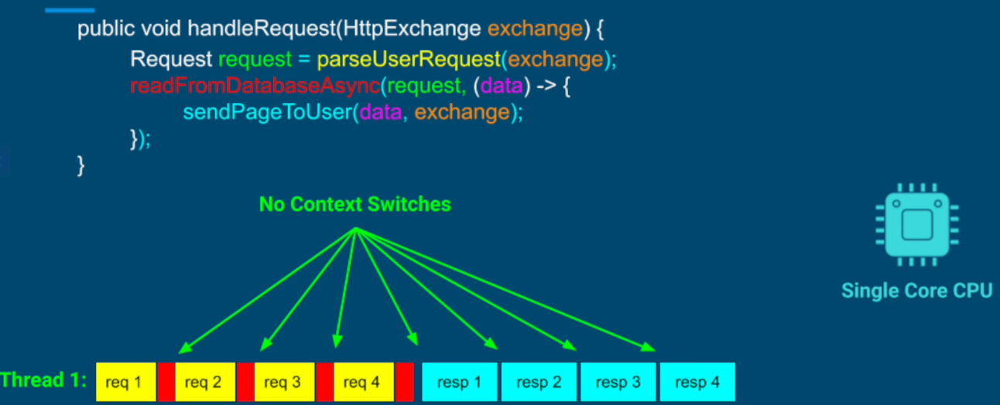
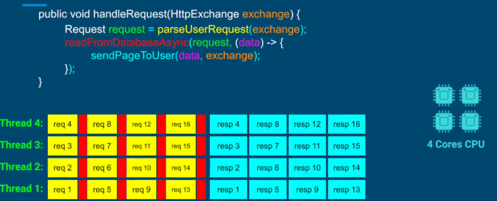
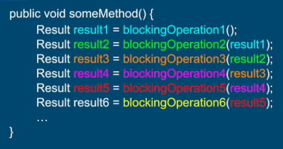
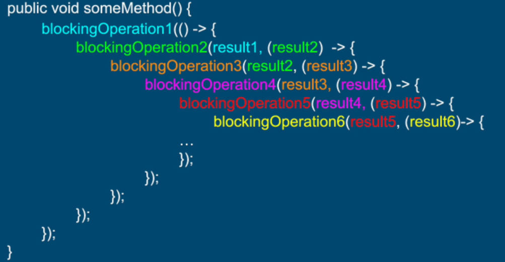
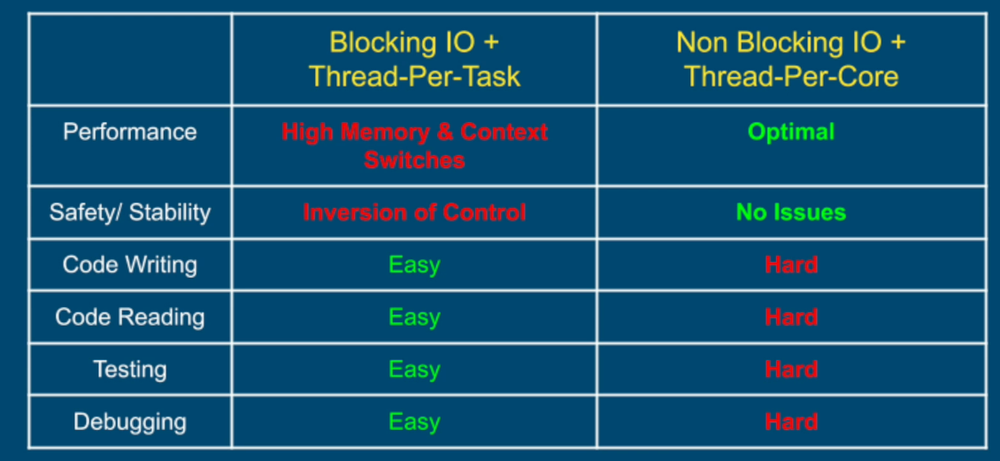

## Non-Blocking IO
```
    public void someMethod() {
        // instead of blocking a thread, a call back function is called when result has been
        // received from blocking IO. The result is passed to the callback
        nonBlockingIO(resultData -> {
            ...
            useData(resultData); // CPU utilization
            ...
        }); 
    }
```



Above can be achieved without context switching and Thread-Per-Core model.



Only reason to create more threads will be if we have more cores. This allows us to handle requests in parallel.


**Thread-Per-Core model with Non-blocking IO provides optimal performance**.

### Challenges
1. Code readability
Non-Blocking code is write, read, test and debug.
**Blocking IO code Vs. Non-Blocking IO code**

This deep nesting of callbacks is referred as **callback hell**


2. Very Hard APIs
- Non-Blocking IO OS methods are very hard to work with and JDK provides a very thin layer of abstraction on top of it
- most projects use third party libs like netty, vert.x, webflux, etc.

## Threading Models Comparision


The virtual threading model provides best of both worlds. I.e.; Blocking IO + Thread-Per-Task AND Non-Blocking IO + Thread-Per-Core models.
