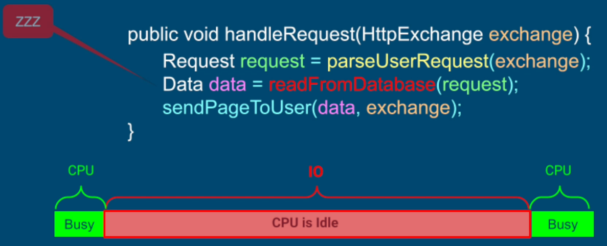
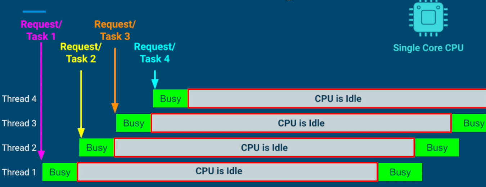

## What is IO?
In computer abstraction, CPU has direct access to memory. But to interact with computer devices (harddisk / keyboard / network) CPU has to talk to devices' controllers via OS. While these devices are doing their job, CPU is idle. CPU's interaction with these devices via DMA (Direct Memory Access) and devices' controllers is called IO (Input / Output). 

This becomes Blocking IO when CPU is idle waiting for external devices to finish its work. 

## Thread-Per-Core Model 
1. When a task involves blocking calls, # of threads = # of cores
- doesn't give us the best performance
- doesn't give us the best CPU utilization

2. Even if we have a few long blocking calls, they can impact the performance of entire app

**Use Thread-Per-Core Model for app where blocking IO calls are not involved**

## Thread-Per-Task / Thread-Per-Request Model
This model allows better CPU utilization even on single core machine. It allows to serve multiple requests concurrently for blocking IO. 

### Benefits
1. Improvement for
- Throughput
- Hardware Utilization

2. Processes tasks concurrently and completes faster than Thread-per-Core model

### Issues
1. Threads are expensive
- Depending on OS, the number of threads we can create are limited
- Threads consume stack memory and other resources
- Too may threads - the app will crash
- Too few threads - lower throughput and CPU utilization

2. Price of Context switches
- OS is trying hard to utilize our CPU - as soon as there is a blocking call, the OS unschedules that thread
- Too many threads and frequent blocking calls lead to the CPU being busy running the OS code - moving threads in and out of the CPU - thrashing

3. Doesn't give optimal performance
- When a thread is blocking on IO, it cannot be used
- Requires us to allocate more threads
- Consuming more resources, adding context switching overhead

