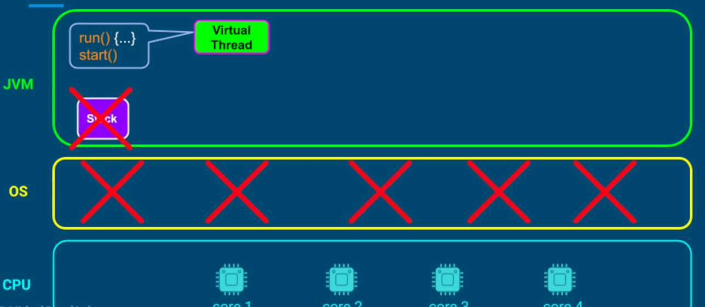
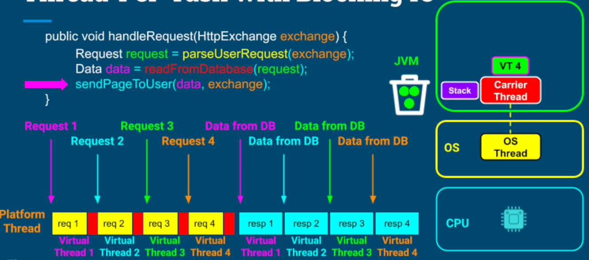

## Java Threads Objects and OS Threads
Thread object in JVM provides a thin layer around the OS thread. 


JVM Thread object is also called **Platform Threads**.


The platform threads are expensive and heavy because each platform thread maps one to one with OS thread & OS thread is a limited resource.

## Virtual Threads
Newer type of threads, introduced in **JDK21**

Like platform thread, virtual thread also contains start() and run(){...} methods. But unlike a platform thread, a virtual thread fully belongs and is managed by a JVM & doesn't have a fixed sized stack. OS takes no role in creating and managing it and is not even aware of it.



Virtual thread is just like any other Java Object allocated in a heap and can be reclaimed by JVM's GC. This makes Virtual threads are cheap & fast to create in large quantities.  

When we create a virtual thread, under the hood JVM creates a small pool of platform threads. 


When JVM wants to run a virtual thread A, it mounts it on one of the platform threads in the pool. When virtual thread is mounted on a platform thread, that platform thread is  called a carrier thread.


If virtual thread finishes its execution, JVM will unmount that thread from its carrier and make that platform thread available for other virtual threads. GC will cleanup the virtual thread object.


In a scenario, where thread A is  not finish and not able to make progress, JVM will unmount it but will save its current state in a heap. 


The state includes its instruction pointer and a snapshot of the carrier thread stack. 

**We, developers, have very little control over carrier threads and scheduling of virtual threads on carrier threads**

## Performance Benefits of Virtual Threads
1. If virtual threads represent only CPU operations
- No performance benefits
- Just an abstraction for scheduling tasks on a pool of platform threads

2. If Virtual threads represent operations that require the thread to wait (block operations, IO, etc)
- very useful for performance / throughput 

**Blocking IO Operations**


No context switch overhead when we use virtual threads. 

## Threading Models Comparison


Many of the blocking operations were refactored to support virtual threads so platform threads can be freed up. Examples;
- Sleep - Thread.sleep()
- Locks - ReentrantLock.lock()
- Semaphores - Semaphore.acquire()
- Networking API - Socket / Datagrams (TCP / UDP)
- etc

## Notes
1. We still need to be aware of all thread safety issues using the virtual threads. All the concepts of locking, interthreads communication, etc apply to virtual threads also

2. Virtual threads have no benefits for tasks only involving CPU operations. It shines when blocking operations are involved. If we are sure that there is no blocking calls in our code, we should stick to platform threads.

3. Virtual threads have no benefits when it comes to latency. The benefit that we get with virtual threads is better throughput.

4. Short and frequent blocking calls are inefficient - virtual threads are better choice for it over platform threads because thread-per-task with platform threads introduces context switching cost. Thread-per-task with virtual threads has only mounting / unmounting cost.

Since price of mounting / unmounting virtual threads is not ZERO, we should batch IO operations into less frequent, long IO operations whenever possible.

5. Virtual threads are always daemon threads. They won't prevent our application from terminating. ```virtualThread.setDaemon(...)``` throws an exception

6. Virtual threads always have a default priority. ```virtualThread.setPriority(...)``` doesn't do anything


## Best Practices
1. Never create fixed sized pools of virtual threads. JVM is already doing it for us by creating platform thread pool. We should stick to thread-per-task model.

2. Preferred way to use virtual thread is to use ```Executors.newVirtualThreadPerTaskExecutor()```

## Observability and Debugging
1. Carrier threads are hidden from us when we set a debugger on virtual thread. The IDEs / debuggers treat virtual threads like any other threads


