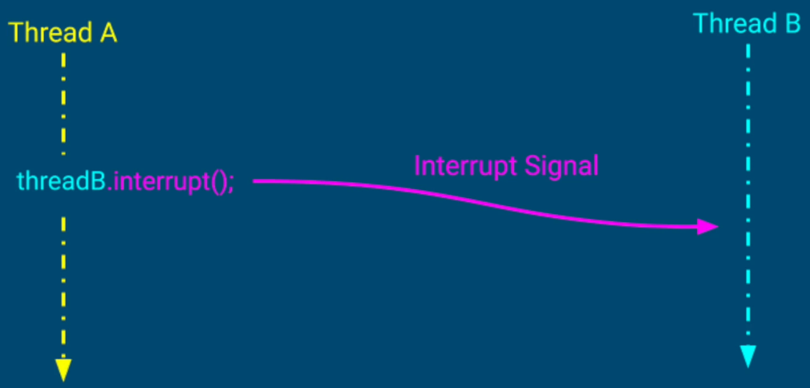

## Thread Termination
Why and when to stop a thread?
1. Thread consumers resources. Even if a thread is not doing anything, it is still consuming memory and some kernel resources
2. If a thread finished its work and the app is still running, we would like to clean up thread's resources consumed by the unused thread
3. If a thread is misbehaving, we want to stop it
- sending a request to server that is not responding
- running a long calculation - much longer than we want to allow it
4. Be default, the application will not stop as long as at least one thread is still running. We want an ability to stop threads gracefully before closing the app.

### Option 1 - ```Thread.interrupt()```


A thread is interrupted in 2 scenarios;
1. If a thread is executing a method that throws ```InterruptedException```

```
    public class InterruptDemo {
	    public static void main(String... strings) {
		    Thread blockingThread = new Thread(new BlockingTask());
		    blockingThread.start();
		    blockingThread.interrupt();
	    }

	    private static class BlockingTask implements Runnable {
		    @Override
		    public void run() {
			    try {
				    TimeUnit.SECONDS.sleep(50000);
			    } catch (InterruptedException e) {
				    System.out.println("Exiting a blocking thread...");
			    }
		    }
	    }
    }

```

2. If the thread we are trying to interrupt handles the interrupt signal explicitly 
Using ```thread.interrupt()``` along with ```Thread.currentThread.isInterrupted()```

```
public class InterruptDemoTwo {
	public static void main(String... strings) throws InterruptedException {
		Thread thread = new Thread(new LongComputationTask(BigInteger.valueOf(2000), BigInteger.valueOf(10000)));
		thread.start();
		// 1. Just calling interrupt won't stop the long running thread because there is
		// no method in run() of the task that throws InterruptedException
		thread.interrupt();
	}

	private static class LongComputationTask implements Runnable {
		private BigInteger base;
		private BigInteger power;

		public LongComputationTask(BigInteger base, BigInteger power) {
			this.base = base;
			this.power = power;
		}

		@Override
		public void run() {
			System.out.println(base + "^" + power + " = " + pow(this.base, this.power));
		}

		private BigInteger pow(BigInteger base, BigInteger power) {
			BigInteger result = BigInteger.ONE;
			

			for (BigInteger i = BigInteger.ZERO; i.compareTo(power) != 0; i = i.add(BigInteger.ONE)) {
				// 2. Since there is no method that can throw InterrupedException, we have to
				// check if the thread was interrupted
				if (Thread.currentThread().isInterrupted()) {
					System.out.println("Prematurely Interrupted...");
					return BigInteger.ZERO;
				}
				result = result.multiply(base);
			}
	
			return result;
		}
	}
}

```

### Option 2 - Daemon Threads
The threads that run in background and do not prevent the application from exiting if the main thread terminates

#### Where to use Daemon Threads?
1. Background tasks that should not block our application from terminating. Example; File saving thread in a text editor
2. Code in a worker thread is not under our control, and we do not want it to block our application from terminating. Example; Worker thread that uses an external library that might not handle the thread interrupt signal

In previous example, if don't think that we need to handle the thread interruption gracefully, we can use following approach;
```
public class InterruptDemoTwo {
	public static void main(String... strings) throws InterruptedException {
		Thread thread = new Thread(new LongComputationTask(BigInteger.valueOf(2000), BigInteger.valueOf(10000)));
		// Setting the thread as daemon thread so it doesn't block the app from closing
		thread.setDaemon(true);
		thread.start();
		// Will wait for 100ms before the app closes - i.e.; will give 100ms to daemon thread to do its work
		TimeUnit.MILLISECONDS.sleep(100);
	}

	private static class LongComputationTask implements Runnable {
		private BigInteger base;
		private BigInteger power;

		public LongComputationTask(BigInteger base, BigInteger power) {
			this.base = base;
			this.power = power;
		}

		@Override
		public void run() {
			System.out.println(base + "^" + power + " = " + pow(this.base, this.power));
		}

		private BigInteger pow(BigInteger base, BigInteger power) {
			BigInteger result = BigInteger.ONE;
			

			for (BigInteger i = BigInteger.ZERO; i.compareTo(power) != 0; i = i.add(BigInteger.ONE)) {
				result = result.multiply(base);
			}
	
			return result;
		}
	}
}
```
