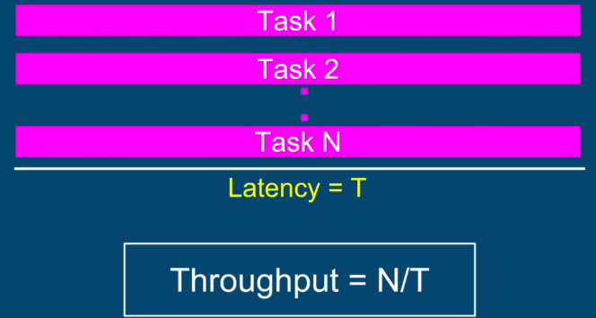

## Performance Criteria
Performance criteria varies based on context and use case.

For example, in high speed trading system, **latency** is an important performance criteria. Faster transactions -> Lower latency is better. Here, performance matrix would be a latency measured in unit of time. 

**Latency** - The time to completion of a task. Measured in time units.

But at the same time, low latency is not a good performance criteria for a video player - delivering each frame as fast as possible would be a terrible UX.  If movie is recorded at 30 FPS and we show 500 FPS, the user would not see anything. Want we want in this use case is to show content at precise frame-rate and minimum jitter. Here, the performance matrix will be accuracy and precision of the frame rate.

In case of machine learning use case - more data an application can ingest in given time-frame, better results will be emitted by a model. In this case, the performance matrix will be better **throughput**. Throughput is typically measured in requests processed / time unit. 

**Throughput** - The amount of tasks completed in a given period. Measured in tasks/time unit

Latency and throughput are independent metrics. Improving one may not have any impact on other, and sometimes may have an adverse effect on the other. 

### Latency
Latency of a task can be reduced using multi-threading by breaking it down into multiple sub-tasks and running all those sub-tasks in parallel. Theoretically, we can reduce latency by a factor of N (where N = number of sub-tasks) and hence improving performance by a factor of N.


#### Considerations
1. **What should be the value of N?**
How many sub-tasks / threads to break the original task?
On a general purpose computer - N should be equal to number of cores with thread per task model. If we have more subtasks than number of cores, latency will increase because of thrashing / context switches. More threads than cores is counterproductive.

**Assumptions**
- # threads = # cores is optimal only if all threads are runnable and can run without interruption (no IO / blocking calls / sleep etc)
- The assumption is nothing else is running that consumes a lot of CPU

2. Does breaking original task and aggregating results come for free? 
Not really, there is a cost to
break task into multiple tasks
+ create threads, passing tasks to threads
+ time between ```thread.start()``` to thread getting scheduled
+ time until the last thread finishes and signals to aggregating thread
+ time until the aggregating thread runs
+ aggregation of the sub-results into a single artifact

Multi-threaded app always have some inherent cost. Small and trivial tasks are not worth breaking into sub-tasks


3. Can we always break any task into sub-tasks? No.

### Throughput
Throughput matters when our system is given multiple tasks concurrently and we want to execute as many tasks as possible in given time. 


#### Approaches to Improve Throughput
##### Approach 1 - Breaking Tasks into Subtasks


##### Approach 2 - Running tasks in parallel


Here we are more likely to achieve N/T throughput because some of the costs associated with breaking down a task into sub-tasks is eliminated;


And using some more advanced techniques like **thread pooling** & non-blocking queues, we can further reduce the cost;


### Thread Pooling
Creating the threads once and reusing them for future tasks eliminating a cost of creating new threads.

Once the threads are created, they sit in a pool. The tasks are distributed among the available threads. 


If all the threads are busy, the tasks are going to sit in a queue waiting for a thread to become available


JDK comes with a few implementations of thread pools. One of them, widely used, is ```FixedThreadPoolExecutor```

```
    int numberOfThreads = 4;
    Executor executor = Executors.newFixedThreadPool(numberOfThreads);
    
    Runnable task = ...;
    executor.execute(task);
```

### Summary
1. By serving each task on a different thread, in parallel, we can improve throughput by N
2. N = # threads = # cores
3. Using a Fixed Thread Pool, we maintain constant number of threads, and eliminate the need to recreate the threads


