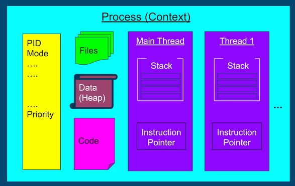
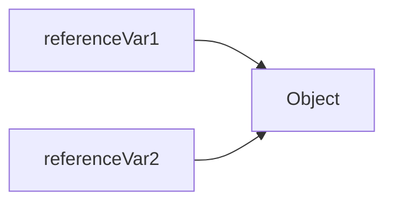
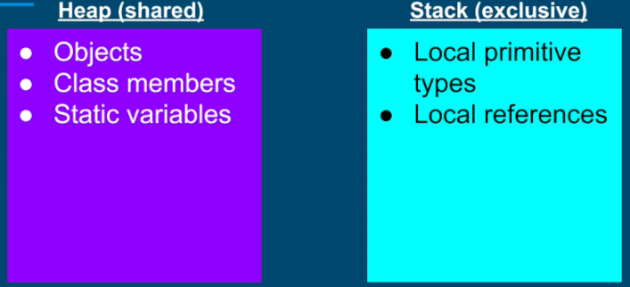
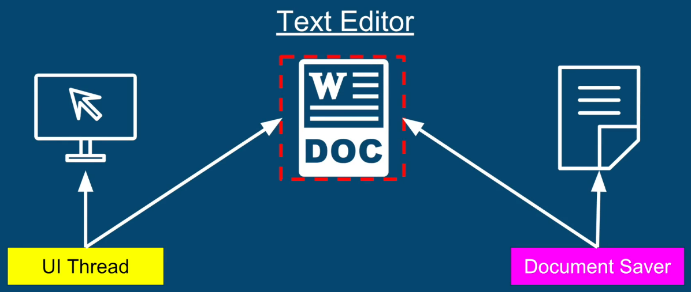
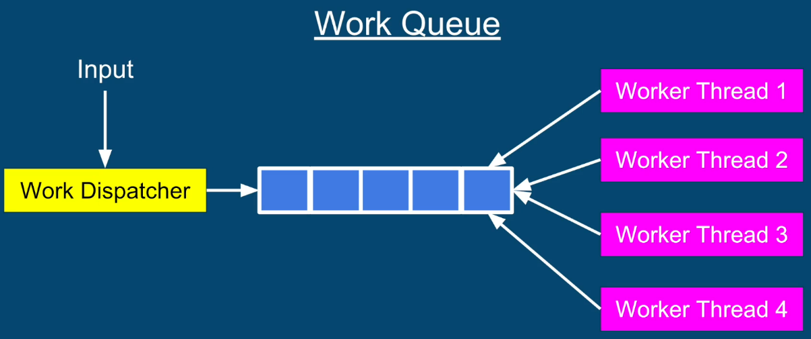
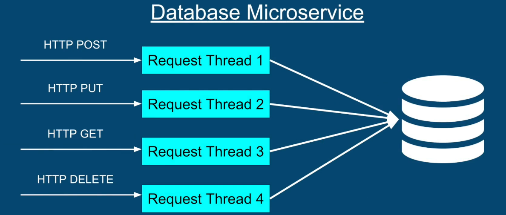

## Stack Memory Region
1. Memory region where
- Methods are called / executed
- Arguments are passed
- Local variables are stored on the stack

2. Stack + Instruction Pointer = state of each thread's execution

### Properties
1. All variables belong to  the thread executing on that stack. A thread cannot access other thread's stack.
2. Stack memory is statically allocated when the thread is created
3. The stack's size is fixed, and relatively small (platform specific)
4. If our calling hierarchy is too deep, we may get an ```StackOverflowException``` - risky with recursive calls



## Heap Memory Region
Heap is a shared memory region that belongs to a process. All the threads share whatever data is located on a heap. Threads can access and allocate objects on heap at any moment.

### What is allocated on the Heap?
1. Objects - anything that is created with the ```new``` operator
- String
- Object
- Collection
- array
...
2. Members of classes - primitive members as well as non-primitive members
3. Static  variables

### Heap Memory Management
1. Governed and managed by GC
2. Objects stay on a heap as long as we have one reference to them. They are garbage collected sometime after all the reference to that object are lost.
3. Member of classes - exist as long as their parent objects exist (same life-cycle as their parents)
4. Static variables - stay forever until applications lifetime

## Objects vs. References

```
    Object referenceVar1 = new Object();
    Object referenceVar2 = referenceVar1;
```



### What is allocated where?
1. **References** 
- Can be allocated on the stack if they are local variables
- Can be allocated on the heap if they are members of a class


2. **Objects**
- Always allocated on the heap



## Resource Sharing between Threads
Resource represents data or state. It can be 
- variables (integers, strings...)
- data structure objects - arrays, collections, maps
- file or connection handles
- message or work queues
- any objects...

### Why do we want to share resources?
#### Example 1
UI thread and document saver thread both wanting to work on a shared document data structure.


#### Example 2
Dispatcher thread and Multiple worker threads working on the same work queue


#### Example 3
Multiple instances of request threads share connection object(s) to the DBMS.



## Atomic Operations
1. An operation or a set of operations is considered atomic, if it appears to the rest of the system as if it occurred at once.
2. Single step - "all or nothing"
3. No intermediate states

for example, item++ is  not atomic - it has 3 distinct steps - get the current value from memory, increment by 1, store incremented item value to memory.
