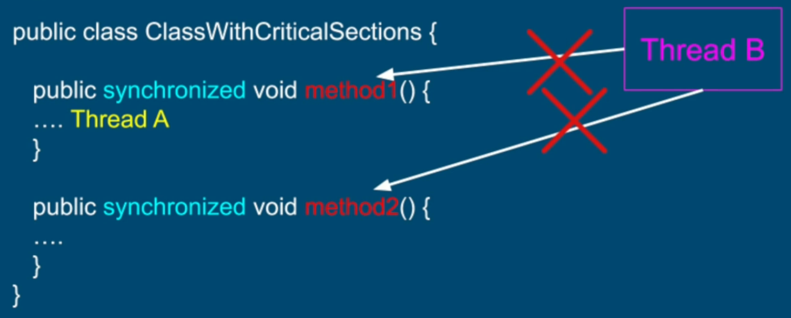
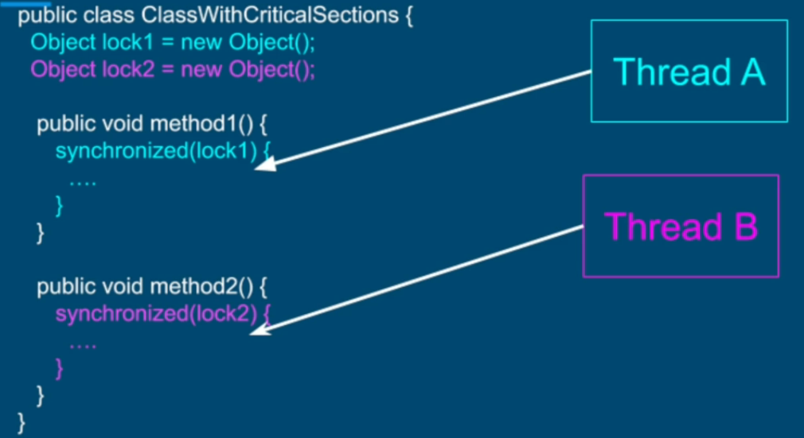
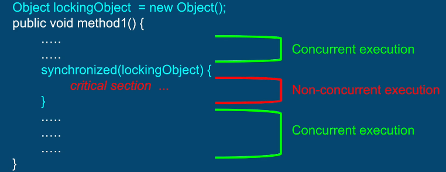
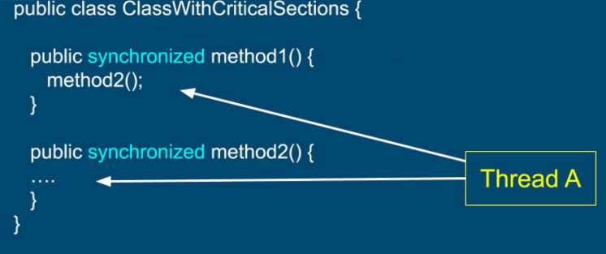

## Critical Section
We would like to perform a set of operations in such a way that they will all appear as a single atomic operation. No 2 threads can be performing those operations simultaneously. 

This section of code that we must protect from concurrent execution is called a **critical section**
```
    void aggregateFunction() {
        // enter critical section
        operation1();
        operation2();
        operation3();
        // exit critical section
        ...
    }
```
If there is no thread executing any of the operations in the critical section,  a thread can enter the critical section. If there is already a thread executing operations in the critical sections, other threads will be denied an entry into the critical section until the first thread exits the critical section. 

JVM with the support of OS and hardware system, provides us multiple tools to guard a block of code against a concurrent access by multiple threads. 

The most basic way to guard a critical section against concurrent access is by using ```synchronized``` keyword.
## ```Synchronized```
It provides a locking mechanism used to restrict access to a critical section or entire method to a single thread at a time

There are 2 ways to use a ```synchronized``` keyword.
### 1. Synchronized - Monitor
When multiple threads are going to try call these methods on **the same object of this class**, only one thread will be able to execute either of these 2 methods. ```synchronized``` is applied per object - the term for this is "Monitor".
```
    public class ClassWithCriticalSections {
        public synchronized void method1() {
            ...
        }
        
        public synchronized void method2() {
            ...
        }
    }
```



### 2. Synchronized - Lock
By restricting concurrent access to a block of code / section.
```
    public class ClassWithCriticalSections {
        // The object serves as a lock - it can be an any object
        Object lock = new Object();
        
        public synchronized void method1() {
            ...
            synchronized(lock) {   
                ...
                // critical section
                ...            
            }
            ...
            ...
        }        
    }
```

This method provides a lot of flexibility. We can rewrite section 1 above using this method by applying locks on multiple objects allowing 2 threads to enter the 2 methods simultaneously.

```
    public class ClassWithCriticalSections {
         Object lock1 = new Object();
         Object lock2 = new Object();
    
        public void method1() {
            ...
            synchronized(lock1) {
                ...
            }
            ...
        }
        
        public void method2() {
            ...
            synchronized(lock2) {
                ...
            }
            ...
        }
    }
```



We would like to minimize lines of code in a critical section to the bare minimum required. This way more code can execute concurrently giving higher performance.



**Synchronized block or method is Reentrant**
If a thread A is accessing a synchronized method while already being in a different synchronized method / block, it will be able to access that synchronized method with no problem. 



