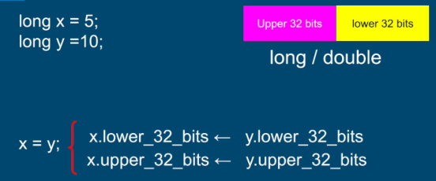

## Atomic Operations in Java
1. All reference assignments are atomic
- We can get and set references to object atomically
```
    Object a = new Object();
    Object b = new Object();
    a = b; //atomic
```
This makes all our getters and setting atomic - no need to synchronize them. 

2. All assignments to primitive types **except for long and double** are atomic
- Reading from and writing to following types are atomic - int, short, byte, float, char, boolean

long and double are exception to a previous rule because they are 64 bit long. 


To address this, long and double variable can be declared as ```volatile`` to make reads and write thread-safe

```
    volatile double x = 1.0;
    volatile double y = 2.0;
    x =  y; //atomic
```
