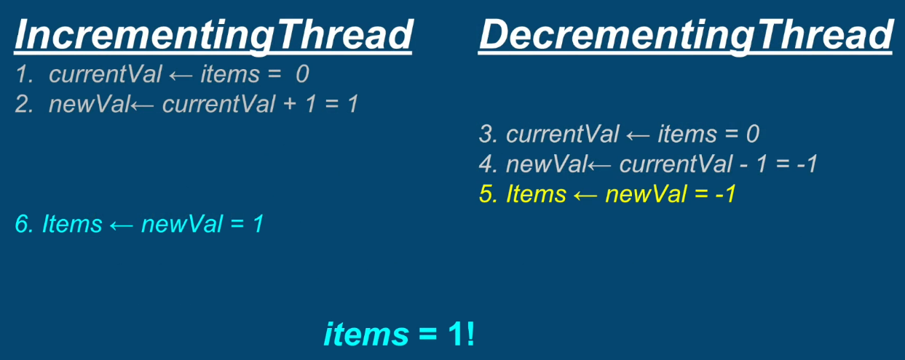
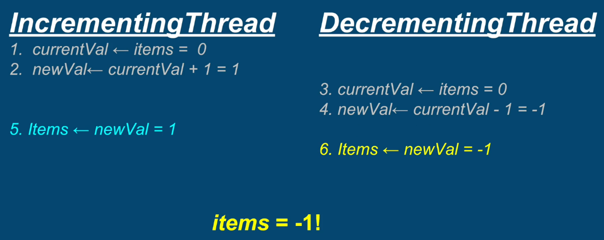
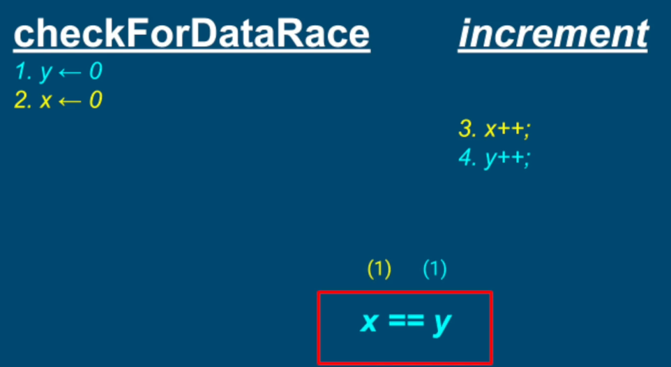
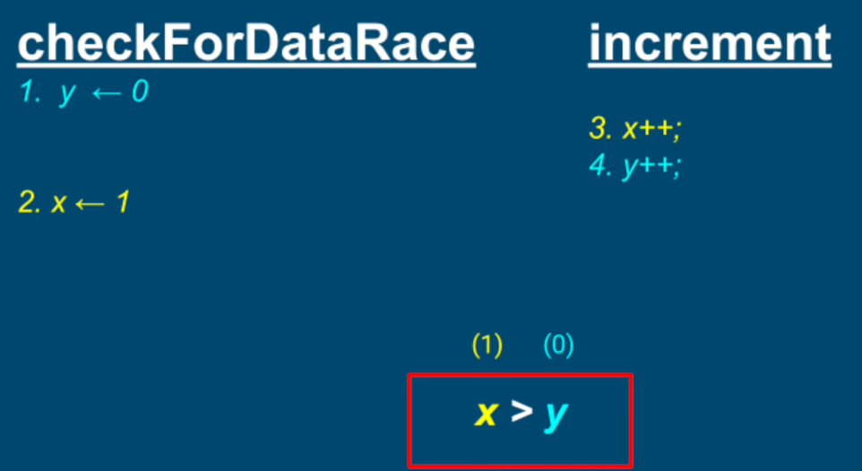
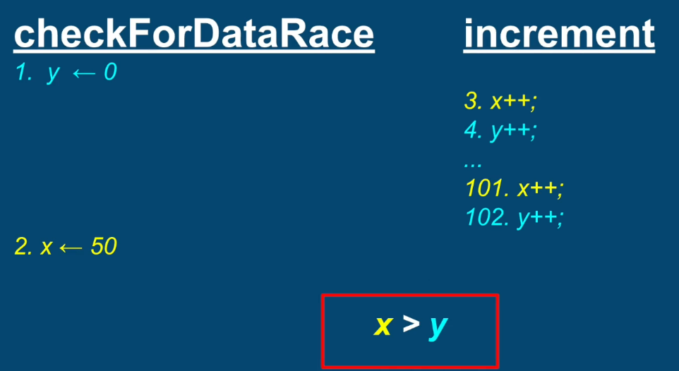
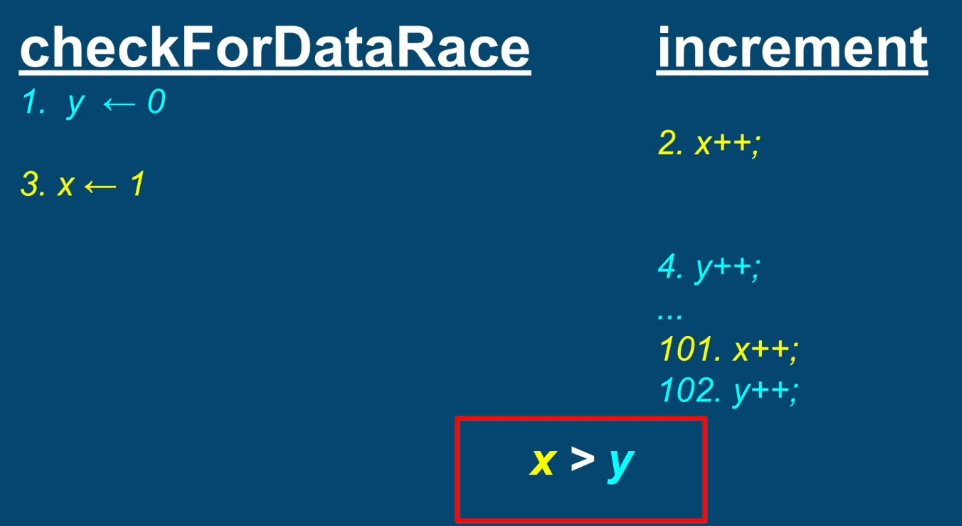
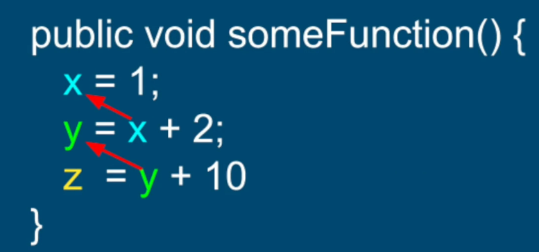
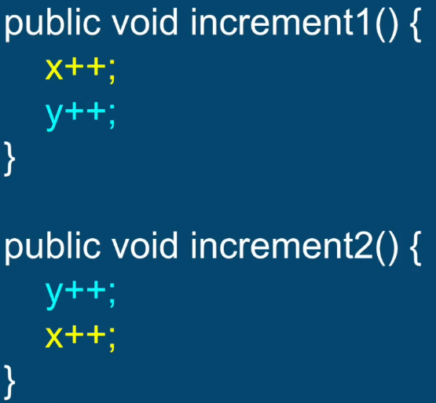
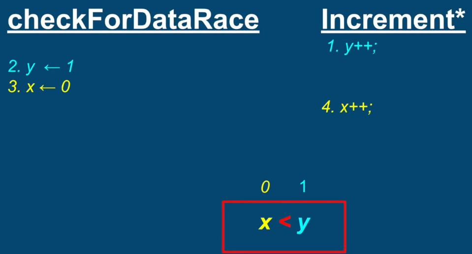
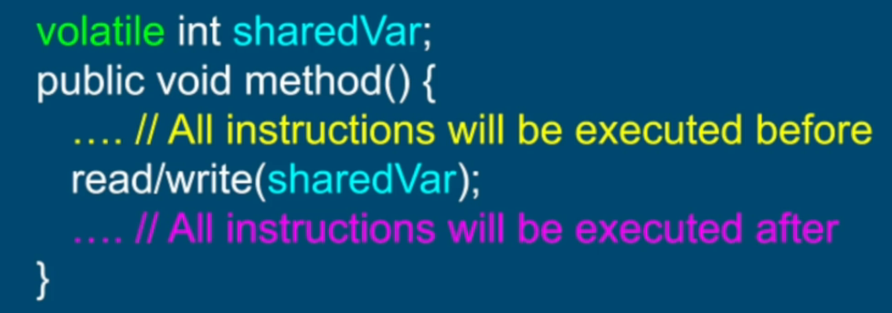

## Race Condition
1. Condition when multiple threads are accessing a shared resource
2. At least one of the threads is modifying the resource
3. The time of threads' scheduling may cause incorrect results
**The core of the problem is non atomic operations performed on the shared resource**

IncrementingThread doing items++ and DecrementingThread doing items--




### Solution
1. Identify the critical section where the race condition is happening
2. Protect a critical section by a ```synchronized``` block


## Data Race
**Example**
method ```increment()``` and ```checkForDataRace()``` are executed by different threads.
```
    public class SharedClass {
        int x = 0;
        int y = 0;
        
        public void increment() {
            x++;
            y++;
        }
        
        public void checkForDataRace() {
            if (y>x)
                throw new DataRaceException("This should not be possible...");
        }    
    }
```
If methods don't interleave, 


If methods do interleave in following way, we still get x > y




So our invariant ```x>=y``` should always hold true. But in reality we will get data race (i.e.; y > x) if we run above code.

### Reason for the Data Race
1. Very often, compiler and CPU may execute the instructions Out of Order to optimize performance and utilization 
2. They will do so while maintaining the logical correctness of the code
3. Out of Order execution by the compiler and CPU are important features to speed up the code
4. The compiler re-arranges instructions for better
- Branch prediction (optimized loops, if statements, etc)
- Vectorization - parallel instruction execution (SIMD)
- Prefetching instructions - better cache performance
5. CPU re-arranges instructions for better hardware units utilization

Following function will never be executed out of order because every line of code is dependent on a result of a previous line - we will never experience a data race here


But following function is prone to data race


Data Race lead to unexpected, paradoxical and incorrect results. 



### Solutions
Establish a **Happens - Before** semantics by one of the following methods;
1. synchronization of methods which modify shared resources
2. declaration of shared variables with the volatile keyword  - reduces an overhead of locking
Following is equivalent to memory fence / memory barrier

