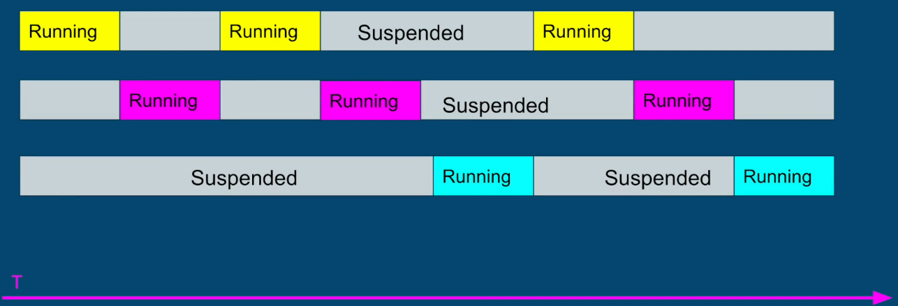
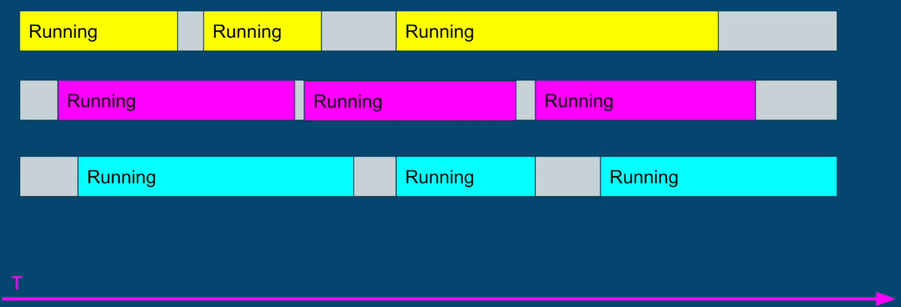
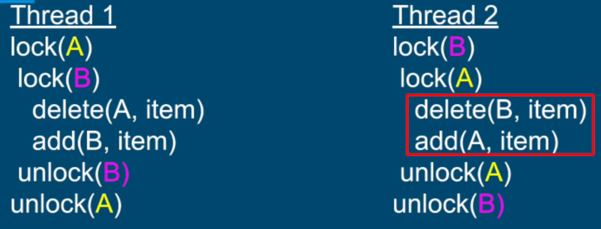
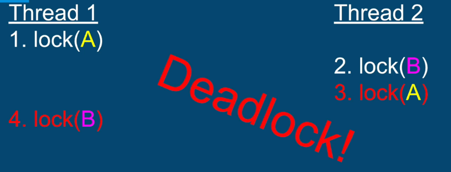
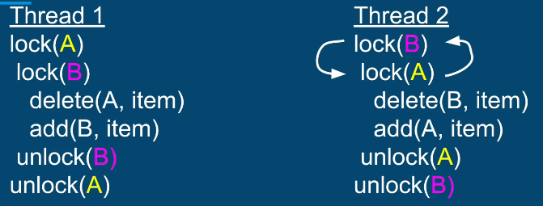

## Fine Grained Locking vs. Coarse Grained Locking


### Coarse Grained Locking
We have only single lock to worry about and we just use that lock whenever any shared resource is accessed. But this strategy may be an overkill - the operations below are not interfering with each-other - why not allow them run concurrently?
```
public class SharedClass {
    // We have 2 shared resources
    private DatabaseConnection dbConnection;
    private List<Task> tasksQueue;
    
    public synchronized Item getItemFromDB() {
        ...
    }
    
    public synchronized void addTaskToQueue() {
        ...
    }
}
```



### Fine Grained Locking
Allows more parallelism and less contention. 
```
public class SharedClass {
    // We have 2 shared resources
    private DatabaseConnection dbConnection;
    private List<Task> tasksQueue;
    
    public Item getItemFromDB() {
        synchronized(dbConnection) {
        ...
        }
    }
    
    public void addTaskToQueue() {
        synchronized(tasksQueue) {
        ...
        }
    }
}
```


## Deadlock
**But when we have multiple locks, we may run into a Deadlock**
Deadlock is a situation where everyone is trying to make progress but cannot. Because they are waiting for another party to make a move. This circular dependency is generally unrecoverable. 


### Deadlock in Softwares





### Conditions for Deadlock
1. **Mutual Exclusion** - Only one thread can have exclusive access to a resource
2. **Hold and Wait** - At least one thread is holding a resource and is waiting for another resource
3. **Non-preemptive allocation** - A resource is released only after the thread is done using it
4. **Circular Wait** - A chain of at least two threads each one is holding one resource and waiting for another resource

When all of the conditions are met, the deadlock is possible and is just a matter of time.

### Solutions to Deadlocks
If at least one of the above conditions are not met, deadlocks cannot happen.

#### Easiest Solution - Avoid Circular Wait
Enforce a strict order in lock acquisition - acquire the locks in the same order. Order of releasing the locks is not important here. Easy to do with a small number of locks


But hard to accomplish if there are many locks in different places. For such complex applications, other techniques can be used.
1. Deadlock Detection - Watchdog
2. Thread interruption (not possible with synchronized)
3. tryLock operations (not possible with synchronized)


