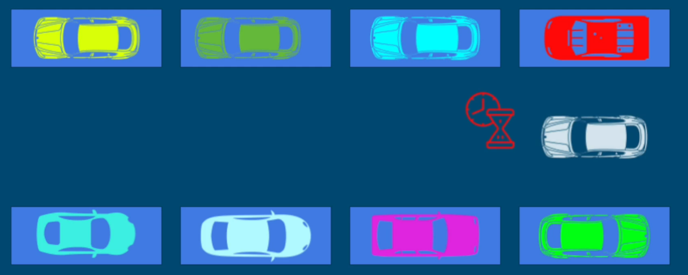

## Semaphore
Semaphore means "a set of gestures intended to convey a message." 

Semaphore in concurrency is like a permit issuing and restricting authority. 

1. It can be used to restrict the number of "users" to a particular resource or a group of resources
2. Unlike locks where only one user can access a resource at a given time, the semaphore can restrict any given number of users
to a resource

**Example**
Parking lot with 8 parking spaces - 8 parking permits can be issued to 8 cars. 8 cars at a time can access the resource, parking lot. Where there are 8 cars in the lot, any additional car wanting to park will have to wait to acquire the permit.


### How to Use
Initialize ```Semaphore`` with available permits.
```
    Semaphore semaphore = new Semaphore(NUMBER_OF_PERMITS);
    semaphore.acquire(2); // NUMBER_OF_PERMITS - 2 now available 
    useResource();
    semaphore.release(2); // NUMBER_OF_PERMITS now available
```
**We can think of a lock as one particular form of semaphore where there is only 1 permit to give**

### How Semaphore is different from locks?
1. Semaphore doesn't have a notion of owner thread since many threads can acquire a permit
2. The same thread can acquire the semaphore multiple times
3. Semaphore can be released by any thread - even can be released by a thread that hasn't actually acquired it

**Semaphore shouldn't be used as locks** They have other use cases.

### Producer-Consumer Use Case
```
    Semaphore full = new Semaphore(0); // the first thread that tries to acquire it will get blocked
    Semaphore empty = new Semaphore(1); 
    Item item = null; // item will be shared between a producer and a consumer
```
**Consumer Thread**
```
    while(true) {
        full.acquire(); // will get blocked and wait for producer to produce an item
        consume(item);
        empty.release();
    }
```

**Producer Thread**
```
    while(true) {
        empty.acquire();
        item = produceNewItem();
        full.release();
    }
```

If consumer is faster, it will spend most its time waiting and not wasting CPU.
If consumer is slower, it is guaranteed that producer won't produce more items until consumer is done consuming them.

Above example works for 1 producer and 1 consumer.

For **many producers and many consumers**;
```
    Semaphore full = new Semaphore(0); // the first thread that tries to acquire it will get blocked
    Semaphore empty = new Semaphore(CAPACITY); 
    Deque<Item> queue = new ArrayDeque<>();
    Lock lock = new ReentrantLock();
```
**Consumer Thread**
```
    while(true) {
        full.acquire(); // will get blocked and wait for producer to produce an item
        lock.lock();
        Item item = queue.poll();
        lock.unlock();
        consume(item);
        empty.release();
    }
```

**Producer Thread**
```
    while(true) {
        Item item = produceItem();
        empty.acquire();
        lock.lock();
        queue.offer(item);
        lock.unlock();
        full.release();
    }
```

