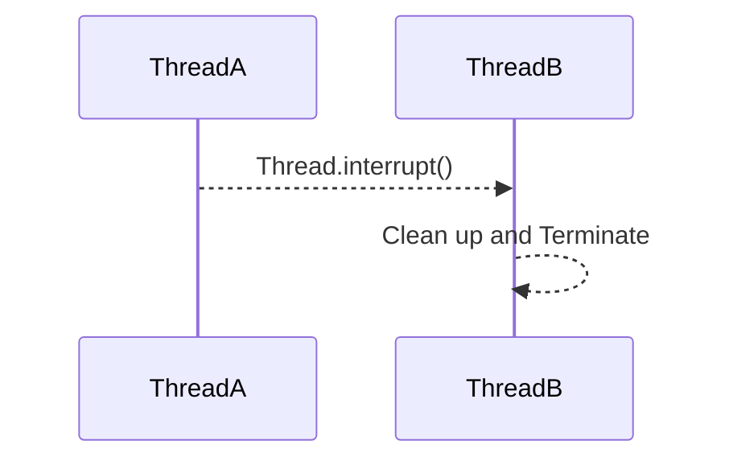
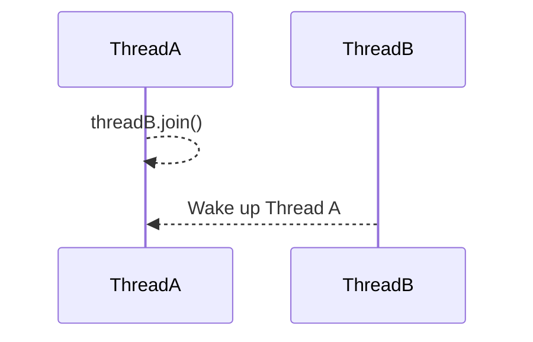
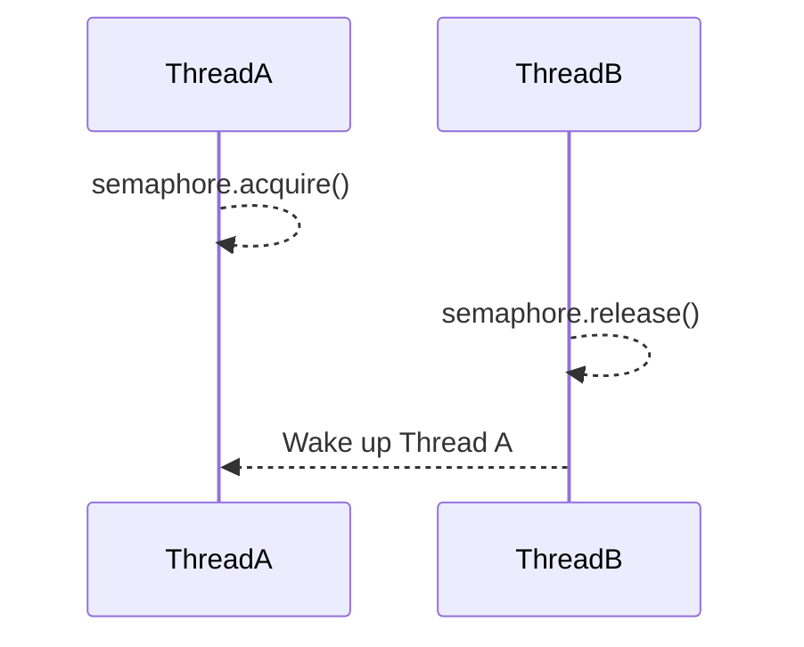

## Ways of Inter-thread Comms
### 1. Thread.interrupt()

```mermaid
    sequenceDiagram
        ThreadA -->> ThreadB : Thread.interrupt()
        ThreadB -->> ThreadB : Clean up and Terminate
```

### 2. Thread.join()

```mermaid
    sequenceDiagram
        ThreadA -->> ThreadA : threadB.join()
        ThreadB -->> ThreadA : Wake up Thread A
```

### 3. Semaphore

```mermaid
    sequenceDiagram
        ThreadA -->> ThreadA : semaphore.acquire()
        ThreadB -->> ThreadB : semaphore.release()
        ThreadB -->> ThreadA : Wake up Thread A
```
