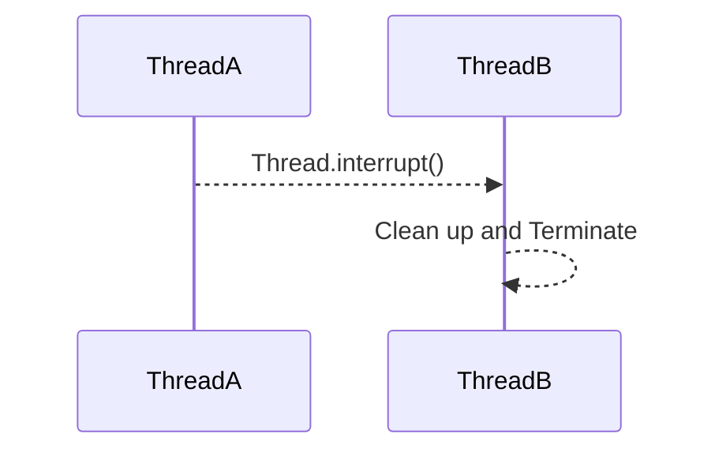
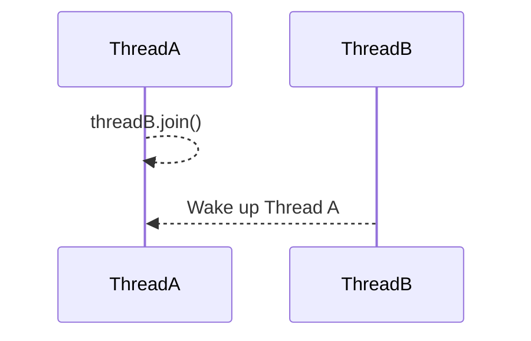
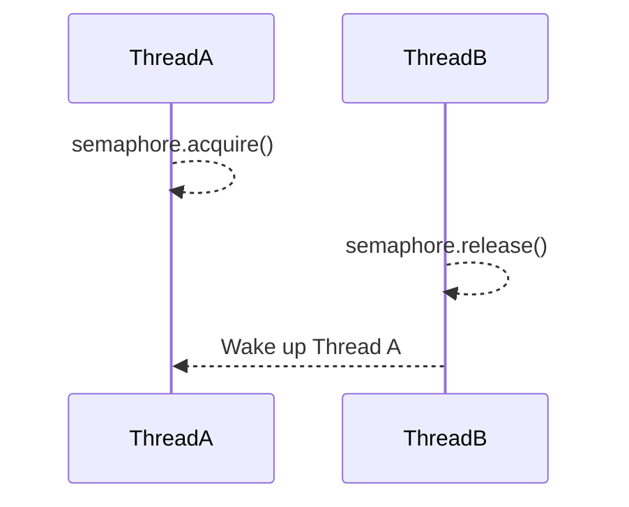
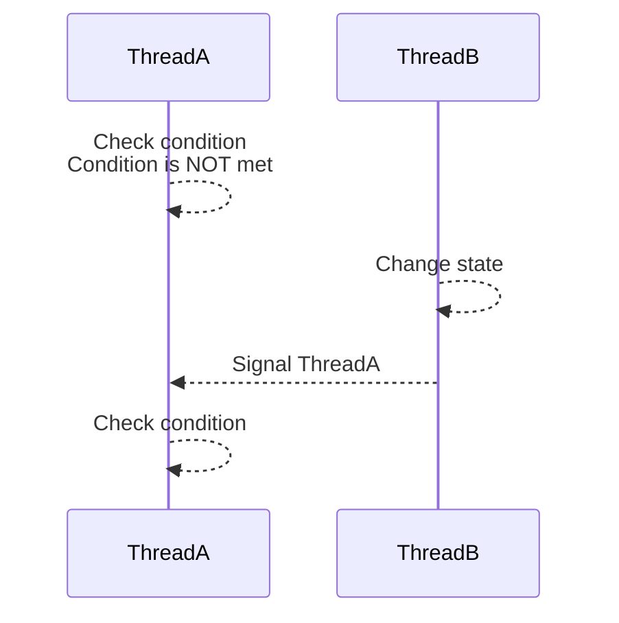

## Ways of Inter-thread Comms
### 1. Thread.interrupt()
When we call interrupt() on a current thread object, we send a signal to another thread. This signal is used only in one context - when we want to let threadB know that we want it to interrupted.


### 2. Thread.join()
When threadA wants to give up its CPU and wait until threadB was terminated (done with its work). This can accomplished by calling join() method on threadB. This way, when threadB gets terminated, it sends a signal to wake up threadA. 


### 3. Semaphore
1. Calling acquire() on a semaphore is equivalent to checking the condition "Is Number of Permits > 0?"
2. If the condition is NOT met, threadA goes to sleep until another thread changes the semaphore's state 
3. When threadB calls release() method, threadA wakes up
4. threadA checks if the condition "Is Number of Permits > 0?"
- If it is, threadA continues to the next instruction



### 4. Condition Variable
1. threadA checks for some condition
- if the condition is not met, we can choose to suspend a current thread, threadA 
- if the condition is met, it can continue with executing further instructions

2. Condition variable is always associated with a lock
3. The lock ensures atomic check and modification of the shared variables, involved in the condition

#### How to Use?
**Producer Consumer Example**
```
    //Creation
    Lock lock = new ReentrantLock();
    Condition condidtion = lock.newCondition();
    
    String username = null, password = null;
```

**Authentication Thread**
```
    lock.lock();
    try{
        while (username== null || password ==  null) {
            condition.await(); // unlock lock, wait until signaled
        }
    } finally {
        lock.unlock();
    }
    doStuff();
```

**UI Thread**
```
    lock.lock();
    try{
        username = userTextbox.getText();
        password = passwordTextbox.getText();
        condition.signal(); // wakes up authentication thread that is currently blocked on the wait() method
    } finally {
        lock.unlock();
    }    
```

##### Condition.await()
1. void await() - unlock lock, wait until signalled
2. long awaitNanos(long nanosTimeout) - wait no longer than nanosTimeout
3. boolean await(long time, TimeUnit unit) - wait no longer than time, in given time unit
4. boolean awaitUntil(Date deadline) - wake up before the deadline date
    
##### Condition.signal()
1. void signal() - wakes up a single thread, waiting on the condition variable. If there are more than 1 threads waiting, only one of those threads is going to be woken up

The thread that wakes up has to reacquire the lock associated with the condition variable

2. void signalAll() - Broadcast a signal to all threads currently waiting on the condition variable. All the threads will wake up. The signalling thread doesn't need to know how many (if at all) threads are waiting on the condition variable
