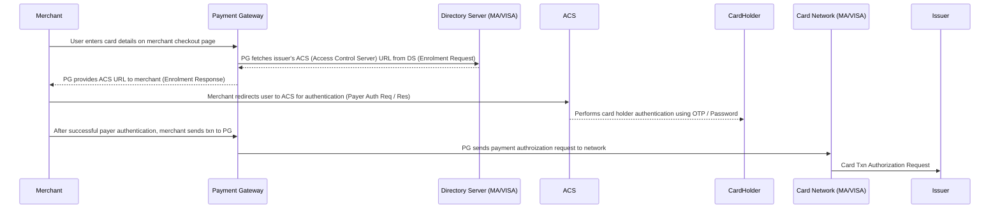
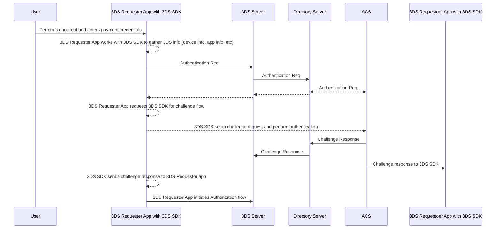

# 3DS (3Domains Secure)
- 3 Domains - acquirer / merchants, issuers and card network. The purpose is to shift CNP (Card Not Present) txn liability from merchant to issuer domain. 
- As part of 3DS, cardholder is authenticated before a normal transaction authorization step.

## eCommerce Transaction Flow (3DS1.0)

User is authenticated by password or OTP. ACS handles this part.
### Challenges
1. Tightly coupled with web interface for authentication
2. Password and OTP based authentication 
3. Limited data-points available to exchange between parties
4. Checkout experience and cart abandonments - users forgetting password / OTPs not reaching

## Enters 3DS2.0
Enhanced version of 3DS1.0 developed by EMVCo
### Enhancements
1. MPA (Mobile Payment App) based authentication in addition to the browser based
2. Support for non-payment authentication
3. Talks about friction-less flow, Challenge flow (Browser / MPA), Merchant initiated transactions

### Transaction Types
1. MPA based
2. Browser based
3. Merchant Initiated Transactions

### Authentication Flows
1. Challenge Flow
2. Friction-less Flow

### Parties Involved
#### 1. 3DS Server
1. Payment gateways, PSPs, Acquirer who provide the MPI (Merchant Plug-In), PG to merchants
2. Works with DS for authentication request / response

#### 2. 3DS Requester
1. Merchant website / mobile app
2. Works with 3DS server for performing the txn
3. MPA based - integrates with 3DS SDK typically provided by the 3DS server provider
4. Browser based - works with user browser

#### 3. 3DS Client
1. Component that performs the authentication with ACS, collects data for an authentication Req msg
2. MPA - Separate SDK that integrates with the requester app & works with ACS for authentication
3. Browser based - Similar to traditional approach to collect data via browser, and invoke auth via browser

#### 4. Directory Server
1. Route messages between ACS and 3DS server
2. Validate 3DS server, 3DS requester and 3DS SDK

#### 5. ACS
1. Verify if cardholder is eligible for 3DS
2. Validate if device is eligible for 3DS auth
3. Authenticate the cardholder

### Transaction Flow

### Friction-less Transactions in 3DS 2.0
NO explicit 2FA a.k.a "Challenge"

#### How is it possible?
##### Risk Based Authentication
Due to enriched data of 3DS2.x, issuers (their ACS) are able to make a call to "skip" the challenge and complete the authentication step.

Some of the data points used by ACS for risk based authentication;
###### Device / Browser Fingerprint
1. Every issuer / ACS has a <b><i>Method URL</i></b>, say a script (JS) that can collect browser / device info.
2. Card network "Directory Server" maintains the list of all <b><i>Method URLs</i></b> per issuer / ACS - BINs

  ```mermaid
  sequenceDiagram
  3DS Server->>Directory Server: Preparation Request (PREQ) to Director Server to collect issuer card ranges / ACS info
  Directory Server-->>3DS Server: Preparation Response (PRES) all info with Method URLs that 3DS server caches
  3DS Server ->> 3DS Client: At start of every transaction, 3DS Client receives the Method URL
  3DS Client ->> Directory Server: The JS at the Method URL is executed on the client browser to collect browser / device info
  ```
###### Past Transaction Behavior
###### Transaction Amount

## 3DS1.0 vs 3DS2.0
### Support for Friction-less txns
Due to extent of data elements exchanged, issuer can decide and choose to skip authentication
### Support for more authentication methods
In addition to OTP/static passwords, bio-metrics and other (device fingerprint) options are supported
### More data exchanged
10x more data than 1.0 from merchant to issuer - almost 150 elements including some optional and conditional elements


