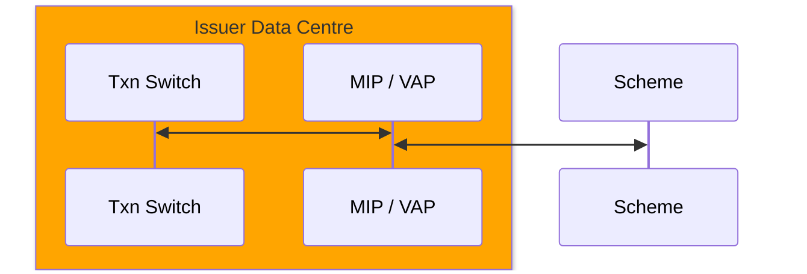
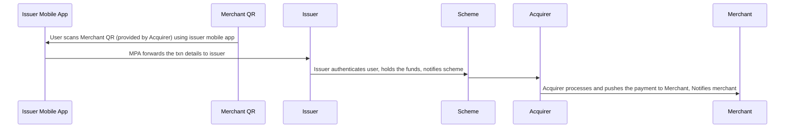

RANDOM NOTES

## Traditional Payment Protocals
POS <-> Acquirer, Acquirer <-> Scheme, Scheme <-> Issuer
1. Protocol - TCP/IP Socket
2. Message Format - ISO8583

### Authorization Technical Flow 

MA / Visa provide a hardware / software system called MIP (Mastercard Interface Processor) / VAP (Visa Access Point) to issuer that controls a communication with Banknet / VisaNet over TCP/IP socket

## Push & Pull Payments
### Pull Payments - Traditional Payment System - Acquirer ecoystem initiates
Card-Holder <-> Merchant <-> Acquirer <-> Scheme <-> Issuer - Merchant initiates the transactions and "pulls" the funds from the issuer

### Push Payments - Issuer ecosystem initiates
Customer <-> Issuer App <-> Issuer <-> Scheme <-> Acquirer <-> Merchant  
1. Customer initiates the txn to issuer using issuer provided app
2. Issuer "pushes" the txn to the merchant

#### Various Modes of Txn Initiation
##### QR Code
1. Static
2. Dynamic

##### Manual Entry of Merchant's A/C
##### NFC Tag
##### Bluetooth Smart Device

### Push vs. Pull Payments
<table>
    <tr><th>Pull Payments</th><th>Push Payments</th></tr>
    <tr><td>Initiated by Acquirer ecosystem; like POS terminal</td><td>Initiated by card-holder using issuer provided app</td></tr>
    <tr><td>Authenticated using PIN, Signature, 3DS(captured at acquirer and authenticated by issuer)</td><td>Issuer authenticates using their own passcode</td></tr>
    <tr><td>Currency conversion usually done by acquirer</td><td>Currency conversion usually done by issuer</td></tr>
    <tr><td></td><td>Issuer holds the funds and pushes it to acquirer</td></tr>
</table>

### QR Payment Flow

