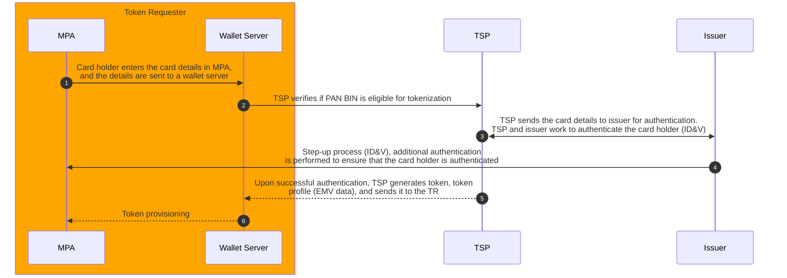
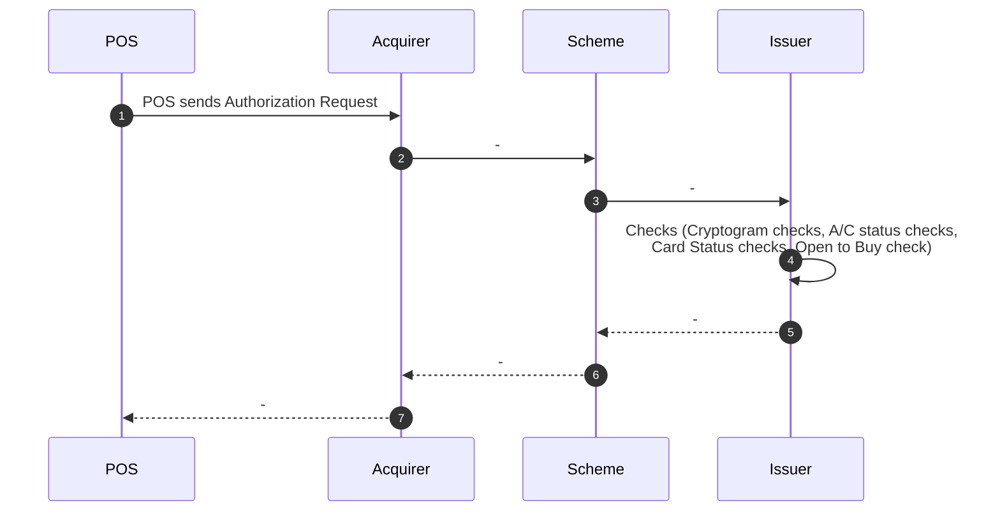
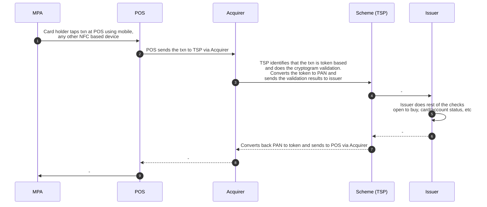

# Why Tokenization?

## Payment Channels
1. During on-line checkout, merchants do offer an option to store user card details (Card-on-File).
2. OEM Wallets (Apple Pay, Samsung Pay, Google Pay), provide feature to "Add Card". And users can use the card to make Contactless, QR-Code and In-App payments
3. Issuer wallets / payment apps
4. End payment devices - Smart watches, keyfobs using NFC

Traditionally, issuer issues EMV chip-card to consumers and in-store, card present txns are considered secured becuase the account data flows in more controlled manner.

<mark>With advent of new payment channels, and enter / store card # features, card # is now is stored on end-devices. Most of these channels, issuer doesn't have control. This raises a security concern.</mark>

<mark><b>Network Tokenization</b> tries to address this security concern. Instead of storing actual card #, PAN is translated to surrogate PAN (also called token) and token is stored on end devices, instead.</mark>

# What is a Network Token?
1. Surrogate value for PAN
2. <mark>Token number is like Card number (BIN + Seq# + Check-digit)</mark>
3. <mark>No changes to acquiring infrastructure</mark>
4. a.k.a. "Reversible non-Cryptographic Token"
5. <mark>One PAN to many tokens  (one token per device) - depending on number of end-devices / channels where user registers her card number</mark>

# Key Stakeholders
## Token Requester (TR)
1. Authorized Entity that can request tokens
2. Can be an eCommerce  website / app
3. Can be an OEM / MNO payment wallet
4. Can be an issuer wallet
5. Typically, a combination of MPA and wallet server - wallet server registers with TSP (Token Service Provider) and becomes a TR

## Token Service Provider (TSP)
1. Handles token requests from TR
2. Controls the token issuance process - involves end-device authentication, card holder authentication, etc
3. Maintains token vault - mapping between PAN <-> token
4. Provisions EMV token profile - important for Contactless payments
5. Issuer interface - ID&V and life cycle mgnt - any changes to card or account status impacts tokens associated with it
6. Txn processing
7. Typically, TSPs are Schemes

# Tokenization Issuance Process - Overview
1. Token Assurance - is the process, of validating if the person adding the PAN is the rightful owner of the PAN
2. Token Generation - is the process of generating a token number and token expiry date for a given PAN - TSP does this
3. Token Issuance - is the process of generating all associated data for a token like the personalization data, including keys (say EMV data) - TSP does this
4. Token Provisioning - is the process of delivering token and associated data to the token location. i.e.; MPA .

# Token Issuance
## 3 Major Steps
### Card Availability - BIN Availability Checks
TSP checks if card BIN is eligible for tokenization
### Card Eligibility - Card Authentication
TSP works with issuer to authenticate card
### Step-up Process - Customer Authentication via OTP / call

## Flow

Steps 1-4 - Token Assurance

## Important ISO8583 Messages (MA -> Issuer)
### Card Eligibility
Token Eligibility Request - 0100 message followed by Token Authorization Request - 0100 message

### Step-up Process
1. Activation Code Notification - 0100 - TSP send to issuer to further send it to card holder's mobile
2. Tokenization Completion Notification -0620 OR Tokenization Event Notification - 0620

## Transaction Processing
### EMV Chip Card Present Txn Flow

Notes;
1. Issuer maintains KMS and HSM
2. Stores EMV card profile data
3. Validates it at the time of authorization

### NFC Tap & Pay Txn Flow (With Tokenization)

Notes;
1. No impact on acquirer
2. TSP does the heavy lifting
3. Issuer has reduced responsibility
   

