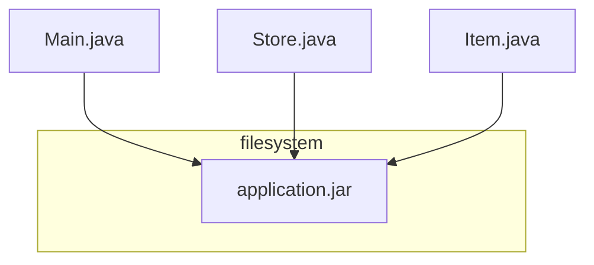

# Challenges with Centralized System
1. Performance and storage - Vertical scaling is limited
2. High Latency & poor use experience - for users from other continents wanting to user our service 
3. Availability - Single point of failure
4. Security and Privacy

# Distributed System as a Solution
is relevant for system having following requirements;
1. Large # of requests
2. Large # of data
3. Horizontal scaling - auto-scaling
4. High Availability
5. Low latency - served from nearest zone / region to user

# Definition

A **Distributed System** is a system of several **processes**, running on **different computers**, communicating with each other through the **network** and are sharing a **state** or are working together to achieve a **common goal**.

Distributed systems are everywhere. Even a simple website running on cloud is distributed system because cloud itself is distributed.

Beauty of a distributed system is that
1. As a user, you are not aware of the complexities of the system
2. It just works!
3. Feels like a single machine

## Process


```mermaid
    flowchart TB
        subgraph filesystem
            other-app.jar
            application.jar
            photo.jpeg
            music.mp3
        end
        
        subgraph memory
            process id 1324
        end
        
        CPU --> application.jar
        application.jar --> process id 1324        
        ```

## Node
process running as a dedicated machine

## Cluster
collection of nodes connected to each other.

The nodes in a cluster are working on the same task, and typically are running the same code.

# Challenges
