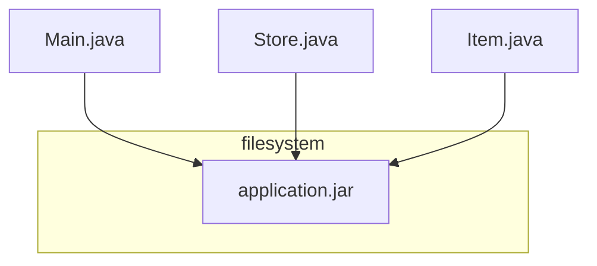
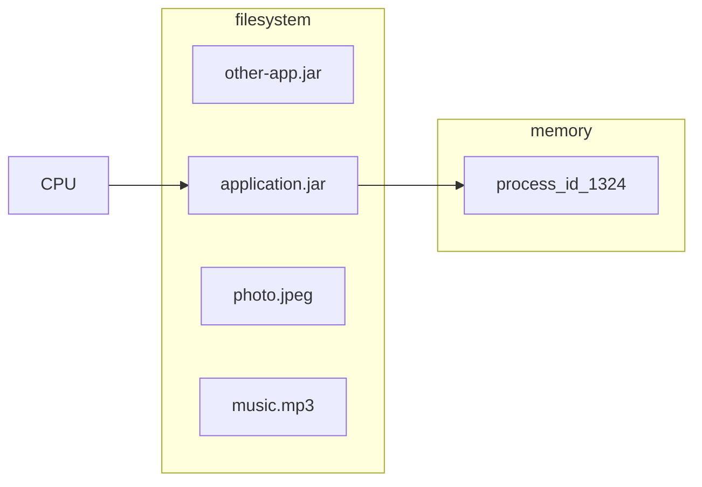

# Challenges with Centralized System
1. Performance and storage - Vertical scaling is limited
2. High Latency & poor use experience - for users from other continents wanting to user our service 
3. Availability - Single point of failure
4. Security and Privacy

# Distributed System as a Solution
is relevant for system having following requirements;
1. Large # of requests
2. Large # of data
3. Horizontal scaling - auto-scaling
4. High Availability
5. Low latency - served from nearest zone / region to user

# Definition

A **Distributed System** is a system of several **processes**, running on **different computers**, communicating with each other through the **network** and are sharing a **state** or are working together to achieve a **common goal**.

Distributed systems are everywhere. Even a simple website running on cloud is distributed system because cloud itself is distributed.

Beauty of a distributed system is that
1. As a user, you are not aware of the complexities of the system
2. It just works!
3. Feels like a single machine

## Process

OS creates an instance of the application in the memory. That instance is called the process. That process is entirely isolated from any other process running on the same computer - no matter if the other process is an instance of the same app or a different app.

Processes running on  the same machine can communicate with each other through the network, file-system and the memory. This still not a distributed system because all the processes share the same resources and cannot be scaled horizontally.
