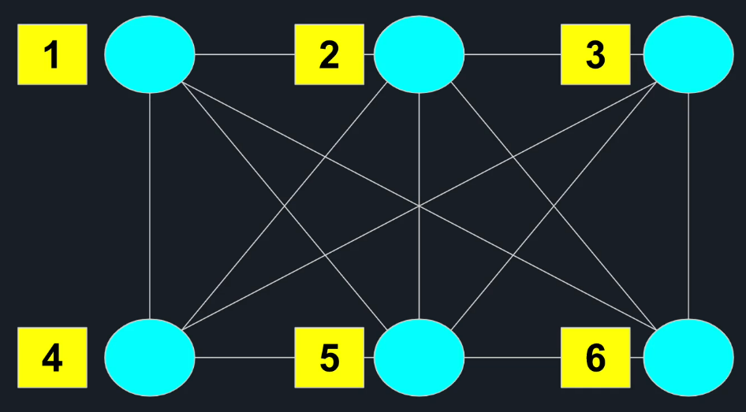
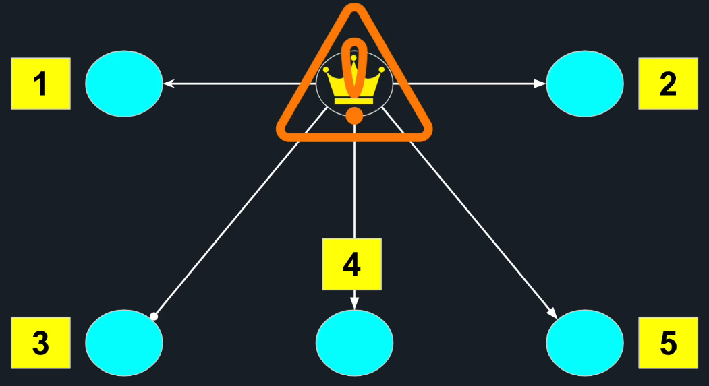
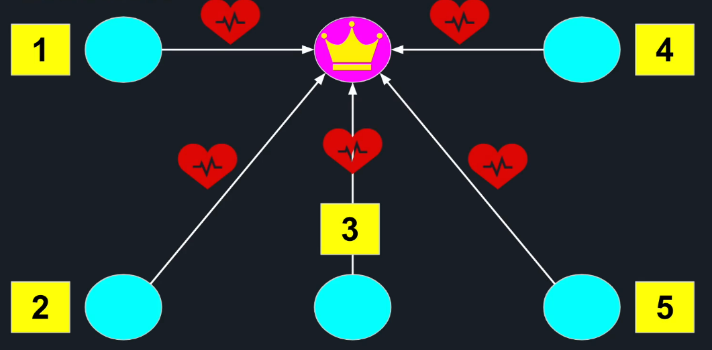
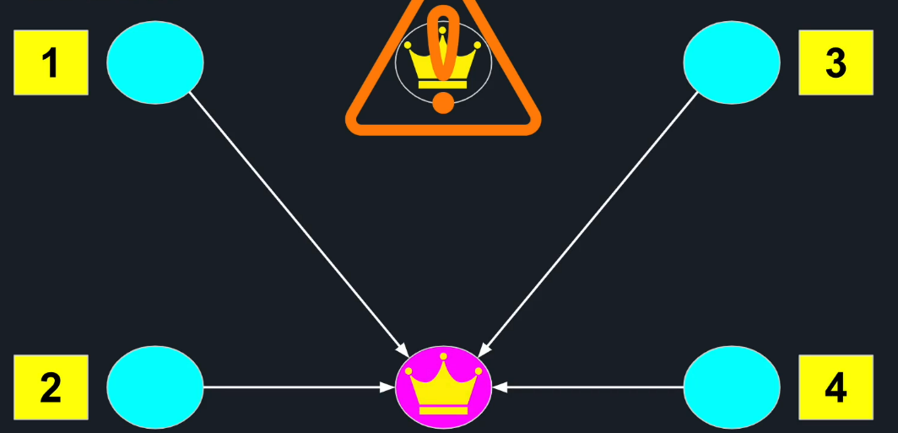
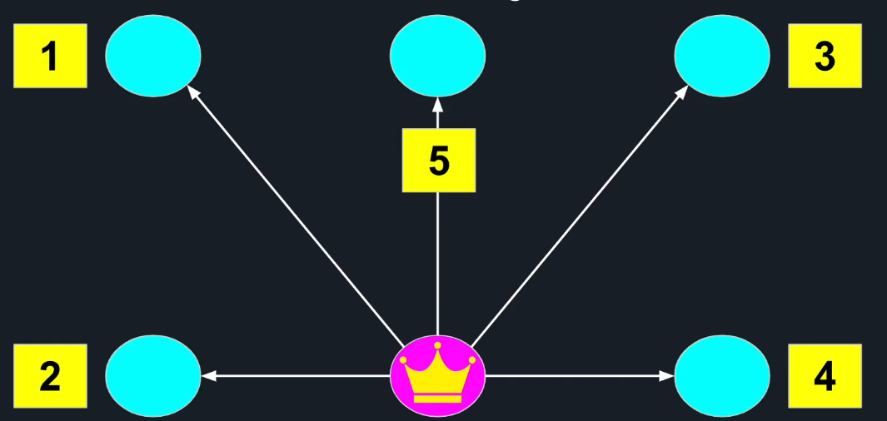
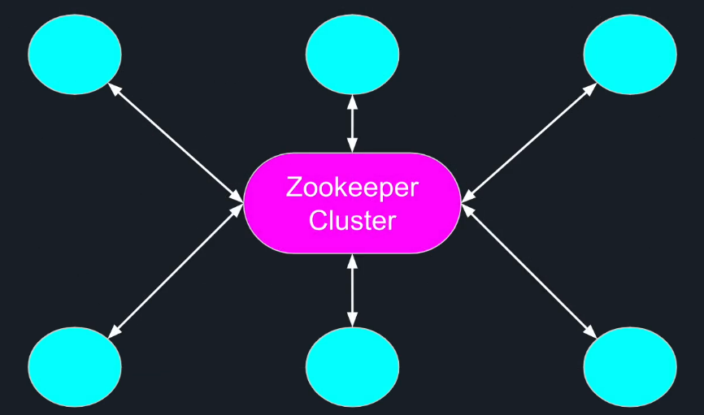
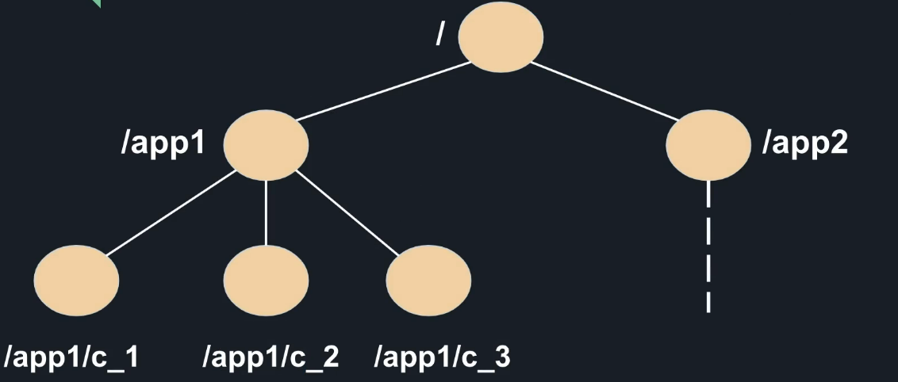
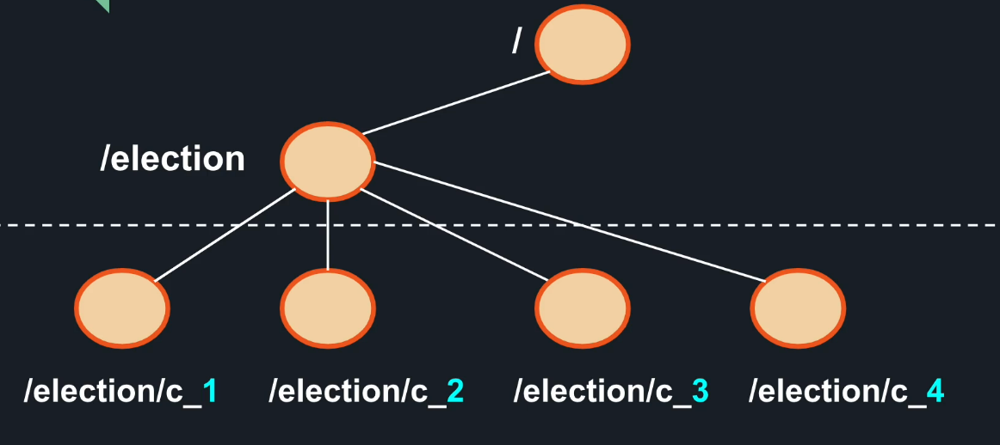
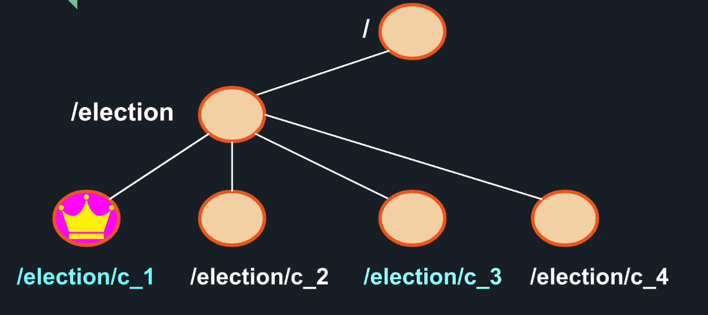

# Terminology
## Node
process running on a dedicated machine

When 2 nodes have edge between them, those 2 processes can talk to each other over a network.

## Cluster
collection of nodes / computers connected to each other.

The nodes in a cluster are working on the same task, and typically are running the same code.

# Master-Workers Architecture
## How to hand a task to a Cluster?

## How to break the work among nodes?
The biggest advantage of distributed system is that we can parallelized the work and let each node run the task independently for that common goal.

### Attempt 1 - Manual Distribution
Won't scale

### Attempt 2 - Manually elect a leader
The leader would be responsible to distribute tasks among the worker nodes & collecting the results. But what if leader goes down?

If leader is  not there to distribute tasks or collect the results, entire cluster is decommissioned.

**In a large distributed system, failure is not a question of if, but question of when**

### Attempt 3 - Automatic leader election
Have an algorithm for cluster to elect their own leader and watch the leader's health. 

If the master node becomes unavailable, the remaining nodes reelect the new leader

Later when the old leader node recovers from its failure, it realizes that it is  not a leader anymore and joins the cluster as a worker node.

## Challenges
1. How to elect leader?
2. By default each node knows only about itself and has no knowledge of who else is part of the cluster- so we need some sort of service registry and discovery to allow node to communicate to other nodes in a cluster
3. Failure detection mechanism is necessary to trigger automatic leader reelection in a cluster

## Solutions
There are many solutions / algorithms for consensus and failover for master-workers coordination. Some of the popular solutions out there for the same are;
1. Apache Zookeeper - high performance open-source coordination service designed for distributed systems. Used by many projects (kafka, hadoop, Hbase, etc). Provides an abstraction layer for higher level distributed algorithms
2. Netflix Eureka
3. Consul

## What makes Zookeeper a good solution?
1. distributed system itself that provides us high availability and reliability
2. typically runs in a cluster of odd number of nodes, higher than 3
3. Uses redundancy to allow failures and stay functional

## How Zookeeper works?
Provides abstraction similar to a tree / file system.

Instead of our nodes communicating directly with each other to coordinate the work, they are going to communicate with zookeeper servers (cluster of zookeeper servers) directly. 

**ZooKeeper's Abstraction and Data Model**
Each element is called a Znode

### Znode properties
1. Hybrid between a file and a directory
- Znodes can store any data inside (just like a file)
- Znodes can have children Znodes (like a directory)

### Znode Types
1. Persistent - persists between sessions. if our app disconnects from Zookeeper cluster and reconnects, the persistent Znodes created by our app stays intact with all its children and data
2. Ephemeral - is deleted when the session ends. Is a great tool for us know if an another node in app cluster that created them went down.

### Leader Election Algorithm
1. Step 1 - Every node that connects to zookeeper volunteers to become a leader. Each node submits its candidacy by adding a Znode that represents itself under the /election parent. Since zookeeper maintains a global order, it can name each Znode according to its order of addition

2. Step 2 - After each node is done creating its Znode, it queries for current children of /election parent.  

3. Step 3 - If the Znode that current node created is the smallest number, it knows that it is now the leader. On the other hand, if the Znode that current node created is not the smallest, it knows that it is not a leader and it waits for work to be assigned.  This is how we break the symmetry.  

