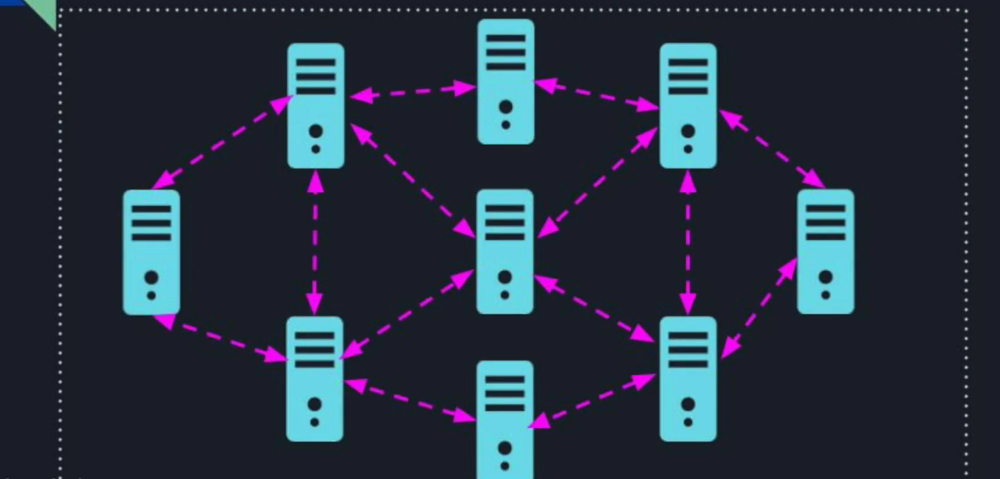

# Introduction
## Service Discovery
When a group of nodes / computers start up, only device that they are aware of are themselves even if they are connected to same network. 

To form a logical cluster, different nodes need to find out about each other. They need to learn who else is there in the cluster and more importantly, how to communicate with those other nodes.

### Static Configuration 
Limitation of manually updating the list of nodes & redistributing the config file if a node goes down or a new node is added.

### Dynamic Configuration
Many companies use static configuration with some level of automation - every time a new node is added, a central config is updated. Then an automated configuration management tool like Chef or Puppet, can pick up the configuration and distribute it among the nodes in the cluster

More dynamic but still involves a human to update the config

ZooKeeper enables fully automated service discovery. 

### ZooKeeper way
#### Service Registry
We start with a permanent znode /service_registry. Each node that joins the cluster adds an ephemeral sequential znode under /service_registry. The node also adds its address inside each znode

#### Service Discovery
Each node that wants to communicate with other nodes in the cluster, registers a watcher on /service_registry for any change in children

To read or get the particular node's address, node can get it from other node's znode

This implementation allows a full **peer-to-peer communication** where each node can talk to any node in cluster.

In case of, **Leader-Workers architecture**, workers don't need to know about each other at all nor the leader needs to register itself to the /service_registry.

- Workers register themselves with the cluster
- Only the leader will register for the notifications - addition / removal of znodes. This way, the leader will know state of the cluster at all times and distribute the work accordingly. If a leader dies, the new leader will remove itself from the /service_registry and continue distributing the work

#### Key points
- Automated service discovery allows the system to be dynamic as nodes can be added or removed at any point
- We will still need to distribute the address of zookeeper to all the cluster
- static / manual config is still valuable despite its limitations

