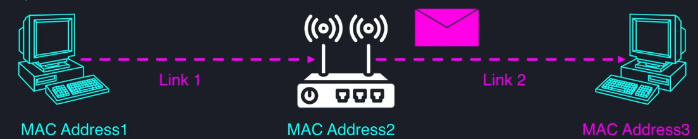

# Introduction

## Multi-threading vs Distributed System
In multi-threaded env, threads can communicate with each other through shared memory. Locks are used for protection against race conditions and semaphores / condition variables are used for signaling.


In distributed systems, we don't have a shared memory. Only way for nodes to communicate with each other is through network.


## TCP-IP Network Model
It is based on a layered architecture. Higher layer depends on lower layer abstractions.

Higher the abstraction layer, closer it is to us, a software developers / users. Lower the abstraction layer is, closer it is to physical layer / hardware.


### Layer 1 - Data Link
1. Physical delivery of data between 2 points over a single link
2. In charge of
- Encapsulation of data
- Flow control
- Error detection
- Error correction, etc..


The commonly used protocol in this layer is Ethernet protocol. This protocol wraps our data into frames and uses devices MAC addresses  to deliver those packages from one device to other.


### Layer 2 - Internet
It typically uses Internet Protocol (IP). Each device in the network is assigned an IP address. This allows packets to travel from source host to destination host.


The internet layer is responsible to deliver the packet from one computer to another. It doesn't know to what specific application process on a destination host the packet is intended for. Nor does it know what application process on source host sent it. For that purpose, we have a transport layer

### Layer 3 - Transport
This abstraction layer takes care of delivering message end-to-end - from process on one machine to a process on another machine. In transport layer, each endpoint / socket identifies itself by 16bit port number. 


In transport layer, there are 2 primary protocols;
1. **User Datagram Protocol (UDP)**
- Connection less
- Best Effort based delivery - unreliable
- Messages can be lost, duplicated or reordered
- Based on unit called Datagram which is limited in size
- **UDP is preferred when the speed and simplicity is more important than reliability**
- **UDP allows broadcasting** - you can broadcast a message in network without knowing what all other computers are out there in the network - this decouples sender from receiver(s)

- **Use cases**
Sending debug information to a distributed logging service. If some log messages get lost, its not a big deal as long as those are not financial data


Real time data stream service such as video or audio


Online Gaming


2. **Transmission Control Protocol (TCP)**
- Reliable - guarantees data delivery as sent, without any losses, duplications or reordering.
- Connection between 2 points - no broadcasting like UDP
- The connection between 2 points needs to be established before data is sent and in the end, has to be shutdown gracefully.
- Works as stream of bytes unlike UDP (individual packets)
- More popular in distributed systems because of the reliability


Since TCP works on stream of bytes, it is difficult to know where the message starts and where it ends. That's where application layer helps.


### Layer 4 - Application
This is the layer we, software developers, typically work with to build distributed system communications.

Protocols
- FTP (File Transfer Protocol)- Transferring files through web
- SMTP (Simple Mail Transfer Protocol) - Sending and receiving emails
- DNS (Domain Name System) - Translating host names into IP addresses
- HTTP (HyperText Transfer Protocol) - transmitting hypermedia documents, video, sound, images

# HTTP for Distributed Systems
Each HTTP transaction has 2 parts
- Request from client to server
- Response from server to client - even if client doesn't need a response from server, a transaction is not complete until the response is received. 

## HTTP Request Structure
Each request has following 5 parts;


### method
can be any of the following set of standard methods - Get, Head, Post, Delete, Put, Trace, Connect, Options, Patch

#### Get Method
**Properties of Get Method**
- Safe - only retrieval action with no side effects - like a getter method in java
- Idempotent - performing the underlying operation N times is equivalent to performing operation only once
- Request doesn't contain any message body

**Use cases**
- Periodic Health check of nodes in cluster
- Data retrieval from other microservices

#### Post Method
**Properties of Post Method**
- A request contains a message body (payload)
- The operation may have side effects and we expect the server to perform a complex operation and give us a result
- Useful to send messages between different nodes

### relative Path
The relative path may also contain query string that allows to send some useful information required to perform operation on server


### protocol version
#### HTTP/1.1
A new TCP connection has to be established when client wants to send some message to a server  - this connection opening has some overhead. Until client receives a response, it cannot send any additional request to server on using the same connection.

**Disadvantages**
1. Creating a connection for every single request is expensive & increases a latency.
2. The number of outgoing connections a client can maintain is limited by
- number of ports
- the OS

**Advantage**
if one of the TCP connection breaks, other connections stay unaffected.

#### HTTP/2
Allows to send multiple requests using the same connection simultaneously. This version of HTTP interleaves multiple requests and responses using the same connection and this interleaving is transparent to us - is done by logically breaking the connection into multiple internal streams. 

### HTTP Headers
Key-value pairs of strings.

```
    Header-Name: Value1; Value2; Value3
```

#### Usage
1. Many standard headers that are used for many purposes
- Content-Length - indices size of the message body
- Content-Type - type of the message body. application/json
- Content-Encoding - compression algo to be used
2. Some headers are used only in request and some are only in response, some are used in both
3. allows recipient to take actions before reading the message body
- memory allocation
- skipping /forwarding (proxying)
4. Can create custom headers, for example
- X-Debug - pass / log more debug info while handling the request
- X-Experiment - turn on experimental features for A/B testing
- X-Test - operate on test data instead of customer's data
- Timestamp headers for transaction instrumentation that can span multiple services


#### Protocol Differences
1. In HTTP/1.1 - plain text key-value pairs that can be easily inspected by tools like Wireshark. 
2. In HTTP/2, the headers are compressed for efficiency
- saves on payload size
- harder to inspect / debug

### Message Body
1. Can contain anything we want as long as  the server and client agree on how to parse the data
2. Can contain complex data objects

## HTTP Response


The response status codes are divided into 5 groups;
1. 1xx - Informational Response
2. 2xx- Success
3. 3xx- Redirection
4. 4xx - Client Errors
5. 5xx - Server Errors


