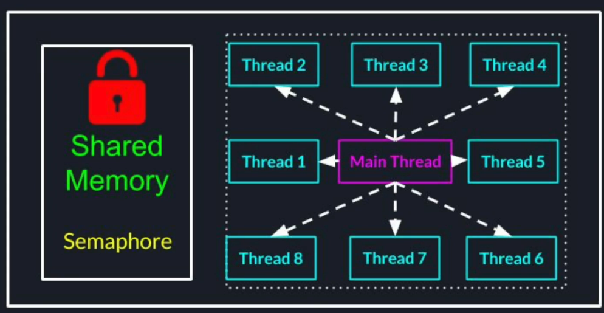

# Introduction

## Multi-threading vs Distributed System
In multi-threaded env, threads can communicate with each other through shared memory. Locks are used for protection against race conditions and semaphores / condition variables are used for signaling.



In distributed systems, we don't have a shared memory. Only way for nodes to communicate with each other is through network.


## TCP-IP Network Model
It is based on a layered architecture. Higher layer depends on lower layer abstractions.

Higher the abstraction layer, closer it is to us, a software developers / users. Lower the abstraction layer is, closer it is to physical layer / hardware.


### Layer 1 - Data Link
1. Physical delivery of data between 2 points over a single link
2. In charge of
- Encapsulation of data
- Flow control
- Error detection
- Error correction, etc..


The commonly used protocol in this layer is Ethernet protocol. This protocol wraps our data into frames and uses devices MAC addresses  to deliver those packages from one device to other.


### Layer 2 - Internet
It typically uses Internet Protocol (IP). Each device in the network is assigned an IP address. This allows packets to travel from source host to destination host.


The internet layer is responsible to deliver the packet from one computer to another. It doesn't know to what specific application process on a destination host the packet is intended for. Nor does it know what application process on source host sent it. For that purpose, we have a transport layer

### Layer 3 - Transport
This abstraction layer takes care of delivering message end-to-end - from process on one machine to a process on another machine. In transport layer, each endpoint / socket identifies itself by 16bit port number. 


In transport layer, there are 2 primary protocols;
1. **User Datagram Protocol (UDP)**
- Connection less
- Best Effort based delivery - unreliable
- Messages can be lost, duplicated or reordered
- Based on unit called Datagram which is limited in size
- **UDP is preferred when the speed and simplicity is more important than reliability**
- **UDP allows broadcasting** - you can broadcast a message in network without knowing what all other computers are out there in the network - this decouples sender from receiver(s)

- **Use cases**
Sending debug information to a distributed logging service. If some log messages get lost, its not a big deal as long as those are not financial data


Real time data stream service such as video or audio


Online Gaming


2. **Transmission Control Protocol (TCP)**
- Reliable - guarantees data delivery as sent, without any losses, duplications or reordering.
- Connection between 2 points - no broadcasting like UDP
- The connection between 2 points needs to be established before data is sent and in the end, has to be shutdown gracefully.
- Works as stream of bytes unlike UDP (individual packets)
- More popular in distributed systems because of the reliability


Since TCP works on stream of bytes, it is difficult to know where the message starts and where it ends. That's where application layer helps.


### Layer 4 - Application
This is the layer we, software developers, typically work with to build distributed system communications.

Protocols
- FTP (File Transfer Protocol)- Transferring files through web
- SMTP (Simple Mail Transfer Protocol) - Sending and receiving emails
- DNS (Domain Name System) - Translating host names into IP addresses
- HTTP (HyperText Transfer Protocol) - transmitting hypermedia documents, video, sound, images

# HTTP for Distributed Systems
Each HTTP transaction has 2 parts
- Request from client to server
- Response from server to client - even if client doesn't need a response from server, a transaction is not complete until the response is received. 

## HTTP Request Structure
Each request has following 5 parts;


### method
can be any of the following set of standard methods - Get, Head, Post, Delete, Put, Trace, Connect, Options, Patch

#### Get Method
**Properties of Get Method**
- Safe - only retrieval action with no side effects - like a getter method in java
- Idempotent - performing the underlying operation N times is equivalent to performing operation only once
- Request doesn't contain any message body

**Use cases**
- Periodic Health check of nodes in cluster
- Data retrieval from other microservices

#### Post Method
**Properties of Post Method**
- A request contains a message body (payload)
- The operation may have side effects and we expect the server to perform a complex operation and give us a result
- Useful to send messages between different nodes

### relative Path
The relative path may also contain query string that allows to send some useful information required to perform operation on server


### protocol version
#### HTTP/1.1
A new TCP connection has to be established when client wants to send some message to a server  - this connection opening has some overhead. Until client receives a response, it cannot send any additional request to server on using the same connection.

**Disadvantages**
1. Creating a connection for every single request is expensive & increases a latency.
2. The number of outgoing connections a client can maintain is limited by
- number of ports
- the OS

**Advantage**
if one of the TCP connection breaks, other connections stay unaffected.

#### HTTP/2
Allows to send multiple requests using the same connection simultaneously. This version of HTTP interleaves multiple requests and responses using the same connection and this interleaving is transparent to us - is done by logically breaking the connection into multiple internal streams. 

### HTTP Headers
Key-value pairs of strings.

```
    Header-Name: Value1; Value2; Value3
```

#### Usage
1. Many standard headers that are used for many purposes
- Content-Length - indices size of the message body
- Content-Type - type of the message body. application/json
- Content-Encoding - compression algo to be used
2. Some headers are used only in request and some are only in response, some are used in both
3. allows recipient to take actions before reading the message body
- memory allocation
- skipping /forwarding (proxying)
4. Can create custom headers, for example
- X-Debug - pass / log more debug info while handling the request
- X-Experiment - turn on experimental features for A/B testing
- X-Test - operate on test data instead of customer's data
- Timestamp headers for transaction instrumentation that can span multiple services


#### Protocol Differences
1. In HTTP/1.1 - plain text key-value pairs that can be easily inspected by tools like Wireshark. 
2. In HTTP/2, the headers are compressed for efficiency
- saves on payload size
- harder to inspect / debug

### Message Body
1. Can contain anything we want as long as  the server and client agree on how to parse the data
2. Can contain complex data objects

## HTTP Response


The response status codes are divided into 5 groups;
1. 1xx - Informational Response
2. 2xx-  Success
3. 3xx-  Redirection
4. 4xx - Client Errors
5. 5xx - Server Errors

## Connection Pooling
Using the same connection to send multiple requests to the server - helps improve performance
1. If HTTP/2 is enabled on both HTTP server and client, connection pooling is enabled by default because protocol version itself is designed to keep all the communication using the single connection
2. If one of the peers doesn't support HTTP/2, we need to
- make sure that its enabled by default
- or we enable it explicitly
3. JDK's built-in HTTP Client supports
- HTTP/2 and
- HTTP/1.1 connection pooling by default
4. In most 3rd party HTTP clients we need to enable connection pooling by setting "Keep-Alive" to true

## Message Delivery Semantics
Unlike a simple method invocation on a single machine, many things can go wrong in distributed systems communicating over network. After the client sent a request, that are outside of the client's control.

Server goes down before receiving the request or request gets lost in network. Server receives the request but crashes before executing the business. Or Server crashes after executing the business but before responding. Server responds but response gets lost in network. 

From client's perspective, all these failures look the same. Client doesn't know if server performed the action or didn't.

If client never got a response, and it it sends message again, the server may end up executing the action twice, if earlier message was already delivered and executed. If client doesn't resend, the server may never receive the message.

To address above;
1. We need to agree on the delivery semantics between the client and the server ahead of time
2. This way, we can avoid dilemma, where either choice has the risk of incorrect behaviour - choice between if the client should resend a message or not resend in case response never received from the server. 

What we really want is **Exactly Once** semantics - but it is very hard to achieve and sometimes even impossible

Other possible delivery semantics are;
### At most Once
1. The client will send a request to server only once
2. if the client;
- never receives a response
- Or the server crashes right before it sends back the response
the client will never redeliver the request to the server

#### Worst Case
- The action never performed by the server

#### Best Case
- The action is performed only once

#### Use cases
- Messages to logging or monitoring services
- Sending promotional emails /notifications to users

### At least Once
1. if client doesn't receive a response from the server, it will keep re-sending the request until client receives the response
2. If server did perform the request action, but failed to respond, the operation will be executed multiple times
3. This semantics works well only for **idempotent operations**

#### Examples of Idempotent Operations
- reading the first line in a file
- update the status of user to "active"
- delete a record by its Id

#### Examples of Non-idempotent Operations
- appending a line to a file
- incrementing a metric in a database
- withdrawing money from user's account

**What do we do when operation is non idempotent?**
1. Our operation is non idempotent
2. Losing the operation is out of the question

In this case, we have to make the non idempotent operation, idempotent artificially.

**Purchase Txn**
Order service sends a seq number along with retry flag to billing service. The billing service stores the seq number in its database with updated balance as an atomic operation.


If billing service fails to respond, order service will resend the request with the seq number and retry flag to true.
if billing service doesn't find the seq number in its database, it knows that earlier action didn't go through. It performs the action, stores the seq number in a single operation and sends back the response.
If billing service finds the seq number in its database, it means that the original request was successful. billing service simply responds back without re-performing the action.

## Complex Data Delivery
### Serialization & Deserialization
1. **Serialization** - translation of a data structure or object into format that can be sent (or stored somewhere) and reconstructed later
2. **Deserialization** - reconstruction of the data back to a data structure or an object


**There are multiple ways to deliver complex data between the nodes**

### Serialization Formats
#### JSON - JavaScript Object Notation
1. One of the simplest and most popular formats
2. We can represent an object in plain text with field of type;
- String
- Number (int/float)
- Boolean
- Arrays
- Objects

##### Advantages
1. Simple and human readable
- even after serialization we can easily read it and debug it
- its plain text so we can create the object and send it  (using cURL for example) without any special software
2. Programming language independent
- we can have one node written in java, communicating with other one written in python as long as both know how to serialize and deserialize json objects
3. Easy integration with JavaScript / frontend

##### Disadvantages
1. Java does not know how to map a Java class to/from Json object unless we use external libs
2. JSON doesn't have a schema (source of truth)
3. Plain text parsing and transmission is suboptimal
- messages are bigger in size compared to binary format
- it is wasteful if services on client and server side are running java services

#### Java Object Serialization
1. Objects of classes implementing Serializable interface can be serialized into a byte stream and reconstructed into original object's state
2. Serializable interface is an empty "marking" interface
3. All the members of the class are going to be automatically serialized except for
- static members
- transient members

```
    public byte[] serialize(Data data) {
        ByteArrayOutputStream byteStream = new ByteArrayOutputStream();
        ObjectOutput objOutput = new ObjectOutputStream(byteStream);
        objOutput.writeObject(data);
        objOutput.flush();
        return byteStream.toByteArray();
    }
```

##### Java Object Deserialization
1. The class needs to match the original class definition
2. The class needs to have an accessible no-args constructor
3. If either of these conditions are violated, we will get an InvalidClassException during the deserialization process

```
    public Data deserialize(byte[] data) {
        ByteArrayInputStream byteStream = new ByteArrayInputStream(data);
        ObjectInput objInput = new ObjectInputStream(byteStream);
        return (Data) byteStream.readObject();
    }
```

###### Advantages
1. No type ambiguity
2. Very clear source of truth (schema) for the object that we want to send over the network - the original class that we want to share our the network

Typically, we put objects needed to be shared between nodes inside a common jar that is available to all nodes.


3. Native support in all JVM languages - no need for external libs, simple development process

##### Disadvantages
1. Not human readable, difficult to test
2. Tight coupling to JVM langauges

#### Google's Protocol Buffers


Example of a proto file


###### Advantages
1. No type ambiguity
2. Clear and well defined schema (stored in a proto file)
3. Language independent thanks to 2 step process
- Proto file definition
- language specific stub generation using proto compiler
4. Efficient serialization and deserialization
5. Security

##### Disadvantages
1. Not human readable, difficult to debug
2. more complex development process


