## Introduction
1. Distributes network traffic across a cluster of application servers
2. Prevents any single application server from being a performance bottleneck.
3. Monitors application servers' health, load balancers make our system more reliable & highly available - serves traffic to only online servers

Cloud LBs support auto-scaling.

## Types of LBs
### Hardware LB
1. Dedicated hardware devices designed and optimized for the load balancing
- High performance
- Can balance the load to larger number of servers
- More reliable - less prone to failures
2. Typically can be put in front of external facing cluster

### Software LB
1. Load balancing software running on a general purpose computers
- Easy to configure, update, upgrade or troubleshoot
- cheaper and more cost effective
- open source solutions available (HAProxy, Nginx) 
2. Can be typically put in front on internal microservice cluster

## Load Balancing Strategies and Algorithms
The best load balancing strategy is different for each distributed system. It depends on;
- System's architecture
- Workload
- Usage pattern
It is always better to start simple and incrementally adjust by running load tests and monitoring traffic

### Round Robin - Uniform load distribution
- Ideal for a cluster having servers with the same specs / capacity

### Round Robin - Weighted Round Robin
- If some of our servers are capable of taking higher load or if we intentionally want to direct more traffic to some servers & less to others
- We assign higher weight to servers we want to send more requests relative to others.
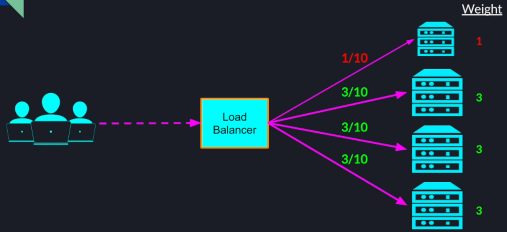

- Can also be useful if we want to upgrade our system gradually to a newer version by directing less traffic to server(s) with lower weightage
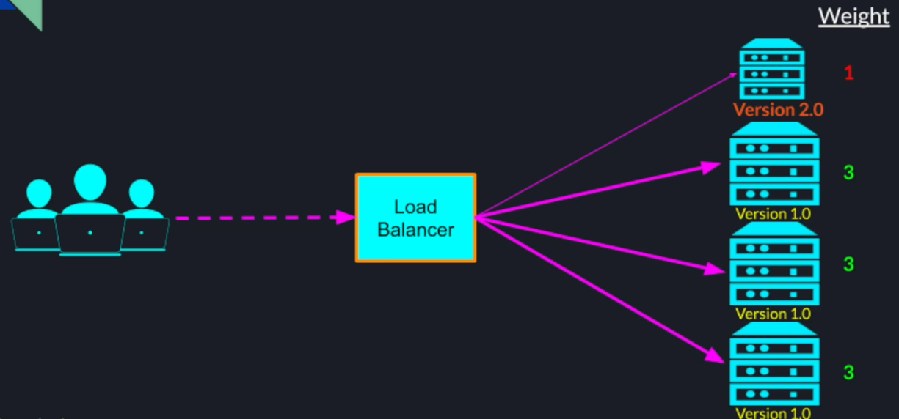

### Source IP Hash / Sticky Session
1. Sometimes it is desired that the user continues communication with the same server unlike round robin
2. Examples;
-   Open Session - Maintaining online shopping cart state between connection loses or browser refresh
-   Local Server Caching - Improving performance by preloading data or caching data locally - for use cases like audio / video file streaming
3. Requests from the same user should go to the same server throughout the entire session

One way to achieve this is by hashing user's machine's IP and mapping one of the servers in the cluster to the hash. Since hash function is deterministic, subsequent requests from the user will be redirected to the same server in the cluster
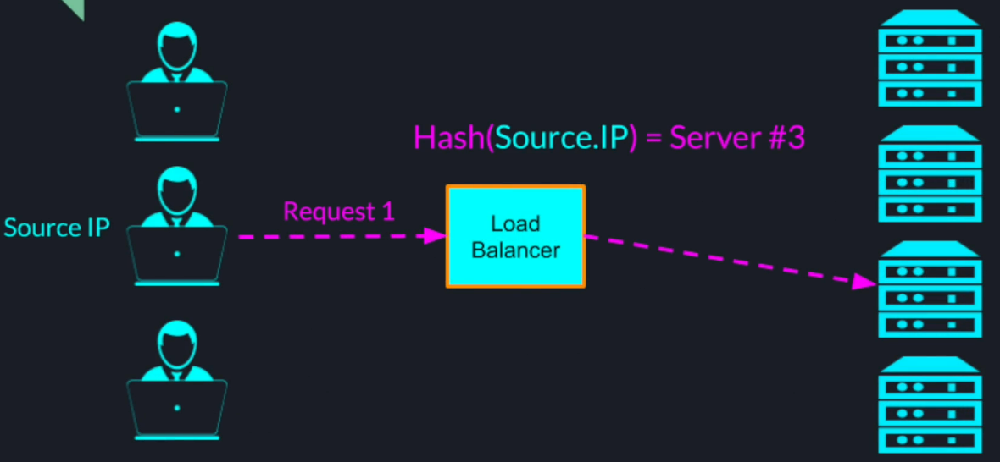

#### Cascading Failure (Round Robin)
1. We assumed that spreading the requests evenly would also spread the load evenly
2. However;
- Not all users are using the system the same way
- Not all requests require the same amount of resources
3. Getting the load balancing strategy wrong can have a cascading chain of failures

For example, we are using a round robin, and 2 of our servers are getting mostly simple get requests for static pages. But the 3rd server is getting a lot of post requests that require heavy computations & talking to external services, it will quickly get overwhelmed and stop responding to health checks.
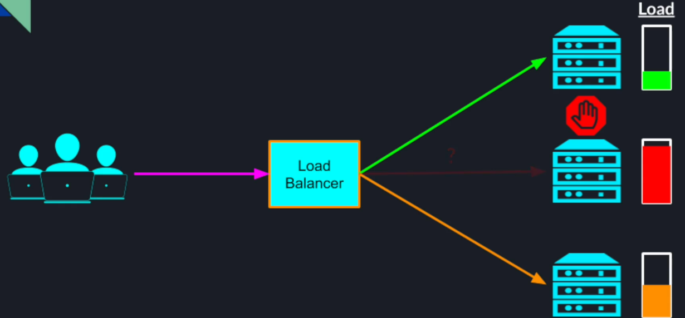

This will make LB believe that the 3rd server is unavailable and will stop sending any more traffic to it. The remaining servers will also get quickly overwhelmed bringing the entire cluster down.

Neither of the strategies we mentioned took the actual load on the servers into account. And that can cause following issue;

If we have a range of resources requirements between different requests, we need a more active approach to monitor a load on each server. Following are some of the active approaches.

### Least Connections
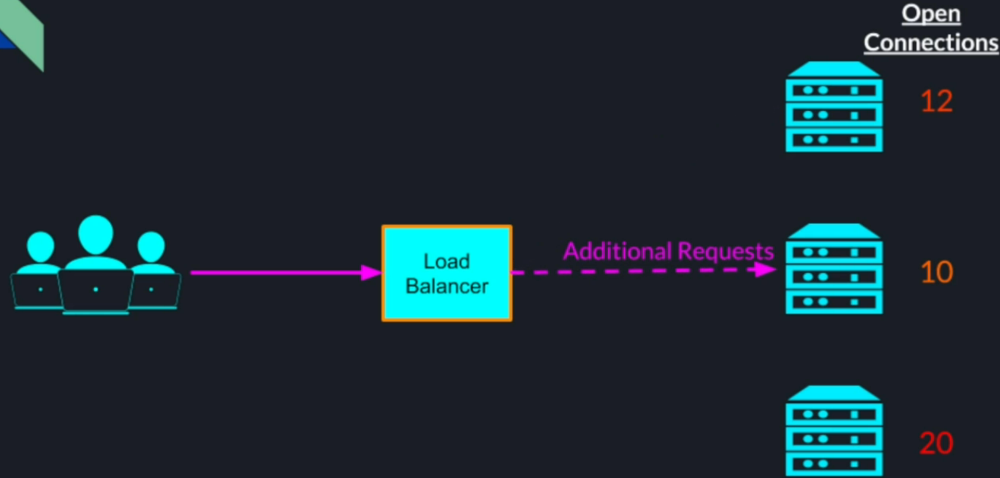

### Weighted Response Time
LB measures response time for health check requests to cluster servers, and redirects more requests to server with a lesser response time. 
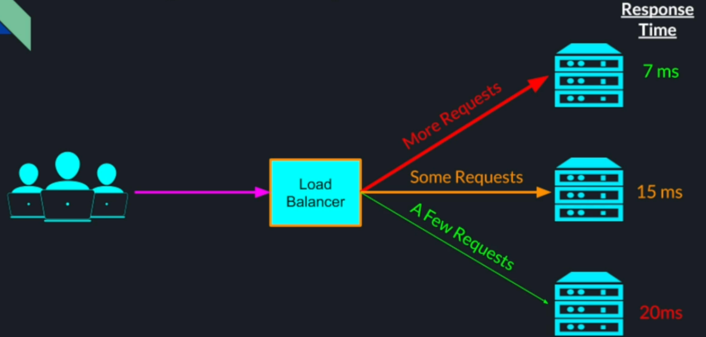

### Agent Based Policy
- More active approach by installing a special program called agent on each server.

**Agent Based Policy Metrics**
This is account background process can measure the server's
- CPU utilization
- Inbound or outbound network traffic (bytes)
- Number of disk operations (reads / writes)
- Memory utilization

These agents can report these metrics in real time to the LB. This helps LB to make the informed decision to redirect traffic to different servers in the best possible way
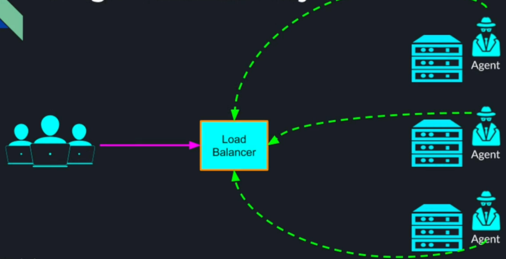

## Load Balancing Routing & Networking Layers
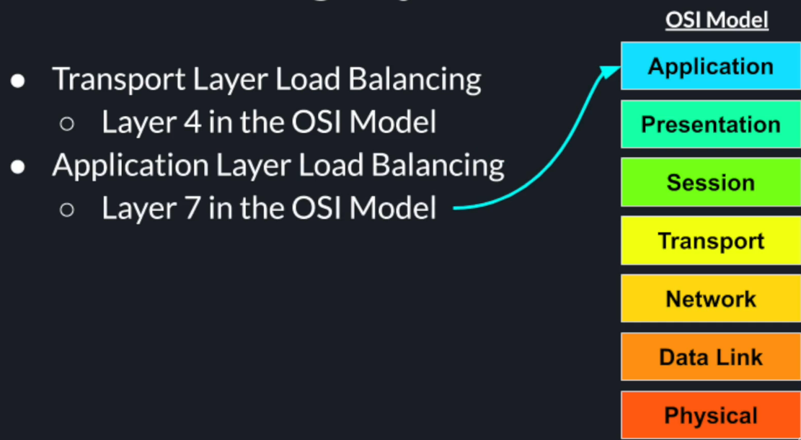

OSI Model is similar to TCP/IP model
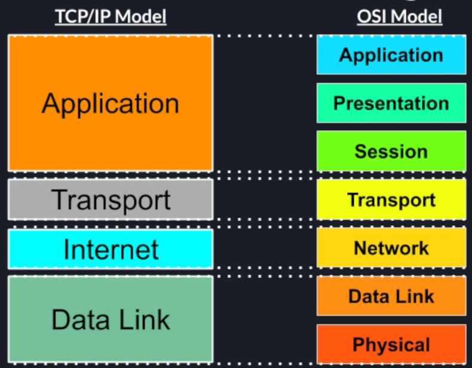

### Layer 4 (Transport) LB
1. The LB performs simple TCP packets forwarding between the client and the backend servers.
2. Doesn't inspect the content of the TCP stream beyond the first few packets - Low overhead
3. LB is only interested in source and destination addresses. LB replaces destination address with the server address that it decides to redirect the request to
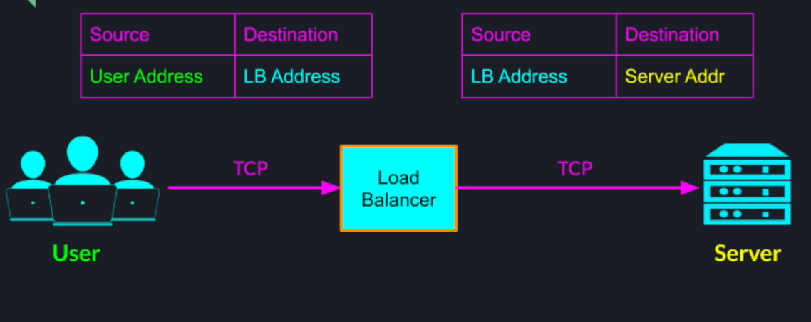

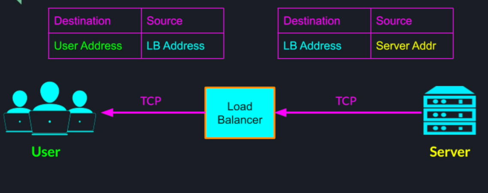

4. The user never knows any details of the actual server that handled its request - makes our distributed system secured and completely transparent to the outside world

### Layer 7 (Application) LB
1. Can make smarter routing decisions based on the HTTP header
2. LB inspects TCP packets and HTTP header
3. LB can route requests to different clusters of servers based on;
- request url
- type of requested data
- http method
- browser cookies

## HAProxy
### Introduction
1. Reliable, High Performance TCP / HTTP LB
2. Easy to setup - very popular, almost a standard in LBs
3. Despite its simplicity, it has a lot of very advanced and powerful features, critical for high performance prod systems
4. HAProxy is software based LB and can be used for Layer 4 and Layer 7 balancing.
5. Officially supports only linux distributions
