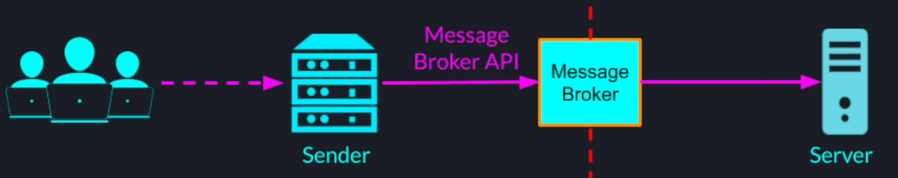

## Introduction
### Challenges of Synchronous Communication
1. client server coupling
2. cost of http connection
3. broadcasting a message to multiple services can exhaust the sender
4. traffic peaks handling

### Message Broker
1. Intermediate software (middleware) that passes messages between sender(s) and receiver(s)
2. May provide additional capabilities like;
- Data transformation
- Validation
- Queuing
- Routing
3. Full decoupling between sender(s) and receiver(s)
- receiver doesn't have to be present when message is sent by the sender
- sender doesn't have to be present when receiver successfully receives the message

Message brokers have their own network protocol, data formats and APIs.

Message broker can also act as a load balancer
- Allows to scale the receivers horizontally
- Keeps the messages from getting lost if the receivers are overwhelmed 

#### Message Broker Scalability
To avoid message broker from being single point of failure / bottleneck, they need to be scalable and fault-tolerant. Message broker are distributed systems by themselves which makes them harder to design and configure. 

The latency, when using message broker, in most cases, is higher than when using direct sync comms. 

#### Push vs. Pull
In synchronous connection, client **pushes** a message to a server. As long as server is listening on a port, server doesn't have any control when and how frequently to receive messages.

In case of message broker based system, sender pushes a message to a message broker. Receiver **pulls**  those messages whenever it chooses to. This gives a lot of control to the receiver on the rate of message consumption. 

#### Popular Use cases
##### Distribute Queue
Message delivery from single producer to a single consumer

##### Pub-Sub
Publishing of a message from a single producer to a group of subscribed consumers

Sender can publish message for the multiple senders by sending a single message to a message broker. Message broker will take care of broadcasting it to all the intended subscribers even without sender knowing who all they are.

On the other hand, receiver can subscribe to a single topic / queue and receive messages from many publishers even without knowing about them.

## Apache Kafka
### Introduction
1. Distributed streaming platform, for exchanging messages in real-time between different servers
2. Can be described as a message broker on a high level - internally, kafka is distributed system that may use multiple message brokers to handle the messages

### Kafka Abstractions
#### Producer Record

#### Kakfa Topics
Category of events / messages, that consist of partitions

Publishers can publish record to any topics and subscribers can consume records from any topics

#### Topics and Partition Logs
Instead of having monolithic log or queue for each topic, kafka allows us to partition each topic into multiple logs. These logs look like array of records.

When a new record is published, it is appended to one of the partitions & is assigned a sequence number in an increasing order. Each such sequence number is called an offset.

**We can think of a topic as a collection of ordered queues where each partition is a separate independent queue of records.** While each partition maintains the order of messages published to the partition, there is no global ordering between the messages inside the topic. 

#### Kafka Record Key and Partitions
The partition to which record is appended depends on the key that publisher sets on the record. Hash function is applied on the record's key and that determines which partition the record will be appended to.

Kafka topic partitioning allows us to scale a single topic horizontally. In general, more partitions we have in topic, higher parallelism and performance we can achieve. 

#### Consumer Groups
To consume messages from kafka topics, a consumer has to belong to a consumer group. Each message is delivered to a single instance in a consumer group.

##### As Distributed Queue
If processing of a messages is complex, we can have multiple consumers in the group and kafka will load balance among the consumers within that group.

##### As Pub/Sub System
We can put each consumer in a different consumer group.

### Performance & Scalability
Kakfa allows to launch more broker instances on separate machines & distribute a topic across those brokers by splitting a partition ownership equally among them.  

Trade-off for achieving high scalability - we lose global ordering.

- Number of partitions in a topic ~= maximum unit of parallelism for a kafka topic
- estimate the right number of partitions for a topic based on expected peak message rate / volume
- by adding more kafka brokers we can increase a capacity of a topic, transparently to the publishers

#### Consumers and Topic Partitions

Due to partitioning;
1. We can have many broker instances working in **parallel** to handle incoming messages
2. We can have many consumers, consuming in **parallel** from the same topic

### Fault Tolerance
If any of the broker fails, we can see that we lose entire partition with all of its data.

To address this issue, kakfa uses replication - leader and followers
1. Each kafka topic is configured with a replication factor
2. A replication factor of N means each partition is replicated by N kafka brokers
3. For each partition, only one broker acts as a partition leader, other brokers are partition followers
4. The leader takes all the reads and writes
5. The followers replicate the partition data to stay n sync with the leader - passively standing ready to replace the leader if leader fails

For example, a topic with 4 partitions, managed by 4 broker instances with replication factor of 2, each partition will be replicated to 2 different brokers;

For each partition, there will be only 1 broker that acts as a leader that handles reads and writes for that partition.

#### Replication Pros and Cons
1. The higher the replication factor the more failures our system can tolerate
2. But more replication means more space is taken away from the system just for redundancy

#### Fault Tolerance Implementation
1. Replication factor is configured on per-topic basis
2. Kafka tries its best to spread the partitions and leadership burden fairly among the brokers
3. Kafka used Apache Zookeeper for all its coordination logic - now moving to KRaft
4. Kafka persists all its messages on disk
5. Even after messages are consumed by the consumers, the records still stay within Kafka for a configurable period of time. This allows;
- new consumers to join and consume old messages
- consumers that failed in the process of reading / processing a message to retry
6. Failed brokers can recover very fast

