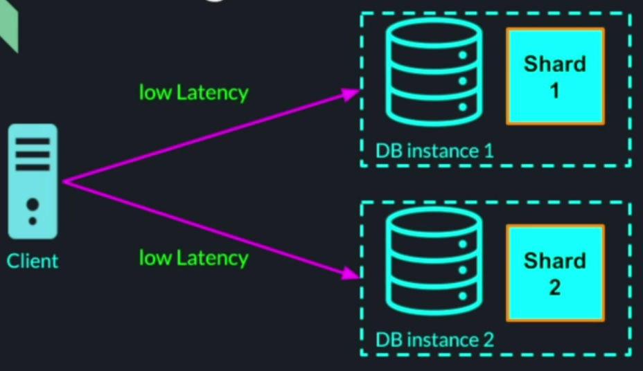
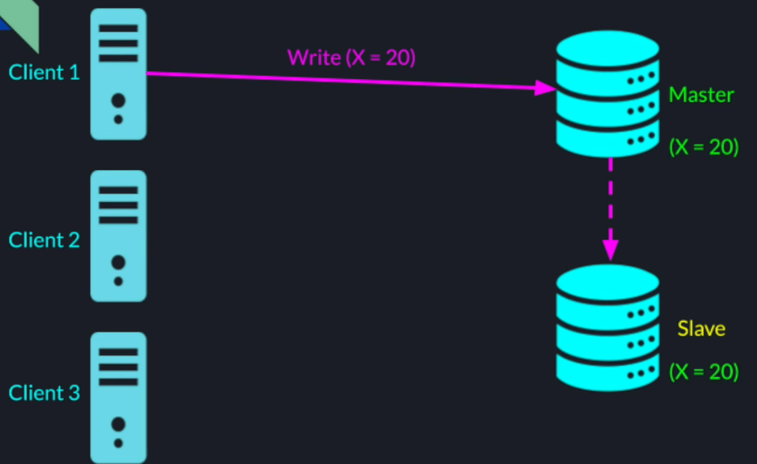

## Storage Options
1. File System
2. Database

### File System vs. Database
#### File System
1. File system is
- a lower level, general purpose approach to storage of data of any format, structure, or size
- best for unstructured data, or data with no relationship to other data
2. Examples; Videos, Audios, Text files, Memory Logs

#### Database
1. is a higher level abstraction that may / may not store data to the underneath file system
- it is an application that provides additional capabilities (query language / engine), caching and performance optimizations
- provides restrictions on structure, relationship and format
- guarantees ACID transactions - Atomic, Consistent, Isolated, Durable
- easy to build and replace

## Types of Databases
### Relational Database (SQL)
1. Data is structured as tables (rows and columns)

### Non-Relational Database (NoSQL)
1. Less structured data
2. Can be in form of
- key/value pair
- key / document pairs
- graph databases
3. Easier to scale compared to relational databases

## Why Distributed Database?
1. We want our database to provide
- Availability
- Scalability
- Fault Tolerance
2. A centralized database cannot achieve above mentioned characteristics. Issues with centralize database;
**Single point of failure**
- losing a database instance is lot worse than losing a compute instance node
- temporary failure to operate the business
- risk of permanently losing our data
- compute nodes can easily be restored, but permanent data loss can be detrimental to the business

**Performance Bottleneck**
- parallelism is limited to the number of cores in a machine
- number of connections to the machine is limited by number of connections the OS and the network card can support
- latency depends on the geographical location of the database instance and the user
- Limited to a the memory a single machine can have

## Fully Distributed System

## Database Sharding
1. Sharding - Partitioning a large dataset into multiple smaller chunks of data called shards
2. Using sharding, we can split large database into smaller pieces living on different machines

**Performance**
Due to sharding, each database instance provides lower latency as it can fit all its data in memory

It also provides higher throughput through parallelism when data transactions operate on data on different shards.

**Scalability**
Through sharding, we can scale our database horizontally by adding more database instances as the amount of data increases.

**Availability**
If one instance goes down, we can still read and write to other shards.

### SQL Database Sharding
A SQL database can be sharded in two ways.

#### Vertical Sharding
By splitting a table into shards containing fewer columns

#### Horizontal Sharding
More scalable way - by splitting a table records into separate chunks - each shard containing subset of the total records

### NoSQL Database Sharding
Simpler compared to SQL database - divide already disjoined records into groups & place each group into different shard

In either case, SQL or NoSQL, multiple chunk of records can live on different database instance, called shard.  And each shard can contain multiple chunks of records

## How Sharding is Done?
1. Typically done based on the record's key
2. The key determines in which shard
- the find an existing record
- to add a new record with a new key

## Sharding Strategies
### Hashed Based Sharding
1. A hash function takes the record's unique key and generates a numeric hash value out of it
2. The hash value is used to determine which shard the record belongs to

**Example**

#### Advantage
1. With monotonically increasing keys and a good hash function, we can achieve even data distribution

#### Disadvantage
1. Keys with close values will likely not fall into the same shard - so range based queries will span multiple shards - higher latency

### Range Based Sharding
1. We divide the keyspace into multiple contiguous ranges
2. Records, with nearby keys will more likely end up in the same shard - range based queries will be more efficient

**Example**
If we take the previous user table, and this time we pick the name as sharding key, we can have  allocate alphabetic range to each shard. 

#### Disadvantage
1. If our keyspace is clustered in certain ranges, we will not get even data distribution
2. We might need to readjust the ranges on continuous basis to ensure good data distribution

### Sharding Disadvantages
1. Operations that involve records that reside on different shards become more complex
2. Concurrency control becomes much harder and more expensive than in a centralized database
**Centralized SQL DB Txn**
- All the data is in one table, on one database instance
- easy concurrency control - acquiring local locks on a table or multiple tables to guarantee data consistency

Because of this, some of the RDBMS don't even support automated sharding & are harder to scale. That's one of the reasons for the rise in the popularity of NoSQL databases. NoSQL databases don't guarantee the same ACID like SQL DB would.

### NoSQL Databases Advantages & Disadvantages
1. Some NoSQL databases guarantee atomic operations on mulitple records only on records that reside on the same physical node
2. some NoSQL databases don't guarantee strict consistency
3. some NoSQL databases don't even guarantee atomicity of operations on multiple records
4. NoSQL databases are easier to shard and scale
5. Designing a system with NoSQL database is more challenging - especially if the system was initially design with SQL database

### Hash Based Sharding Issues
#### Dynamic Cluster Resizing
If we want to add a new instance to the cluster, the formula to identify a shard changes and queries won't find the records that were stored based on previous formula. All existing records will have to move to a new instance according to a new sharding formula

Similarly if we want to remove a node from the cluster, we will have reshuffle a large number of keys not only from the node that was removed but from all the remaining nodes as well

#### Asymmetric Nodes
Not all instances may have the same capacity

In this case, we would like to allocate more records to the more powerful node. There is no way to achieve this using a standard hashing algo

To address above limitations of a standard hashing algo, we can use consistent hashing algo based sharding.

### Consistent Hashing Based Algo
Idea of consistent hashing is to not just hash keys but also a node into the same keyspace

Alternative representation, turn it into a ring

For example, key with a value 1 belongs to node 2

#### Advantages
1. This allows uniform record distribution among the distributed database nodes.
2. Consistent hashing allows us to dynamically add and remove nodes without re-assigning too many keys and hence moving fewer records

**Example**
After removing node 2

### Consistent Hashing Virtual Nodes
1. If some physical nodes are more powerful / have more capacity than other nodes, we can assign the stronger nodes more keys
2. Method;
- Map each physical node to one or multiple of virtual nodes
- More powerful physical nodes -> many virtual nodes
- Smaller / weaker physical nodes -> single or fewer virtual nodes
3. We can build robust database clusters with existing hardware with no need for additional expenses
4. We can use multiple hash functions on nodes to get even distribution of keys among the nodes

## Database Replication
### Sharding vs Replication
<table>
    <tr><th>Sharding</th><th>Replication</th></tr>
    <tr><td>Splitting the data and placing each chunk into different machine</td><td>Creating identical copies of all the data, and placing each copy on a different machine</td></tr>
    <tr><td>No redundancy</td><td>Full redundancy</td></tr>
    <tr><td>Motivation - Performance & Scalability</td><td>Motivation - High Availability, Fault Tolerance, Scalability and Performance is read intensive operations</td></tr>
</table>

### Replication Benefits
#### High Availability
If Master is unavailable, say due to network failure, the system is still functional by pointing to the replica

#### Fault Tolerance
If Master disk fails, the system can continue to function with the replica

#### Performance & Scalability
Specifically shines in read intensive operations

### Replicated Database Architectures
#### Master Slave
All write operations go to Master and read ops go to the slave. Every write operation is propagated to slave.

If master fails, slave takes over.

#### Master Master
Each node takes both reads and writes and every write is propagated to other nodes for data consistency

##### Event Consistency
1. **Both architectures above provide eventual consistency**
2. If no further updates are made, eventually all readers will have access to the newest data
3. Provides lower latency and higher availability

##### Strict Consistency
1. The writer will now get an ack until we guarantee that all the readers will see the new data
2. slows down operations and limits system's availability (if some replica are temporarily not accessible) 

**Strict Consistency in fully distributed symmetric Master-master architecture with multiple nodes**
**Attempt 1**
1. It will take long to write to all the other nodes - best scenario
2. If any of the node is unavailable, the operation will timeout -worst scenario

**Solution is the Quorum Consensus**
##### Quorum Consensus - Record Version
1. Each record in our database along with the key and value will have a version.
2. Every update to the record will increment the version number to distinguish between the older record and a newer record

**Quorum Definitions**
**R** - Minimum number of nodes a reader needs to read from
**W** - Minimum number of nodes a writer needs to write to
**N** - Number of nodes in the database cluster

Quorum consensus strict consistency protocol dictates following;
**R + W > N**
If we choose R & W such that their sum is greater than number of nodes in the cluster, we are guaranteed to have a strict consistency

**Example**
R = 3, W = 3, N = 5

Data is written to 3 nodes

Reader will read from 3 nodes and pick the record with the higher version

To optimize for reads, we can choose R = 2 and W = 4. Reader needs to pick only 2 nodes to pick from giving lower latency.

