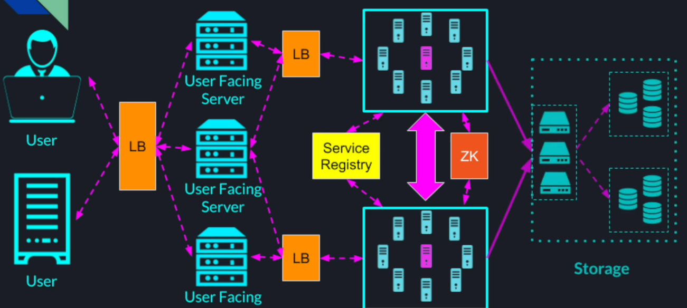
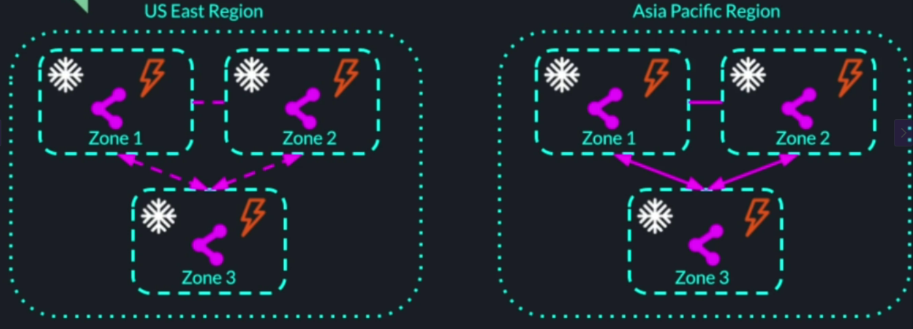
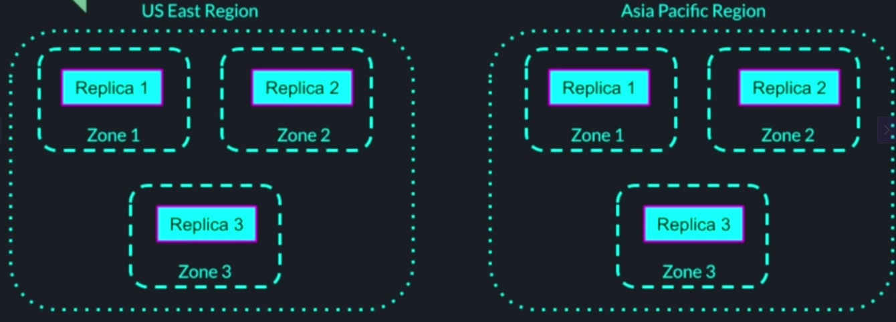
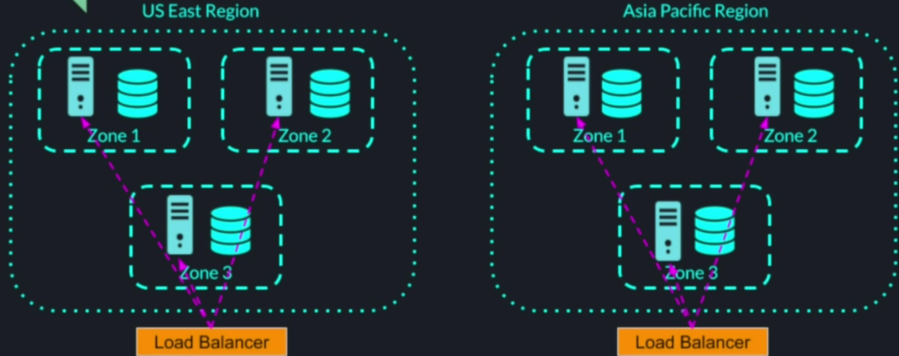
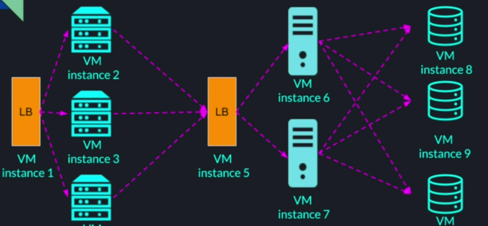

## Introduction
**Typical Distributed System**

Cloud provides infrastructure to deploy distributed systems. It provides infra as utility - IaaS. Cloud providers also launched PaaS that provides higher level abstractions for developers.

### Benefits
1. Cloud vendors made their internal infra available for us for rent on demand
2. We pay just for what we use
3. We can get our startup up and running within minutes
4. No need for large initial investment
5. Cloud vendors focus on their infra, we focus on our business logic & system design

## Cloud Architecture and Building Blocks
### Geo Regions
Isolated from each other. As a client of our cloud vendor, we can deploy our services in one ore more regions.

Each region has one or more data centers. 

Data replication and config sharing between regions is limited, but this isolation provides the following benefits;
1. Fault tolerance and  stability in case of a natural disaster
2. Compliance with local rules and regulations
3. Security Isolation
4. Low latency

Data replication across regions is possible however it
1. Incurs higher costs
2. Slower
3. Complex

### Availability Zones
Each region is broken down into separate zones. These zones are isolated in terms of power, cooling and networking. But are connected to each other withing the same region by high speed connection. 

As a client, we can deploy our servers or database instances in multiple zones to provide HA and fault tolerance withing that region. 

### Building Blocks
#### Compute Nodes
1. Compute Nodes (VMs), Examples;
- AWS - Elastic Cloud Compute (EC2)
- GCP - Compute Engine
- MS Azure - Virtual Machine
2. Running on VMs
3. Coming in different sizes and configurations. Using these compute nodes, we can build our system.

#### Auto-Scaling
- AWS - Autoscaling groups
- GCP - Instance group autoscaling
- MS Azure - VM Scale Sets
Allows us to intelligently and automatically adjust our compute capability maintaining steady performance at the lowest cost. Based on triggers configured (CPU utilization, memory, etc), the system gets scaled out or in.

#### Load Balancers
1. LBs
- AWS - Elastic LB (ELB)
- GCP - Google Cloud LB (GCLB)
- MS Azure - Azure LB
2. Provides
- Unified IP address for our service
- LB capabilities
- Failure detection
- Monitoring    

#### Cloud Storage Solutions
1. Solutions
- AWS - Simple Storage Service (S3)
- GCP - Google Cloud Storage
- MS Azure - Azure Storage
2. Multiple tiers
- Ultra cheap rarely accessed storage for long term backup
- High QPS, low latency file storage for audio, video and app data
3. All provide above 99.9% availability and durability

#### SQL Databases
1. SQL DBs
- AWS - Relational Database Service (RDS)
- GCP - Spanner / Cloud SQL
- MS Azure - Azure SQL DB
2. NoSQL DBs and Caching Layers
- AWS - DynamoDB, Elasticache
- GCP - Bigtable / Memorystore
- MS Azure - Azure Cosmos DB

#### Other general purpose services include;
1. Unified logging
2. Monitoring
3. Alerting
4. Big Data Analytics
5. Distributed Queues

#### Specialized Services
1. Serverless / FaaS
2. ML APIs and specialized hardwares
3. IoT Services
4. Blockchain
5. Security
6. etc...

#### Global DNS and Traffic Mgmt
1. Services
- AWS - Amazon Route 53 DNS and Traffic Flow
- GCP - Google Domains and Google DNS
- MS Azure - Azure DNS and Traffic manager
2. We can register our service domain
3. Route traffic to different regions based on 
- latency
- geo proximity
- etc

