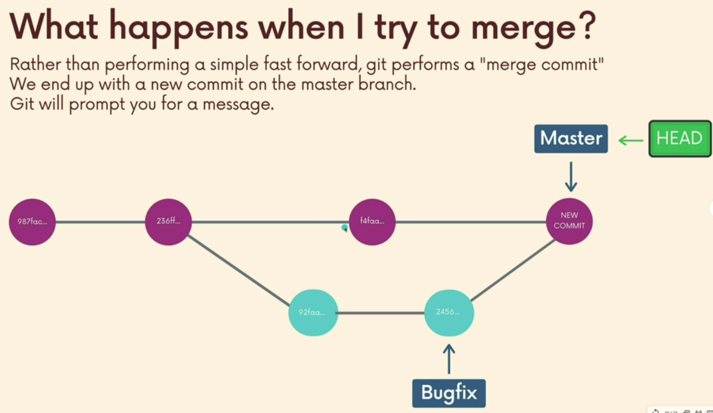

# Key git Commands
## git init
to create a new repo - It can be used to convert an existing, unversioned project to a Git repository or initialize a new, empty repository
## git status
provides a snapshot of the current state of your working directory and staging area. It shows you which files have been modified, added, deleted, or are untracked, and whether they have been staged for commit.
## git log
displays all of the commits in a repository's history.
## git add
adds a change in the working directory to the staging area. 
- git add . 
- git add <specific_file1> <specific_file2> - recommended to group changes across multiple files meant for a common feature / bug fix together.
## git commit
- git commit -m "add commit message"
## git remote add <remote_pointer_name> <remote_repo_url>
- setup ssh keys to start pushing
## git push <remote_pointer_name> <local_branch>
- to push local committed changes from the local branch to remote 
## git clone <remote_repo_url>
primarily used to point to an existing repo and make a clone or copy of that repo at in a new directory, at another location.
## git branch
CRUD ops for git branches
### git branch
to print all the available branches and the current branch
### git branch "branch_name"
to create a new branch with name "branch_name"
### git switch "branch_name"
switch from current branch to the "branch_name"
### git branch -M "new_branch_name"
renames a current branch to a new name

## git merge
- allows to incorporate changes from one branch to another one

### Key Concepts
1. We merge branches, not specific commits
2. We always merge to the current HEAD branch

#### Simple Fast Forward Commit

#### Merge Commit
scenario where you have changes in master after you branched-off feature branch & if there are no conflicting changes between master and feature branch. git takes care of merging for us.

#### Conflicting Changes
##### Steps to resolve conflicts

