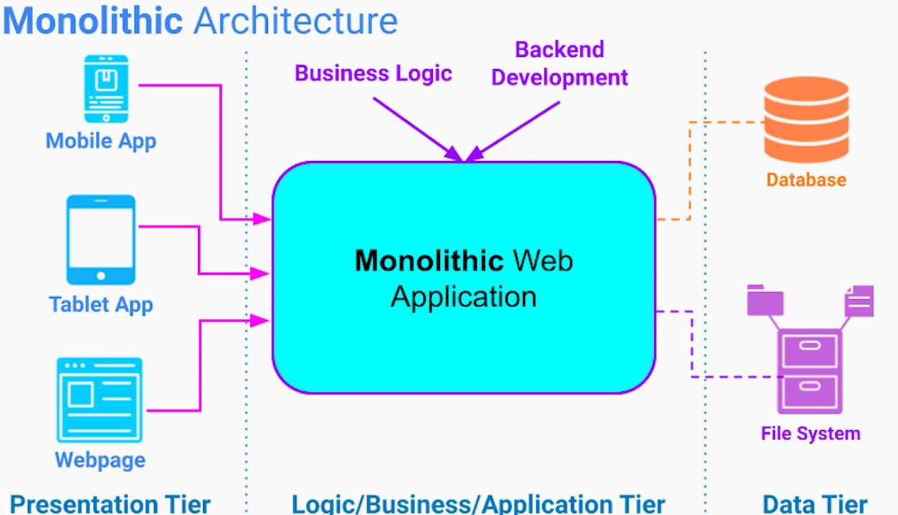

# Introduction
## Microservices architecture
The system is organized as a collection of independent services. Each scope has its narrow scope of responsibility and is fully owned by a small team of developers (2 Pizza Rule).

When done correctly;
- allows organizations to scale
- allows system to scale
- keep organizations cost low - lesser on-boarding cost, lesser coordination among teams, productive teams - smaller code-base -> quicker to load in IDE > quicker to test & deploy, smaller deployables -> can run on commodity hardware
- stay efficient and innovative

## Event Driven Architecture
Commonly used with microservices architecture.

By established asynchronous event based communication between microservices,  we can achieve even greater;
- decoupling
- higher scalability

EDA allows to implement very powerful design patterns for microservices architecture.

## Monolithic Architecture
Most commonly used, 3-tier web-based architecture looks like following. The app is deployed as a single process (single run-time unit), hence called a monolithic.

### Benefits
- Easy to design - fits any web-based system regardless of the industry or services a company is providing
- Easy to implement 

Perfect for a small startup to get the idea on the hands of its users quickly or a company with a small development team (2 Pizza Rule).

### Challenges
But as organization starts to scale, in terms of people & in terms of system services, monolithic architecture brings in some challenges;
1. Low organization scalability
- Too many engineers working on the same code-base - higher number of code merge conflicts. Everyone stepping on each other's toes - even completing a trivial feature becomes slower and harder. To deal with these issues, we need a lot of planning and coordination - which means longer and larger less productive meetings.
2. Complex Code-base
- Harder to reason about
- Takes longer to load in the IDE
- Slower to build & test
- Risky to deploy
- Larger and less frequent releases
- On-boarding a new developer takes longer - they would take longer to get familiarized with a large code-base -> reduced productivity
3. Low system scalability
- Each application instance that contains the entire business logic requires a lot of CPU and memory. So instead of running it on cheap commodity hardware, we have to run our app on high-end expensive machines.
- We are constrained by the technology choices that we made few years back - we cannot take advantage of new and better technologies. Refactoring our code-based from one lib to other can be a huge efforts, let alone migrating to a new programming language or framework.
- The app becomes less stable - even a small memory leak, performance issue or a bug can bring down an entire system. Larger blast radius.

Important to note - logically separating the app into modules or packages can help just so much. The app is still running a single process, tightly coupled and we are still constrained by the same technology

# Microservices Architecture - Benefits and Challenges
## What is a Microservice?
- It is an architectural style having loosely coupled, independently deployed services. Each service is owned by a small team 
(2 pizza rule).
- Follows SRP design principle
- Suited for large systems having lot of moving parts, large team and needing frequent deployments
- Allows to move faster - more innovations and push out features sooner to your customers

## Benefits
1. High Organizational Scalability 
- Quicker on-boarding of new members
- Smaller code-base per microservice - Lesser code load time in IDE - improved productivity
- Easier to test in isolation
- Higher team velocity
- Easier to reason about - much less logic to understand and test
2. High System Scalability
- Compared to Monolith app, Microservices have a smaller runtime unit - can run on commodity hardware - lesser cost
- Each Micorservice can use appropriate technology to solve the problem, independently
- Smaller code base - easier to manage, or to even switch technology for a specific microservice
- Higher Stability - Due to independent runtime unit, reduced blast radius of bug, memory leak, performance issues and security vulnerability

## Challenges
1. Highly distributed system - local calls in monolith app are now network calls. This means unpredictable behavior & performance
2. Difficult to test in integration mode - slower integration tests, who owns integration tests?
3. Difficult to debug & troubleshoot bugs and performance issues
4. Potential to poor organizational scalability, if boundaries of the services not set correctly. We may end-up having too many dependencies - tightly coupled services leading to a lot of coordination - This situation is commonly referred as "Distributed Monolith" or "Big Ball of Mud"

Following industry proven principles and best practices for microservices architecture can offer benefits that out-weigh its complexity.

