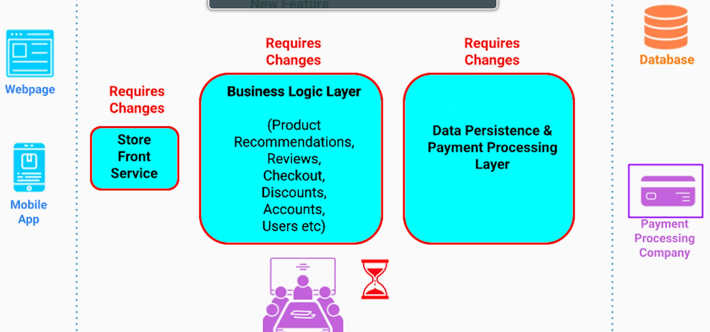
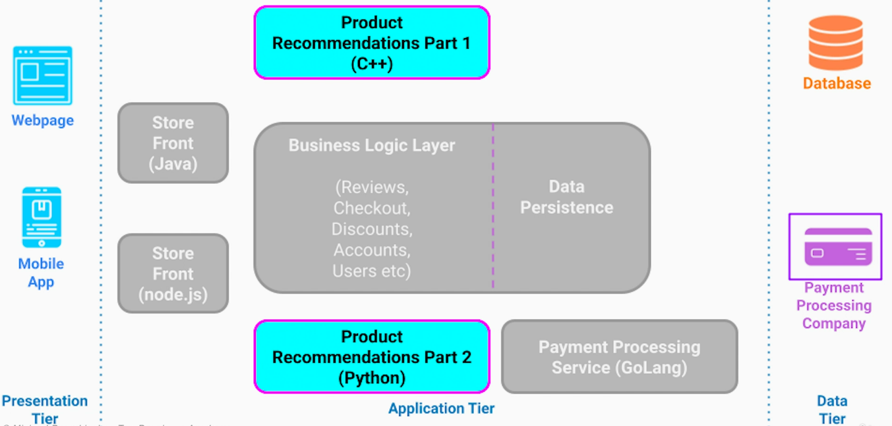
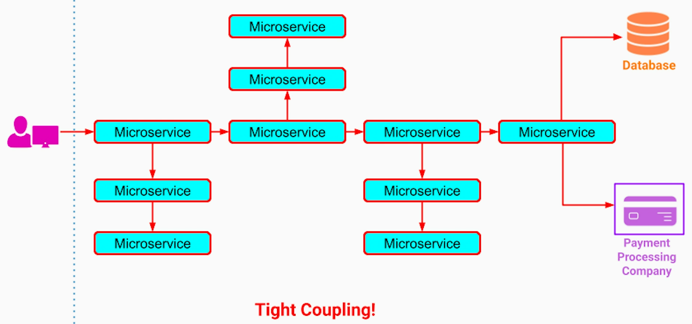
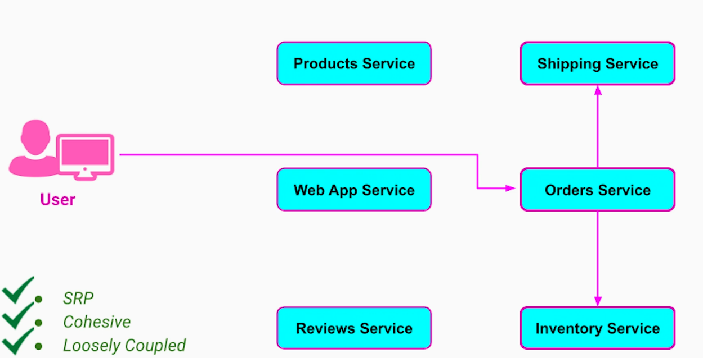
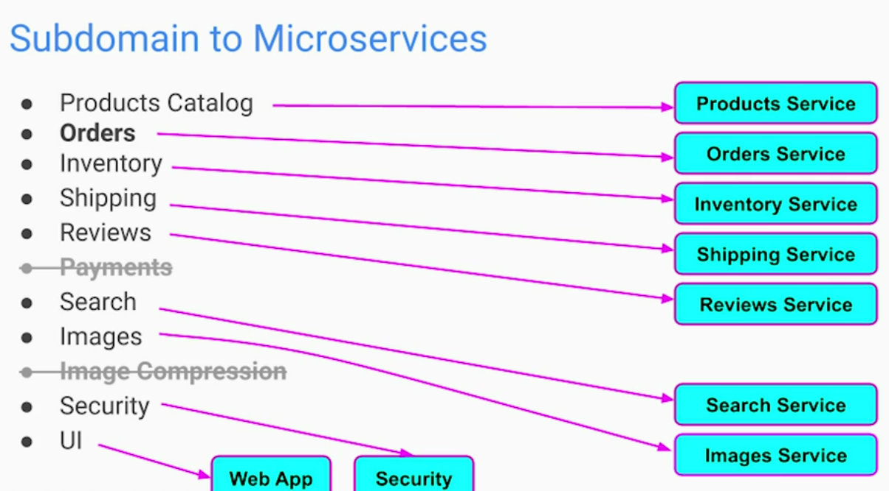
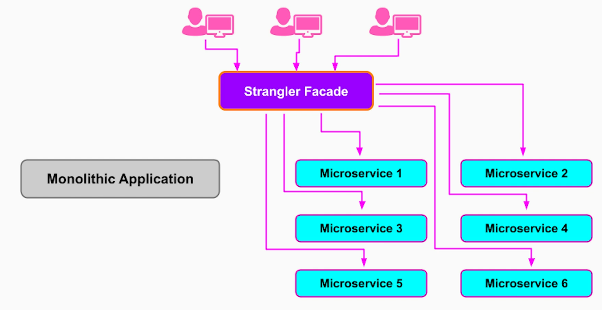

Just breaking a large application into an arbitrary set of microservices won't give us any benefit.

Defining correct boundaries for the microservies is important so the system doesn't turn into a Big Ball of Mud.

# Boundaries of Microservices
## Common mistakes
1. **Splitting by Application layers** - separate microservices for presentation layer, business-logic layer, infrastructure layer. Every new feature will need change in all 3 microservices requiring careful planning and release coordination between different teams. No organization scalability. Breaking 3 tier app into more tiers won't work.

2. **Splitting by Technology boundaries** - while this may bring in some performance benefits, outside stakeholders (product managers, etc) won't know which subsystem / team / service gets new task. Naming terminology of each API will be too convoluted. Also, business logic layer microservice is still too big and has a potential to become yet another monolith.

3. **Splitting for Minimum size** - we looked at "micro" in microservices and assumed that splitting the monolithic app into tiny services would give us the best benefits - smaller the better. Splitting by package / class is a common mistake.

## Core Principles
Each core principle below is related to common mistakes above, respectively
1. High Cohesion: Elements that are tightly related to each other and change together, should stay together. Allows each team to operate independently. 
2. Single Responsibility Principle: Each microservice should do only one thing and do it exceptionally well. No ambiguity about where new functionality should go and which team owns what. Easy to follow API for each microservice because all terminology (entities, identifiers, etc) are bound to a given context
3. Loosely coupled - Little / no inter-dependency - minimum communication with other microservices. 

# Decomposing Monolithic App to Microservices
Methods to decompose Monolithic App to Microservices:
1.  **Decomposition by Business Capabilities** - Business capability is any core capability that provides value to the business or its customers. The value can be in-terms of revenue, customer experience, marketing, etc.

Once we identify the business capabilities, we can map each capability to a microservice.

One of the ways to identify business capabilities, is to run a thought experiment;
- Describe the system to a non-technical person
- Explain what system does / what value each capability provides
- Apply the 3 core principles to the capabilities and validate

2.  **Decomposition by Domain / sub-domain** - Core Domain(s), Supporting, Generic - Domain Driven Design can be used to derive it

## Decomposition by Business Capabilities vs. Sub-domain
<table>
    <tr><td></td><th>By Business Capabilities</th><th>By Sub-domains</th></tr>
    <tr><th>Cohesion and Loose Coupling</th><td>Winner</td><td></td></tr>
    <tr><th>Size of Microservices</th><td>More coarse-grained</td><td>More fine-grained</td></tr>
    <tr><th>Stability of the Design</th><td>Winner - because core business is more stable than technology</td><td></td></tr>
</table>

# Migration Steps, Tips & Patterns
Why not take Big Bang approach to Microservices migration?
1. Impacts business as we stop adding new features to existing Monolithic application
> Product Managers get bored and they have nothing to show - leave company
> Sales team don't have anything new to sale
> Users care less about internal architecture - they would feel that our company is not doing well, don't care about
users if they don't new features coming out frequently
2. Too much of coordination when too many people involved in refactoring a monolith
3. Hard to estimate efforts for such a large and ambiguous project
4. High risk of abandonment

Best approach is to migrate in incremental and continuous way.

**START:**
Best Candidates for the migration;
1. Areas with the most development / frequent changes - can help reduce monolith release frequency, less code merge conflicts in monolith. Migrating a code that nobody ever touches, doesn't give us much value. Because it isn't the source of our problem
2. Components having high scalability requirements
3. Components with the least technical debt & good logical separation

**PREPARE:**
To minimize the risk of migration;
1. Keep code and technology stack unchanged to reduce moving parts, and thus risk
2. Ensure good test coverage before starting
3. Identify well defined APIs for migration candidate

**EXECUTE:**
1. Using Strangler Fig Pattern 
First introduce a proxy in front of the monolith app. It simply allows requests to pass through. The is proxy is commonly called a Strangler Facade and typically implemented using API gateway.

Once a newly created microservice is tested and deployed, we divert requests for those APIs from monolith to a new microservice. After monitoring the functionality and performance of a new microservice for some time, we can remove the old component from the monolith app.

Incremental Approach Advantages;
1. A small team can kick-off the migration
2. No hard deadline necessary as long as we're making consistent, visible and measurable progress compared to Big Bang approach
3. Business is not disrupted - new features can be added to other components of the Monolith to support business requirements
4. Estimates won't exceed in large magnitude as smaller chunks are being taken up

