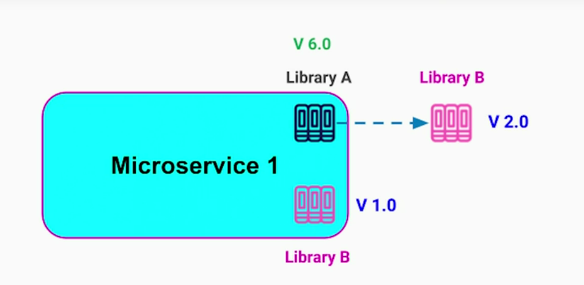
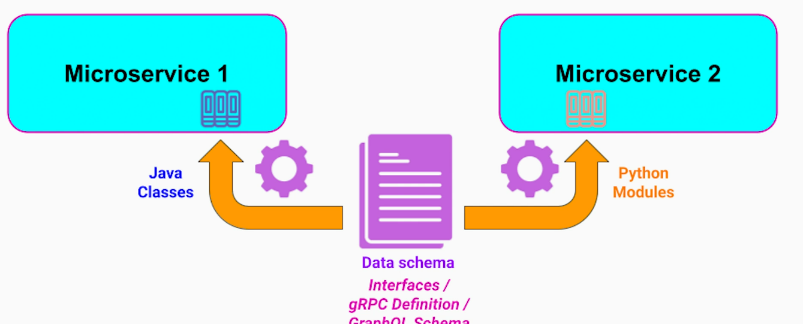
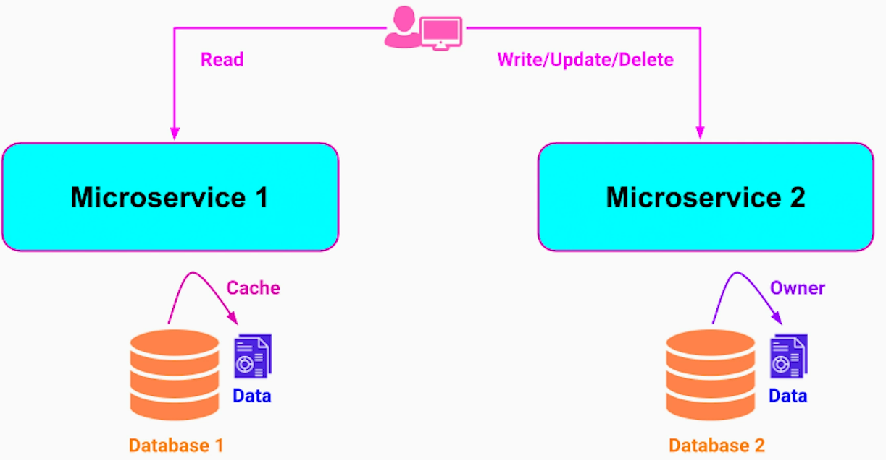

# Database Per Microservice
**Issues of Shared Database**
1. Microservices are constrained from using appropriate database technology & policies
2. Tight coupling between teams and microservices for database changes

**Recommended Approach**
1. Each microservice should have it's own database to reduce coupling between microservices and team. Microservice only exposes its data through APIs to other services - other microservices cannot access its database directly - encapsulation & information hiding principles, loose coupling
2. Multiple instances of the same microservice share the same microservice database

**Downsides & Possible Solutions**
1. Added latency - caching data that belongs to another microservice ensuring that the source of truth remains with the owning microservice; CQRS + Materialized view can be used at the cost of eventual consistency
2. No "Join" operation - Materialized View pattern can be used
3. No support for Transactions - Saga pattern (Transactional Orchestration and Choreography Patterns)

# DRY principle & Shared Libs
**DRY doesn't always hold true in Microservice architecture, particularly in regard to Shared Libs**

**Issues of Shared Libs**
1. Tight coupling - coordination needed between the teams using the shared lib
2. Every change in shared lib requires;
- Rebuild
- Retest
- Redeploy
3. Bug / vulnerability in a shared lib impacts all microservices using it
4. Dependency Hell

**Possible solutions to manage shared code / data across Microservices**
1. Reevaluate if the existing microservices boundaries are correctly defined. Alternatively, create a new Microservice for the shared business logic
2. If 2 microservices share the same data model, code generation tools can be used based on shared data model / schema (Interfaces / gRPC Definition / graphQL schema). 

As long as code is generated based on common interfaces / schema and that generation is performed as part of build and test process, it is a very common and safe approach.
3. Sidecar Pattern - No code duplication needed

Microservices communicate using http protocol to sidecar process running on the same host.
4. Data duplication - sometimes inevitable and important for performance. But Only one owner - source of truth. Only eventual consistency is guaranteed. 

Within each Microservice code-base, we still need to follow DRY principle.

# Structured Autonomy for Development Teams
## Myth
Each microservices team has full freedom to choose its technology stack, tools, databases, APIs, frameworks.

## Problems with Full Autonomy to Development Teams
1. **Upfront cost of Infrastructure** - monolithic or microservices based systems, both need infrastructure - build tools, CI/CD, test frameworks, monitoring, alerting, configs. There is a significant cost in setting this infrastructure and maintaining it. Allowing each microservice team to choose its own infra stack means higher DevOps / QA / SRE cost. 
2. **Steep Learning Curve** - a developer wanting to take a look at another team's config /code-base, will have a steep learning curve if the other team is using totally different infra stack.
3. **Non-uniform APIs** - Example, each team deciding to have their own API style & naming conventions. i.e.; REST, gRPC, graphQL, Thrift API. A front-end engineer who has to pull data from different microservices will have to learn all these API styles. The front-end code will be a huge mess. The same problem happens when one microservice needs to talk to multiple microservices.

Hence a balance between team autonomy and structure is needed. There are **three tiers** of team autonomy suggested;
## Tier 1 - Full restrictive
1. Infrastructure
- Monitoring / Alerting
- CI / CD
2. API
- Guidelines and best practices
- Relevant for external and internal APIs 
3. Security & Data compliance

## Tier 2 - Freedom with Boundaries
in choosing;
1. Programming Languages
2. Database Technologies
from pre-selected set. This allows utilizing the skills across the company in efficient manner.

## Tier 3 - Complete Autonomy
1. Release process
2. Release schedule and frequency
3. Custom scripts and tools for local development and testing
4. Documentation
5. On-boarding process of new members

These are recommendations but actual boundaries may differ from company to company based on following factors;
### Factors for Tier Boundaries
1. Size and influence of DevOps / SRE team - typically, a company with dominating DevOps / SRE team lean towards common standards making their life easier
2. Seniority of developers - generally, more senior the developers are, more freedom they prefer
3. Company's culture

