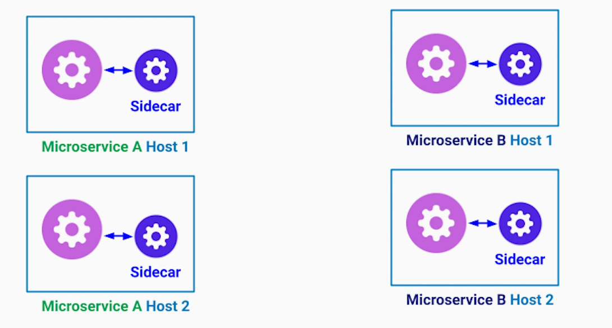

# Database Per Microservice
**Issues of Shared Database**
1. Microservices are constrained from using appropriate database technology & policies
2. Tight coupling between teams and microservices for database changes

**Recommended Approach**
1. Each microservice should have it's own database to reduce coupling between microservices and team. Microservice only exposes its data through APIs to other services - other microservices cannot access its database directly - encapsulation & information hiding principles, loose coupling
2. Multiple instances of the same microservice share the same microservice database

**Downsides & Possible Solutions**
1. Added latency - caching data that belongs to another microservice ensuring that the source of truth remains with the owning microservice; CQRS + Materialized view can be used at the cost of eventual consistency
2. No "Join" operation - Materialized View pattern can be used
3. No support for Transactions - Saga pattern (Transactional Orchestration and Choreography Patterns)

# DRY principle & Shared Libs
**DRY doesn't always hold true in Microservice architecture, particularly in regard to Shared Libs**

**Issues of Shared Libs**
1. Tight coupling - coordination needed between the teams using the shared lib
2. Every change in shared lib requires;
- Rebuild
- Retest
- Redeploy
3. Bug / vulnerability in a shared lib impacts all microservices using it
4. Dependency Hell

**Possible solutions to manage shared code / data across Microservices**
1. Reevaluate if the existing microservices boundaries are correctly defined. Alternatively, create a new Microservice for the shared business logic
2. If 2 microservices share the same data model, code generation tools can be used based on shared data model / schema (Interfaces / gRPC Definition / graphQL schema). 

As long as code is generated based on common interfaces / schema and that generation is performed as part of build and test process, it is a very common and safe approach.
3. Sidecar Pattern - No code duplication needed

Microservices communicate using http protocol to sidecar process running on the same host.
4. Data duplication - sometimes inevitable and important for performance. But Only one owner - source of truth. Only eventual consistency is guaranteed. 

Within each Microservice code-base, we still need to follow DRY principle.

# Structured Autonomy for Development Teams
## Myth
Each microservices team has full freedom to choose its technology stack, tools, databases, APIs, frameworks.

## Problems with Full Autonomy to Development Teams
1. **Upfront cost of Infrastructure** - monolithic or microservices based systems, both need infrastructure - build tools, CI/CD, test frameworks, monitoring, alerting, configs. There is a significant cost in setting this infrastructure and maintaining it. Allowing each microservice team to choose its own infra stack means higher DevOps / QA / SRE cost. 
2. **Steep Learning Curve** - a developer wanting to take a look at another team's config /code-base, will have a steep learning curve if the other team is using totally different infra stack.
3. **Non-uniform APIs** - Example, each team deciding to have their own API style & naming conventions. i.e.; REST, gRPC, graphQL, Thrift API. A front-end engineer who has to pull data from different microservices will have to learn all these API styles. The front-end code will be a huge mess. The same problem happens when one microservice needs to talk to multiple microservices.

Hence a balance between team autonomy and structure is needed. There are **three tiers** of team autonomy suggested;
## Tier 1 - Full restrictive
1. Infrastructure
- Monitoring / Alerting
- CI / CD
2. API
- Guidelines and best practices
- Relevant for external and internal APIs 
3. Security & Data compliance

## Tier 2 - Freedom with Boundaries
in choosing;
1. Programming Languages
2. Database Technologies
from pre-selected set. This allows utilizing the skills across the company in efficient manner.

## Tier 3 - Complete Autonomy
1. Release process
2. Release schedule and frequency
3. Custom scripts and tools for local development and testing
4. Documentation
5. On-boarding process of new members

These are recommendations but actual boundaries may differ from company to company based on following factors;
### Factors for Tier Boundaries
1. Size and influence of DevOps / SRE team - typically, a company with dominating DevOps / SRE team lean towards common standards making their life easier
2. Seniority of developers - generally, more senior the developers are, more freedom they prefer
3. Company's culture

# Micro Frontends Architecture Pattern
## Problems of Monolithic Frontend
One frontend team that maintains a single code-base responsible for all user experience. The code-base resides in a single repo. Any change in any of the microservice will need frontend team's time to enable that feature - this creates dependency and tight coupling. Also, the frontend team may become a bottleneck. 

On the other side, frontend team will have to learn APIs & business domain of each microservice to add a new feature. 

In addition to above mentioned organizational problem, the frontend code may become too large to maintain and to reason about. These are the same set of problems that we dealt with in a monolithic backend app.  

## Micro Frontends Architecture Pattern
1. Split monolithic frontend to multiple micro frontend modules and libs. The split can happen based on business capabilities or domain.

Typically, each page in the web frontend becomes a micro frontend. We can also have several micro frontends visible on the same page.

Each micro frontend should know how to load, mount and unmount itself from the DOM in the browser. Each micro frontend can be loaded standalone in a browser for testing purposes. 

Each micro frontend is owned by a separate team with full-stack capabilities & domain knowledge to develop and maintain this micor frontend. 

2. Container App
All these micro frontends are assembled at run-time by the container web app when user loads our site in a browser. 

**Role of a Container App**
1. Render common elements like page headers and footers
2. Take care of common functionality like authentication and shared libs
3. Tell each micro frontend when / where to be rendered

**Sources of Confusion**
1. Micro frontends is an architecture pattern - **not** a framework / lib
2. Micro frontends are **not** reusable UI elements

## Benefits
1. Replaced the complex monolithic frontend codebase with small and manageable micro frontends
2. Full-stack ownership of each micro frontend - loose coupling between teams
3. Easier / faster to test in isolation
4. Separate CI / CD pipeline
5. Independent release schedule

## Best Practices
1. Ensure that micro frontends are loaded at runtime by the container app and are not expressed as compile time dependencies of the container app
2. Micro frontends shouldn't share state in the browser - it is like microservices sharing a database
3. Intercommunication among micro frontends can be through;
- custom events
- passing callbacks
- using browsers address bar

# API Management
## Problems
1. If we have dozens of microservices exposed, the clients will have to hardcode API endpoints across client frontends and SDKs. This tightly couples API endpoints to client-side code
2. Different type of API technology may be needed for different consumers. I.e.; SOAP XML / REST / gRPC  
3. Support for different API versions / tiers based on subscription level
4. Traffic control and monitoring
- Since each client makes a direct call to different micorservices, their monitoring becomes difficult
- Each microservice will have to write similar boilerplate code for authentication, rate-limiting, etc

## Solution
To decouple our client side from internal architecture and to make API management easier, we can use **API Gateway** pattern.
1. API routing
2. API type / data-format transformation based on client needs - this frees up microservices from worrying about client needs and they can all follow one standard, and utilize the same infrastructure
3. Traffic management and throttling / rate-limiting
4. We can also delegate authorization and TLS termination to the API gateway
5. Enables centralized monitoring
6. Certain API gateways also support fanning out the request to multiple microservices and aggregating results to send back it to client. This can be particularly useful for handheld & IoT devices where battery life is a limiting factor - can help reduce number of connections to backend

## Load Balancer vs. API Gateway
1. Both route a request to a single destination - but here is where similarities help. Both have different roles. 
2. In-context of microservices, we typically have a load balancer in front of each microservice where each microservice is a deployed as a group of identical instances
3. Load balancer features;
- Aims to be as simple as possible to reduce performance overhead
- Performs health checks on instances in it's cluster to ensure it doesn't route request to unresponsive instances
- Offers different load balancing algorithms for different workloads
4. API Gateway features;
- Throttling
- Monitoring
- API versioning and management
- Protocol / Data transformation

