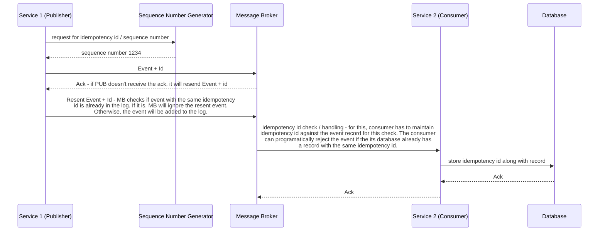

# Introduction
- "Event" represents Fact, Action or State Change that happens in our system
- Events are always immutable
- Unlike requests, that are ephemeral, Events can be stored indefinitely
- Events can be consumed multiple times by different services compared to one-to-one in request-response mapping

## Participating Entities
1. Producer - produces the Events
2. Message Broker - stores and routes those Events. Allows us to route the events to as many consumers that we want. It also adds a level of redundancy - we can always retrieve messages from the message broker
3. Consumer(s) - receive and process the Events

## Request-Response vs Event-Driven Model
1. Synchronous vs. Asynchronous
- In request-response model, sender must wait for the response even it contains no useful information. 
- In event-driven model, producer doesn't need to / expects to receive any response from consumer(s). Delivery of the events to consumer(s) is outside of producer's control and responsibility. This allows producer to move on to its next task instead of waiting for response.
2. Inversion of Control 
In request-response model, sender has to know endpoints of all receivers - tightly coupled. In event-driven model, producer doesn't need to know about consumers. Consumer(s) may not be even running when producer sends a message.

This decouples producers from consumers completely. 

# Use-cases
## Event-Driven Architecture Use-cases
1. For actions that can be classified as Fire-and-Forget and are asynchronous by nature - Report Generation Event, Product Review Posting
2. Reliable Delivery - important in financial systems
3. Infinite stream of data / events - Sensor / IoT data stream to analyze, transform or store in real-time
4. Anomaly detection / pattern recognition - metrics from servers in monitoring system. Each data point in isolation is not that interesting or useful, however when we put these events in sequence we gain interesting insights. For example, requests/sec for a given service increases, we know that we have to scale-out. Similarly, if requests/sec suddenly drops, it indicates some hardware or system problem that needs immediate attention.
5. Broadcasting
6. Buffering - to handle sudden surge in requests / traffic spike
## Request-Response Model Use-cases
1. Immediate response with data is needed
2. Simple interaction - it would be an overkill to use event-driven architecture for simple interactions because configuring and running a distributed / cloud-managed message-broker does come with complexity and cost

In reality, 
1. A typical microservices architecture combines event-driven architecture and synchronous request-response model.
2. It's better 
- to start with request-response model
- Upgrade to event-driven architecture when / where needed

# Event-Delivery Patterns
1. Event Streaming
In this pattern, message broker is used as a temporary or permanent storage of events. Consumers have full access to the log of those events even if the event was already consumed by the same consumer or other consumer(s). A new consumer that joins later also has access to those old events and can replay them from any point it wants.

Ideal for use cases like;
- reliable delivery
- pattern / anomaly detection

2. Pub/Sub
In this pattern, consumers subscribe to a particular topic / queue / channel on a message broker. Consumers receive only new events after subscribing. In this case, subscribers don't have access to the old events. 

As soon as all the subscribers received the event, message broker will typically delete the event from the queue.

Ideal for;
- broadcasting mechanisms
- message broker is used as a temporary storage
- fire and forget
- buffering
- infinite stream of events

# Message Delivery Semantics
Publisher, Message Broker and Consumers have to agree on the message delivery semantics ahead of time.
## At-Most Once
- Data loss is "OK", but we would like to avoid duplication of data
In this semantics, we tell our publisher that if it doesn't receive the ack from message broker, don't resend the message. In the best case scenario, if the message did arrive at the message broker but the ack got lost in the network, we won't lose any data. But if message broker didn't receive the request or crashed before it received the event, we will lose the message entirely. 

We tell subscriber to ack the event before it processes the message / stores it in database. This way, if the subscriber crashed, it won't get the event again. 
- Least overhead / lowest latency
- good for log delivery, metrics, analytics, etc. Example; in ride sharing service, each driver sending his location every few seconds, we can afford to lose few events. 

## At-Least Once
- Data loss is unacceptable
Here, we agree that if a publisher doesn't receiver the ack from message broker in given time, it will resend the event. This guarantees that we never lose the event. But it could result in the event being stored in message broker more than once. 

On subscriber side, we ask subscriber to first process the event and then only send the ack. Until message broker receives an ack, it will keep resending the message.
- Data duplication is OK
- Increased latency
- good for product shipped notification, product review, etc. Not a good choice for high throughput use case. 

## Exactly Once
- Most difficult to achieve
- Highest overhead / latency
- most desirable semantics for use cases involving financial transactions, but it is most difficult to achieve. Not all message broker technologies offer it. If they offer it, read their documentation carefully for the feature. On consumer side, idem-potency id handling is needed at application level.

Some message broker technologies do support generation of idempotency id. If it doesn't, we need a separate sequence number generator service.

