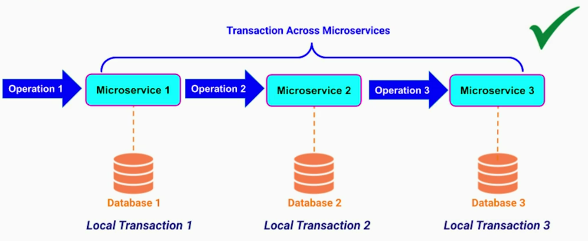
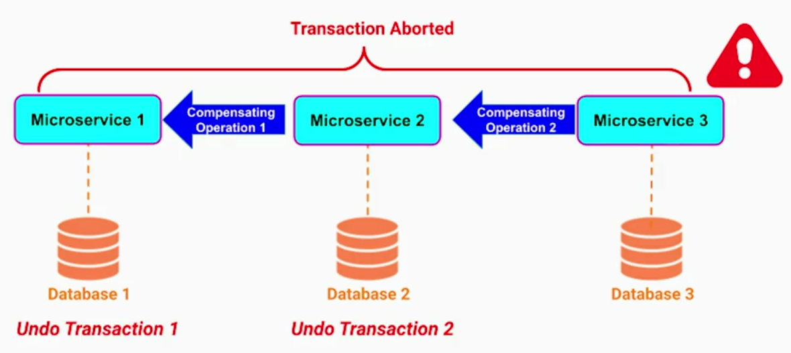
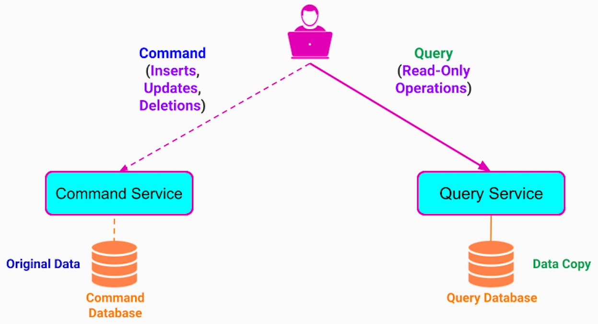
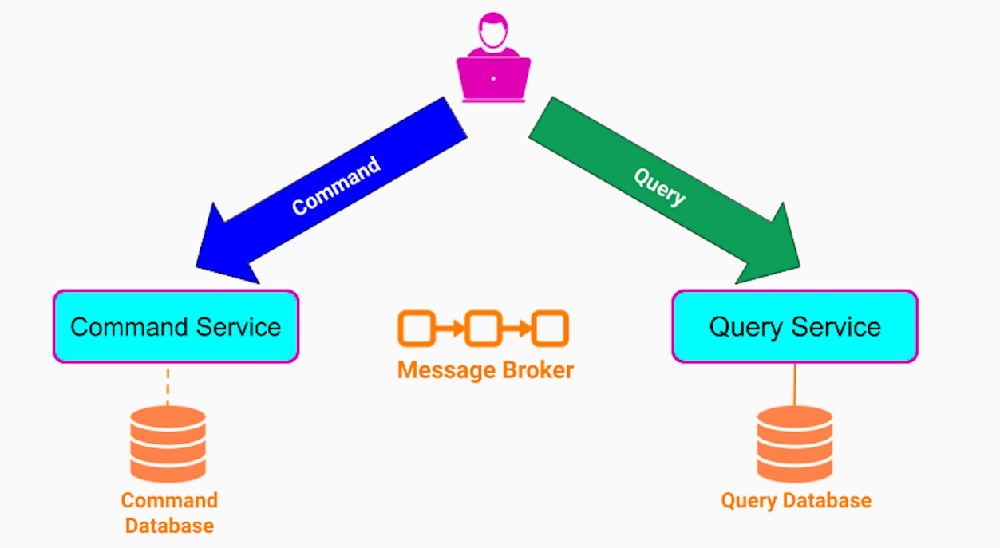
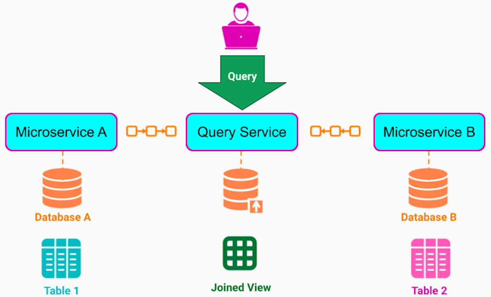
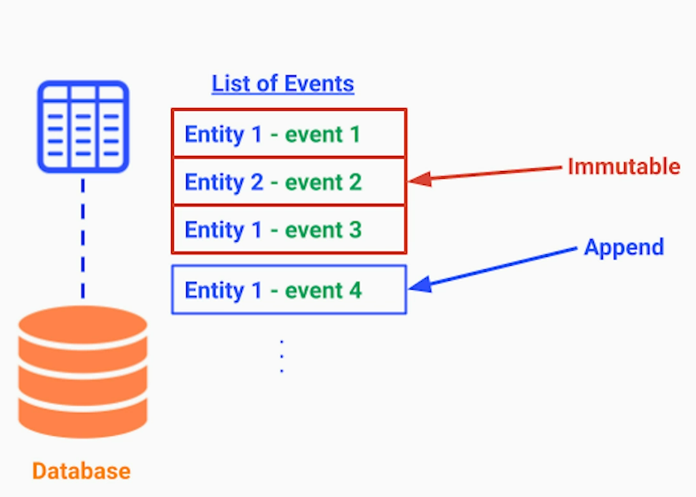
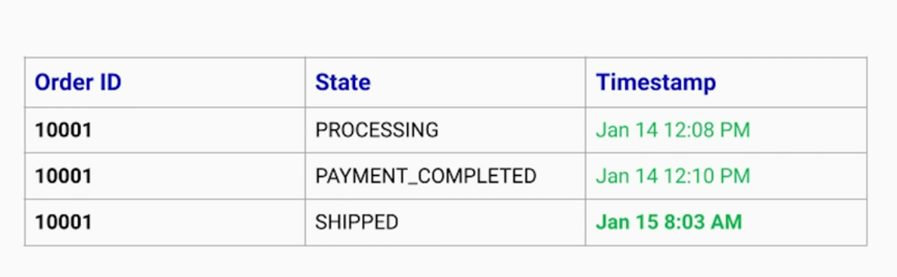
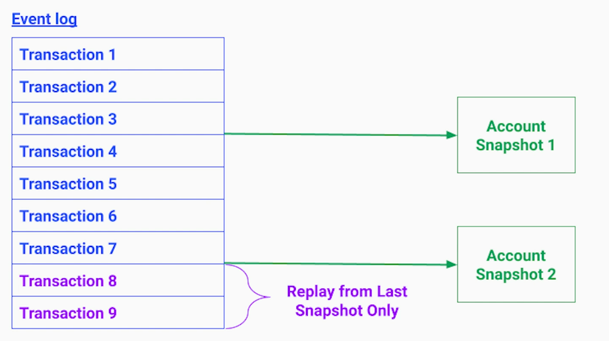
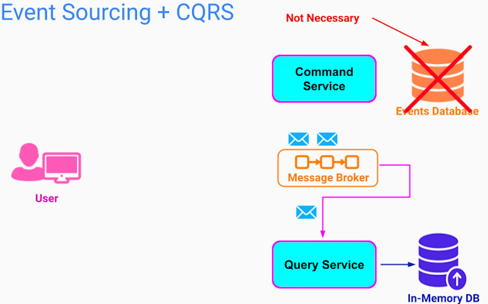

# Saga Pattern
## Problem Statement
In microservices architecture, we have a database per microservice. It means, we can't have ACID support for transactions spanning across multiple microservices

**Transaction** - to an external observer, a sequence of operations appears as a single operation.
This is referred as ACID guarantee - Atomicity, Consistency, Isolation, Durability

## The Pattern
Saga pattern gives transaction support across microservices using compensating txns to rollback previous transaction in case of a failure.

## Two ways to Implement
### Workflow Orchestration (Execution Orchestration Pattern)  
Based on request-response model where workflow orchestration service manages the state of each transaction. If anything goes wrong, it will fire compensating transaction requests to appropriate services.

Here, orchestration service is tightly coupled with all the involved microservices. It is considered Distributed Monolith Anti-pattern.

### Event-Driven Model (Choreography Pattern)
Here, we remove the workflow orchestration service and delegate a task of managing the workflow to microservices themselves. The communication between involved microservices is done using message broker. Each microservice needs to be aware where it needs to send events when successful and failure scenarios to trigger the compensating ops. 

## Additional Notes
1. If I want stronger reliability:
- Outbox Table + Debezium (CDC) → Reliable and fast (near real-time).
- Kafka Transactions → Guarantees atomicity (DB & Kafka commit together).
2. If I want lower latency:
- Kafka Exactly-Once Processing → Reduces the need for outbox polling and de-duplication.
- Idempotent Kafka Producer → Speeds up event publishing.

# CQRS Pattern
## Introduction
- CQRS - Command and Query Responsibility Segregation
- Used in improving database communication performance
- Command - action that results in data change - Write / Update / Delete
- Query - only data read, no data change. Data can be returned as-is or after transformation (sorting / aggregation)

Segregate data & the service into 2 parts - one for Command & other for Query

To keep data in sync between command and query database, we use event-driven model.

## Benefits
Due to Separation of Concerns, we get following benefits;
1. SRP
- We can evolve each part independently using an optimal data model in our programming langauge for each workload 
2. High Performance  
- We can use optimal schema, structure and database technology for command and query database.
- Typically, RDBMS is used for write DB. And NoSQL is used for read DB for its performance benefits.
3. High Scalability
- We can adjust number of instances for each microservice & database instances depending on its traffic
4. Joining data from different microservices

## Additional Notes
- Since CQRS only guarantees eventual consistency, it may not be a right choice for certain financial use cases. E.g.; Show balance.

# Event Sourcing Pattern
## Problem Statement
Finding a previous state of a record in database is not always straight-forward. But in some use cases (transaction history, re-conciliation, etc), we need previous states for visualization, auditing and potential corrections. 

## The Pattern
The events for a given entity reflects either a change or a fact. The events are immutable. Only thing that we can do is to append new events at the end of the log.

To know the current state of the entity, we can replay all the events.

## Event Storage Strategies
1. Database - separate record for each event
- Ability to generate insights using SQL queries

2. Message Broker - separate message for each event
- Not good for performing complex queries 

## Benefits
1. Visualization
2. Monitoring
3. Auditing
4. High Write Performance - appending is faster. Updating the same record by multiple instances has high contention -> poor performance

## Replaying Strategies
Replaying all the events may not be always efficient. For example; to show account balance. To optimize it, we can apply few strategies;
1. Snapshots - we can take a snapshot of user's account balance once a month.

2. CQRS Pattern
- Using CQRS, we can separate the parts that appends events to our system and stores them from the query part. The query part stores the events in the read-optimized database. The read-only database can even be an in-memory DB.

By using CQRS, command side doesn't need a special database. The message broker provides storage capability.

This combination is very popular because;
1. We get history and auditing
2. We get fast and efficient writes
3. We get fast and efficient reads

