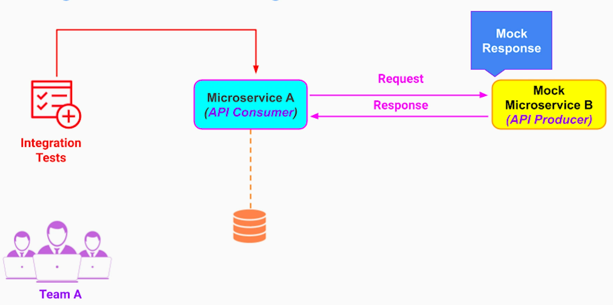
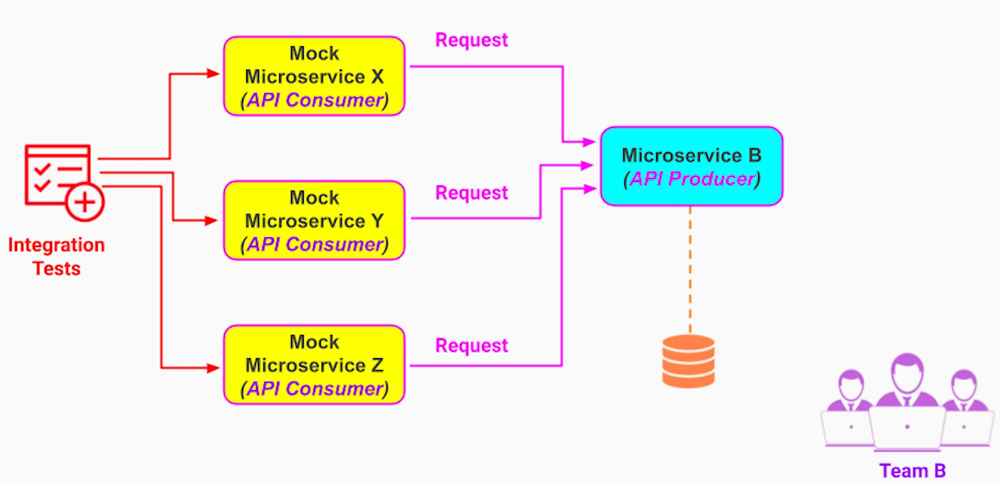
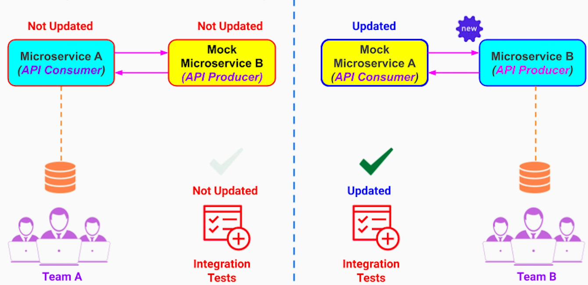
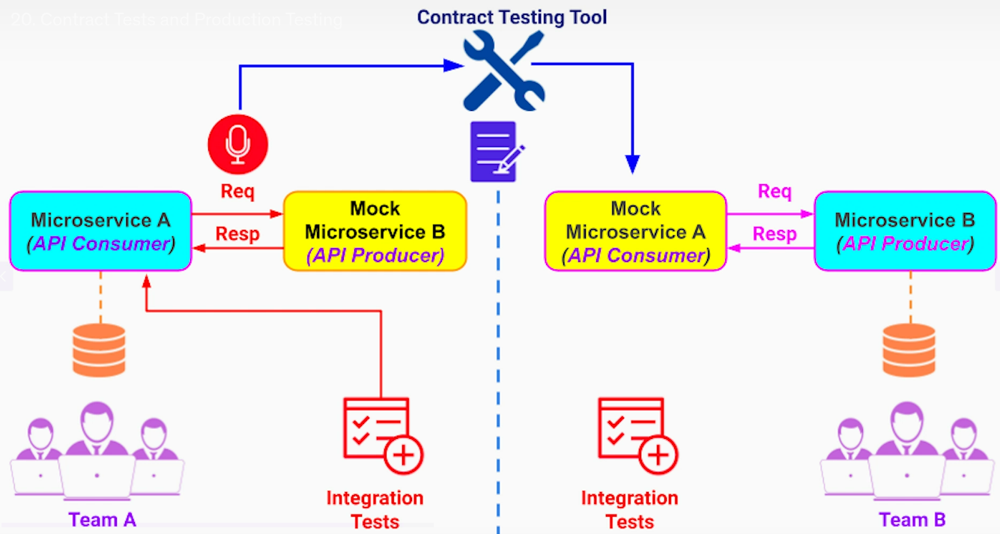
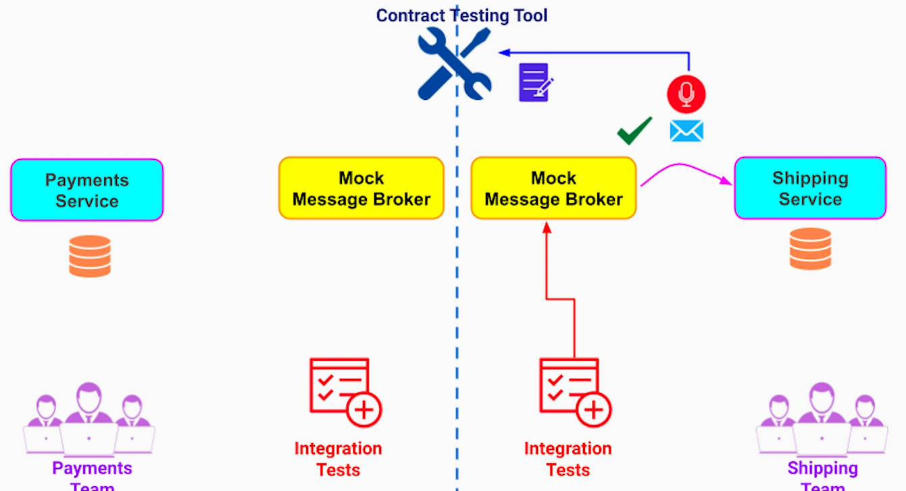
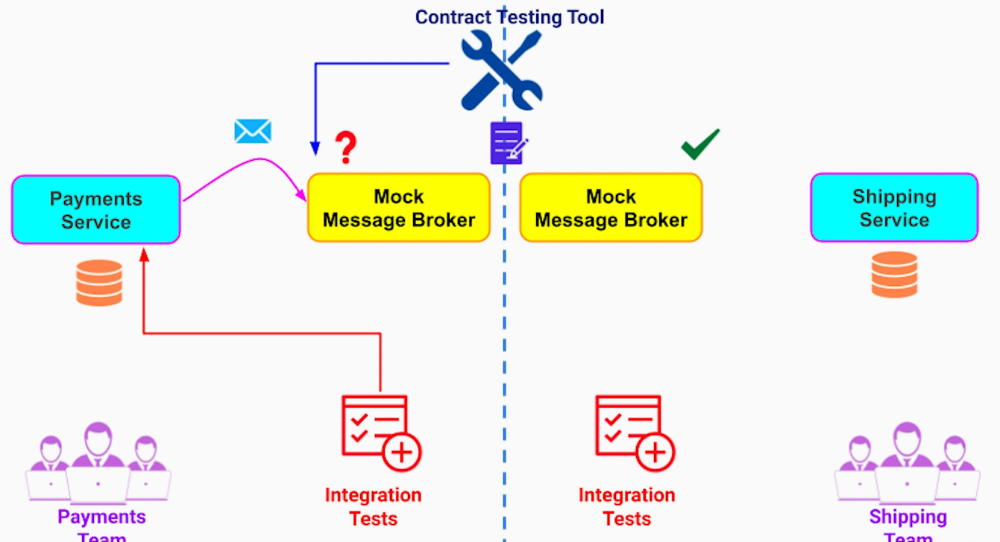

# Testing Pyramid or Table ? :-)
<table>
<tr><td></td><th>Monolithic App</th><th>Microservices</th></tr>

<tr><th>Functional (end-to-end tests)</th>
<td>- Tests end-to-end user journeys / business requirement - Most complex to setup and slowest to run - low in count - Gives the highest confidence about the system functionality</td>
<td>End-to-end tests of user journeys and business requirements involving all microservices</td>
</tr>

<tr><th>Integration tests</th>
<td>- Bigger & slower - Gives more confidence about the system quality</td>
<td>- Integration test between every pair of microservices while mocking rest of our system</td>
</tr>

<tr><th>Unit tests</th>
<td>- Cheap & fast to build and maintain - hence should have as many as required - Gives the least confidence about overall system quality</td>
<td>- Testing each microservice (including its micro frontend-service-database) is essential but not enough</td>
</tr>
</table>

# Challenges
## End to End Tests
1. Hard to setup and maintain the environment
2. No clarity about ownership - what team own the environment and the tests?
3. One team may block everyone from deploying their build to prod
4. Low confidence if the tests are ignored before releasing a microservice to prod 
5. Very costly to run - need a duplicate environment like existing prod

Some companies invest too much in setting up and maintaining the tests. While others, totally ignore it - don't invest at all.

## Integration Tests
1. Difficult to run - creates tight coupling between teams
- Consumer microservice team has to build, configure and deploy producer microservice and its database. If producer microservice has its own dependencies, it becomes even more challenging for consumer microservice team to setup producer microservice.
- Similarly, if producer microservice wants to update its API and there are multiple consumers, it has to setup all those consumer microservices and execute all their tests
2. Slows down development

## Integration Testing for Event-driven Microservices
1. Difficult to test because of loose coupling between microservices

# Strategies for Integration Tests
## Light-weight mocks
On consumer side;

On producer side;

### Pros
This strategy reduces the coupling between teams. If one team breaks its build, the other team can continue to run its tests. It also reduces an overhead of running a real instances of other microservices. 

### Cons
The contract between API provider and consumer can get out of sync without even teams detecting it. This will fail in prod though.

To solve this problem, we can use contract tests.

## Contract Tests 
### For Synchronous Comms
The contract tests work by a dedicated tool, contract testing tool, to keep a mock API provider and the mock API consumer in sync through a shared contract. 

Consumer records the tests and those recorded contracts are shared with provider via the contract testing tool. 

If a provider microservice has multiple consumers, it will take recorded contracts of each of the consumer microservices from the contract testing tool and run them all against its actual API implementation.

#### Pros
1. Each team run their own integration tests without dealing with building, configuring and running other microservices
2. Contract test tool keeps the API contract between microservices in sync

### For Asynchronous Comms 

### Contract Testing Solutions
1. Pact - An open-source contract testing tool that allows API consumers and API providers to define and verify their API contracts. Pact support for many programming languages and frameworks.
2. Spring Cloud Contract - An open-source umbrella project for contract testing solutions. Contains the Spring Cloud Contract Verifier project that enables Consumer Driven Contract (CDC) development of JVM-based applications using Groovy DSL or YAML. 
3. PactFlow -  A commercial offering that manages the lifecycle of contracts defined by contract testing tools (like Pact, Spring Contract, etc.) and provides a workflow to manage them in your CI/CD pipelines. Supports all JVM languages as well as Ruby, Golang, NodeJS / JavaScript, Python, Objective-C / Swift, .NET, PHP, C++, and Rust

# Strategies for End-to-end Tests
If setting up an end-to-end tests (env, test cases, etc) is not feasible (because its too complex and expensive), an alternative is to test in production using following strategies. 
## Blue-Green deployment + Canary testing
Blue env has old version and Green has a new version.
1. Run automated / manual end-to-end tests against the Green environment where a new version is deployed before live traffic is routed to the Green env.
2. After we run those tests, we can shift portion of prod traffic to Green env & monitor the new version for performance & functional issues - This process is  called Canary testing. If we detect any issue, we immediately shift all traffic to Blue env. If no issues are detected in Green env, we direct all prod traffic to Green env.

