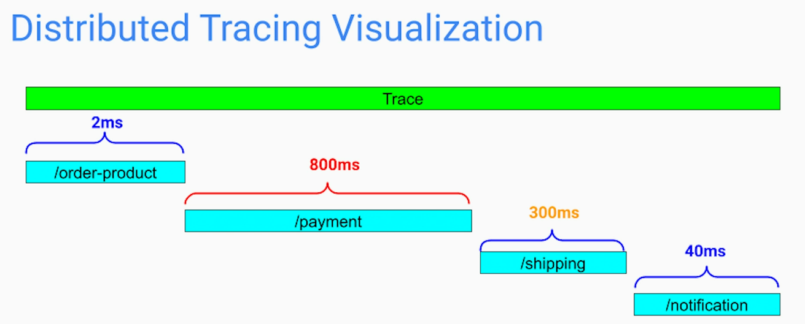

# Introduction
Bugs, performance issues are inevitable in prod. These issues are particularly hard to troubleshoot in distributed systems comprised of many microservices. 

## What is Observability?
1. Observability allows us to follow a flow of individual;
- Requests
- Transactions
- Events
across the entire system spanning multiple microservices

2. Discover and isolate performance bottlenecks

3. Point us to the source of the problem instead of just tell us that the problem exists

In microservices architecture, observability is important because;
1. We cannot ssh to view logs or do instrumentation on every single microservice instance to identify an issue
2. Statistically, most of the issues occur at endpoints in microservices architecture. Observability provides insights into flow of input and output for each microservice

# Three pillars of Observability
1. Distributed Logging
Logs are append only files that logs events happening in app process, container, database instance and server. The logs are represented as structured / semi-structured strings of data. The logs include metadata as such timestamp, request that triggered it, method / class / app where event happened, and so on.
2. Metrics
Regularly sampled data points. It includes numerical values such as counters, distributions, gauges. Some examples are 
- counters of requests/min, errors/hour
- distributions of latency
- gauges such as current CPU utilization, memory usage, cache hit rate
3. Distributed Tracing
Captures path of given request through several microservices & time each microservice takes to process it. The traces may include additional details such as request headers, response status code.

## Observability Signals
When we get an alert about an issue or manually detect an issue, we can use all 3 forms of signals to debug the issue. We can address issues by;
- issuing a rollback
- making a hotfix
- adding more instances
- diverting traffic to another region or data center

# Distributed Logging
1. Simple way to provide insight into application's state
2. A logline can be:
- Event
- Action
- Exception
- Error

## Best Practices
### Centralized System
To makes sense of the large amount of distributed log data, we need a highly scalable and centralized logging system. The system collects logs from all the microservice instances.  

The system needs to parse and index those logs so that they can easily 
- searched by patterns, texts
- grouped & filtered by attributes like host, microservice, time-period, region, etc 

### Predefined structure / schema
To make searching easy and consistent. The log lines should be easily read by humans but at the same time machine parsable.

The log structure can be represented at logfmt (key-value pair), JSON or XML.

### Log Level / Log Severity
Each log line should have a log level. It helps filter logs more efficiently - reduce noise and reduce alert fatigue. 

An automatic tools can apply filter on certain level of severity (FATAL, CRITICAL, ERROR) and generate automated alerts to engineers on call.

### Unique Id / Correlation Id
We should have a unique id (also called correlation id) for every user request / transaction. Helps with distributed tracing.

### Adding Contextual Information
Common data points to include in each log line;
1. service name that emitted the event
2. host / ip where the event happened 
3. userId or some other identifier to know who initiated the operation
4. timestamp when event occurred - time on each server should be in sync using centralized time server
5. correlation id to trace the request across microservices - ideally, should be generated at the entry point in the system
6. stack trace and method parameters (only non-sensitive data)
7. database query & query response time

Considerations;
1. Log only necessary data to keep storage space in check
2. Do on log
- Sensitive data
- PII (Personal Identification Information)

# Metrics
## Introduction
Metrics are measurable or countable signals of software that help us monitor the system's health and performance. 

Typically, metrics are regularly sampled so we can see a continuous progression - this helps us monitor our systems and detect anomalies. Since they are numerical values, we can set limits and alerts on it.

Since they are just the numbers, they are easiest to collect, organize and visualize using dashboards.

## Problem of collecting too much
We can collect lot of data for the system. But collecting anything that we can measure is an anti-pattern.

Collecting too many signals can be;
1. Expensive
2. Information Overload

## The 5 Golden Signals/Metrics
for maximum observability and minimum complexity. These 5 signals are based on 2 sources of knowledge - Google SRE Book "The Four Golden Signals" & **USE** method by Brendan Gregg

1. Traffic - amount of demand being placed on our system per unit of time. E.g.; http request/sec for microservice, queries/sec for DB, events received/sec and events delivered/sec for a message broker, number of incoming requests/sec + number of outgoing reqs/sec

2. Errors (error rate and error types) -  number of application exceptions, http status response code other than 2xx, 
response exceeding latency thresh-holds, failed events, failed delivery, aborted transactions & disk-failtures on database side

3. Latency - time it takes to process a request - instead of average check 95 percentile of the requests, separate successful and failed requests

4. Saturation - how overloaded / full a service or a given resource is. Meant for queue / topic 

5. Utilization - CPU / memory / disk space - ideally, thresh-hold should be around 80% - distributed across time, not just average

# Distributed Tracing
## Introduction
Helps narrow down the faulty component or communication problem in microservices architecture. After that, we can use logs and metrics to further debug the issue.

## How it Works?
Each microservice instance runs a tracing agent as a separate process. It collects trace data and shares it with tracing system typically via message broker. The tracking system indexes these data and makes it available for developer analysis.

1. When the initial request is being made, we generate a unique Trace Id and place it into an object called Trace context. 

2. As the request flows through services, the context is propagated usually through http header or message header.

3. But just passing tracing context from service to service is not enough. For application to collect the tracing data, we need to instrument them using instrumentation lib / SDK. These tracing libs come in different programming languages. This allows us to get a complete trace for even a polyglot system

4. All these trace data can later be aggregated using trace id

5. To visualize how much time each service took, a trace is broken down into spans. These trace spans can be coarse grained (say at service level) or developer can create fine-grained (method level, for example) spans using tracing lib / SDK.

6. To further increase granularity, we can have spans in hierarchy

## Challenges
### Manual Instrumentation of Code
1. In most cases - not a big deal
2. Requires us to;
- depend on and load a lib
- learn and manually add instrumentation code
3. Otherwise;
- span may be too broad
- missing spans

### Cost
1. Need to run an agent on each microservice host - it consumes its own CPU and memory. 
2. The collected data is sent over the network to the tracing system - this consumes network bandwidth. 
3. Then we need to run a big data pipeline with its own infra to process all the tracing data - it has its own maintenance cost
4. Storage cost - to keep storage cost in check, most companies use sampling (1/1000 requests) on client side. 

### Big Traces
1. A single trace can be hard to look at
2. Some are so big that they cannot be loaded in the UI

## Distributed Tracing Instrumentation Frameworks
1. OpenTelemetry - OpenTelemetry is a is a collection of APIs, SDKs, and tools for instrumenting, collecting, and exporting metrics, logs, and traces. It is open-source and is available in many programming languages such as C++, .NET, Erlang/Elixir, Go, Java, JavaScript, PHP, Python, Ruby, Rust, and Swift. OpenTelemetry is also a specification that describes the cross-language requirements and expectations for all OpenTelemetry implementations.

## Distributed Tracing Backends
1. Jaeger - Open source, distributed tracing platform that is cloud-native, infinitely scalable, and 100% free. It enables the monitoring of distributed workflows, tracking down root causes for performance bottlenecks, and analyzing service dependencies.
Requies OpenTelemetry for instrumentation .

2. Zipkin - Another open-source distributed tracing system. Its data served to the UI is stored in memory or persistently    within Apache Cassandra or Elasticsearch. Originally developed at Twitter in 2010 and based on Google's Dapper papers. Supports a variety of official and community-created instrumentation frameworks.

3. Uptrace - Uptrace is an OpenTelemetry-based observability platform that helps you monitor, understand, and optimize distributed systems. It is a commercial, cloud-based solution that supports a variety of features such as App Performance Monitoring, metrics collection and visualization, logs injection and analysis, and more.

