# Cloud Virtual Machines 

## Multi-Tenancy
### Benefits
1. Affordable, flexible pricing
- Pricing Model - Pay-per-use
- Rate depends on capabilities - CPU, Memory, N/W bandwidth, etc

### Downsides
1. Security risks due to multi-tenancy - however low, certain industries like banking, healthcare, national security services cannot afford the lowest of security risk
2. Potentially lower performance due to "Noisy Neighbor"

Multi-tenant deployments with VMs may not be the best option for systems needing low latency and high security.
Single-tenant and Dedicated hosts may be a better choice for above.

## Single Tenant Instances & Dedicated Hosts

Dedicated hosts also reduce overhead of Hypervisor for virtualization

### Downsides
1. More expensive than multi-tenant, cloud VM deployment

## Conclusion

# Server-less Deployment (using FaaS)
Allows us to architect our system fully using event-driven model - not only from software perspective but also from infra perspective. 

To cloud vendor, we need to provide;
1. Type of request / event to handle
2. Logic to execute

## Pricing Model
1. Based on 
- Number of requests/month
- Execution time
- Memory
2. If we don't get any requests/ events, the price is ZERO

## Benefits
1. Reduced infra costs - beneficial for seasonal workloads to handle traffic spikes
2. Reduced operations overhead for scalability
3. Reduced development cost for building, packaging and deploying microservices

## Downsides
1. If the traffic pattern changes, infra costs may increase significantly
2. Unpredictable performance
3. Less secured - runs in multi-tenant env and our source code is exposed to cloud provider

# Containers
## The Problem Statement(s)
### Dev / Prod Env. Parity
"It worked fine on my machine"

## Benefits over VM based approach
### Dev Env
Running multiple microservices with virtulization on dev machine is too much of overhead
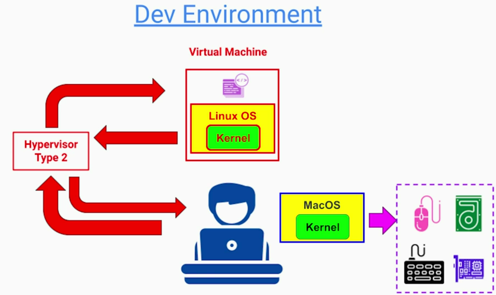

If we want to run multiple microservices on our machine for integration, we need to run multiple VMs - each with its own copy of OS and its own kernel. This makes the dev machine extremely slow and inefficient
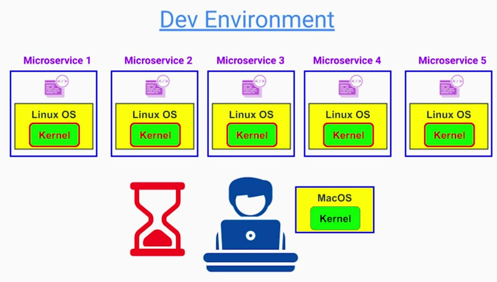

Instead containerization solve this problem by isolating only what we want to isolate and sharing everything else. This has less overhead.
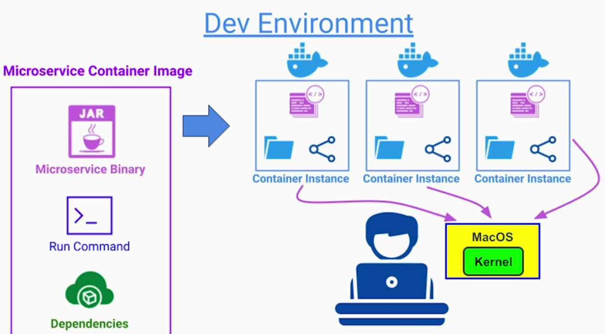

### Integration Env
Now, we can run the contain image on any OS and hardware now that supports container and container runtime. 
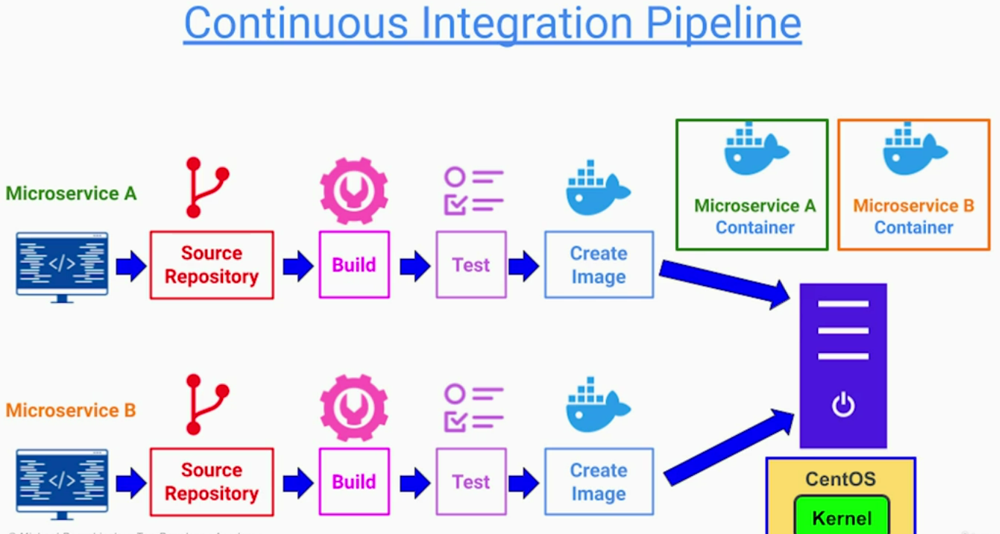

### Production Env
VM based deployments have few drawbacks;
- Inefficient resource utilization
- Slow to start new instances - create VM, deploy, etc.
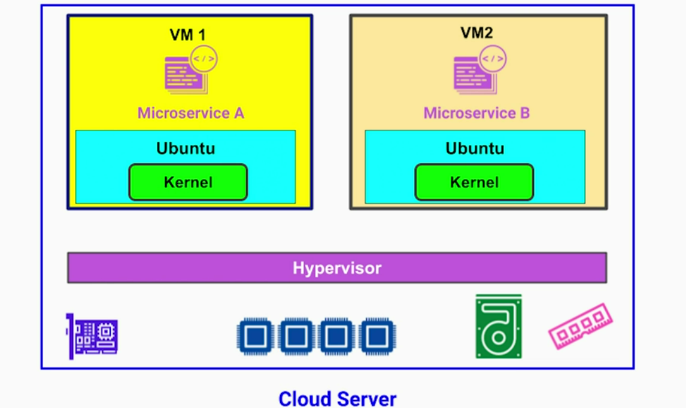
- Cloud vendor lock-in & lack of portability. VM image formats & configs are cloud vendor specific
Also, managing multi-cloud or hybrid cloud envs with VM based approach would be a nightmare.
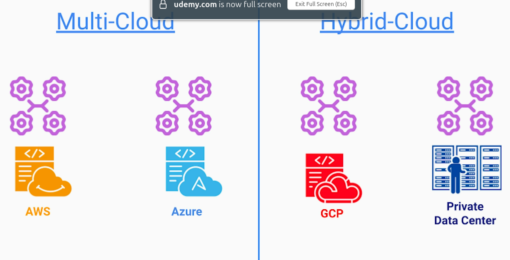

Instead, we can utilize cloud server resources more effectively with containerization;
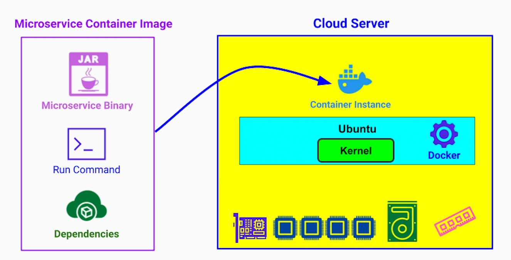

## Benefits
1. Parity between dev and prod envs
2. Portability across cloud providers
3. Faster deployment / startup of instances
4. Lower infra costs

Instead of renting few smaller VMs, we can rent a larger VM or a dedicated host. This allows us to run more microservices with the same amount of hardware compared to VM per microservice instance approach.
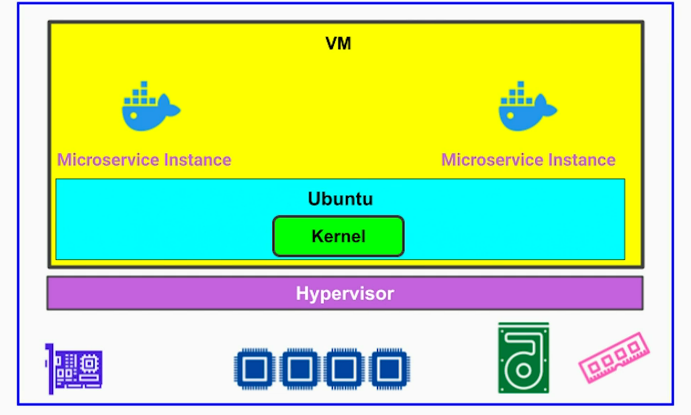

# Container Orchestration
Challenge of using contains is to manage & deploy thousands of containers for hundreds of microservices, potentially, across different cloud providers
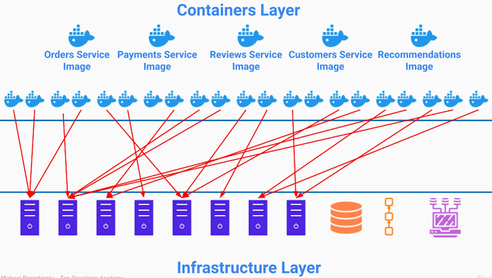

## Introduction
Container orchestrator is a tool that manages entire lifecyle of containers - it is like an OS for microservices architecture deployed as containers

Container orchestrator is responsible for;
1. Deployment automation of microservices as containers
2. Managing resource allocation to containers to ensure each container gets right amount of CPU, memory and storage to work properly
3. Monitoring the health of containers
4. Self-healing - to maintain healthy number of instances of each microservice
5. Bin-packing - better hardware utilization
6. Load balancing between containers of the same microservice 
7. Scaling services out or in by adding / removing containers based on the traffic and resource utilization
8. Container discovery
9. Network connectivity between containers and the outside world

## Kubernetes Architecture (Representative)
Kubernetes is popular, but not the only container orchestration tool

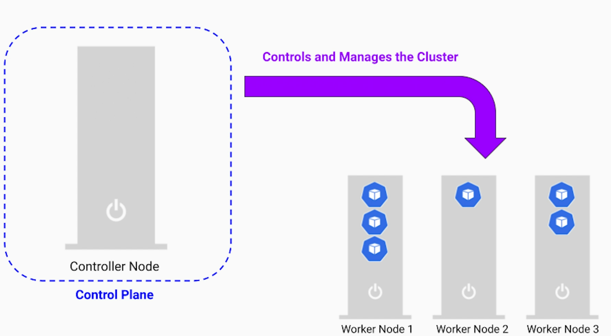
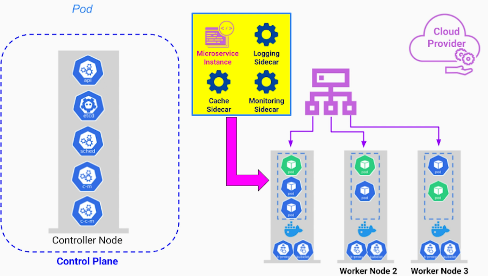
Configs
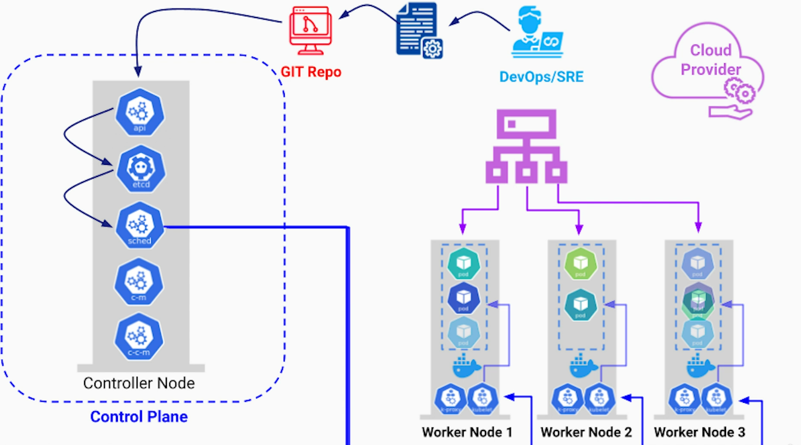

Real-life Env
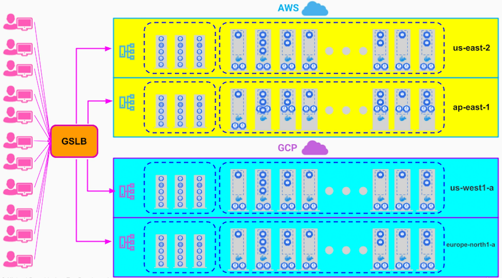

