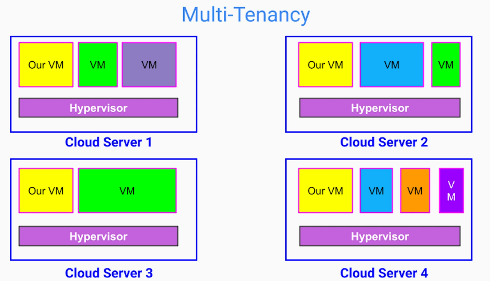
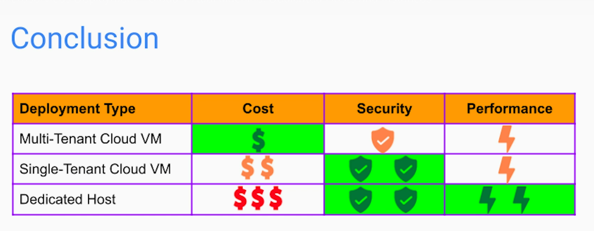

# Cloud Virtual Machines 

## Multi-Tenancy
### Benefits
1. Affordable, flexible pricing
- Pricing Model - Pay-per-use
- Rate depends on capabilities - CPU, Memory, N/W bandwidth, etc

### Downsides
1. Security risks due to multi-tenancy - however low, certain industries like banking, healthcare, national security services cannot afford the lowest of security risk
2. Potentially lower performance due to "Noisy Neighbor"

Multi-tenant deployments with VMs may not be the best option for systems needing low latency and high security.
Single-tenant and Dedicated hosts may be a better choice for above.

## Single Tenant Instances & Dedicated Hosts

Dedicated hosts also reduce overhead of Hypervisor for virtualization

### Downsides
1. More expensive than multi-tenant, cloud VM deployment

## Conclusion

# Server-less Deployment (using FaaS)
Allows us to architect our system fully using event-driven model - not only from software perspective but also from infra perspective. 

To cloud vendor, we need to provide;
1. Type of request / event to handle
2. Logic to execute

## Pricing Model
1. Based on 
- Number of requests/month
- Execution time
- Memory
2. If we don't get any requests/ events, the price is ZERO

## Benefits
1. Reduced infra costs - beneficial for seasonal workloads to handle traffic spikes
2. Reduced operations overhead for scalability
3. Reduced development cost for building, packaging and deploying microservices

## Downsides
1. If the traffic pattern changes, infra costs may increase significantly
2. Unpredictable performance
3. Less secured - runs in multi-tenant env and our source code is exposed to cloud provider
