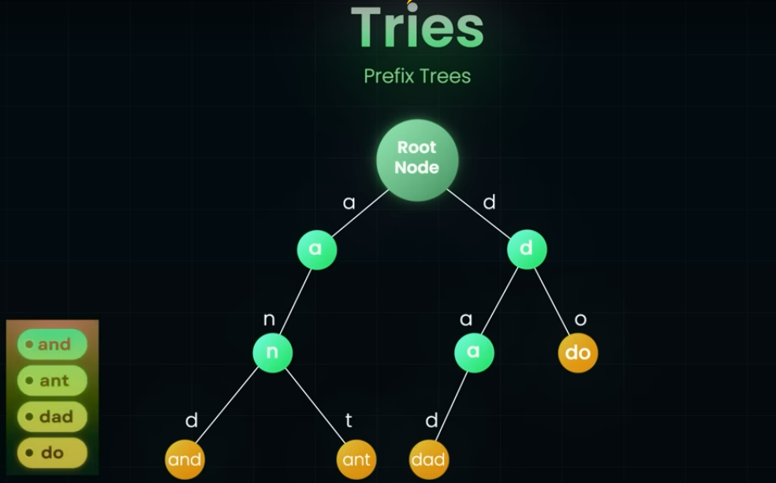
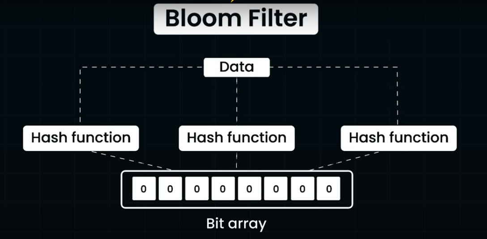
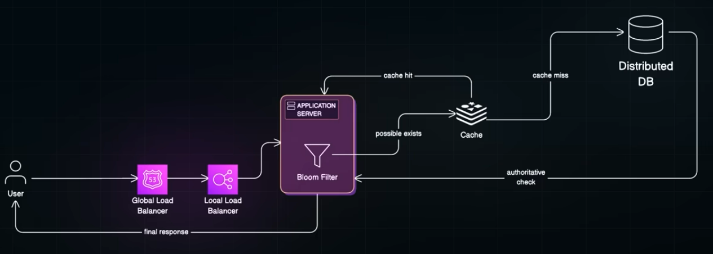

Here are various strategies to improve system performance;

# Design Strategies
[Design Strategies](https://github.com/maulikdave-fh/cpsa/blob/main/8-Design%20Strategies.md#high-performance)

# In-memory Data Structures
<table>
  <tr><th>Data Structure</th><th>Lookup Time</th><th>Memory Usage</th><th>Supports Prefix Search</th><th>Supports Range Query</th><th>False Positives</th><th>False Negatives</th><th>Best Use Case</th><th>Notes</th></tr>
  <tr><th>Redis HashMap</th><td>O(1)</td><td>High (exact data stored)</td><td>No</td><td>No</td><td>No</td><td>No</td><td>Exact match, fast cache hits</td><td>Often used in caching layers</td></tr>
  <tr><th>Trie</th><td>O(m) where m is a length of the string</td><td>Moderate to High - Reduced redundancy - "and" and "ant" share the same path</td><td>Yes</td><td>No</td><td>No</td><td>No</td><td>Auto-complete, prefix queries</td><td>Examples;  - Similar available usernames - Check all names that starts with given prefix</td></tr>
  <tr><th>B+ Tree</th><td>O(log N)</td><td>Moderate</td><td>Yes (via range scans)</td><td>Yes</td><td>No</td><td>No</td><td>Sorted look-ups, range scan in DB</td><td>Used in SQL and NoSQL databases for indexing. High Fan-out - each node can store 100s of keys, so tree stays shallow</td></tr>
  <tr><th>Bloom Filter</th><td>O(k)</td><td>Low (bit array)</td><td>No</td><td>No</td><td>Yes (~1%)</td><td>Never</td><td>Filtering out non-existent entries quickly</td><td>Doesn't need to store the actual data</td></tr>
</table>

## Tries (prefix trees)

## B+ Tree
As dataset grows, maitaining B+ tree's performance on a single machine becomes difficult. That's where systems like Google Cloud Spanner comes into picture - spanner distributes a sorted key-space, backed by a B+ Tree like structures, across multiple machines and replicas. Allows system to scale horizontally without compromising on performance

## Bloom Filter

If any of the bits is zero, data is definitely not present. If any of them is one, data is probably present - here is where you fall-back on more expensive check like Redit Hashmap cache or database query. They never give false negatives. Database systems like Cassandra uses bloom filter to avoid unnecessary disk look-ups. 

Another alternative is to have a global bloom filter.

## Real World Example
In real world, you can combine all these data structures strategically by layering them to maximize speed, reducing memory usage and minimizing database load.
- Global LB uses DNS based look-ups to route request to the closest data center
- Bloom filter is a small in memory data structure, synchronized with a central data source or rebuilt periodically with data base.
- Only cache misses go to distributed db

# Architectural Patterns
## CQRS (Command Query Responsibility Segregation)
## Materialized Views
## CDN (Content Delivery Networks)
## IP caching - avoid DNS hops
1. Rebuild cache periodically

# Database Techniques
## Sharding

# Distributed Databases
## 

