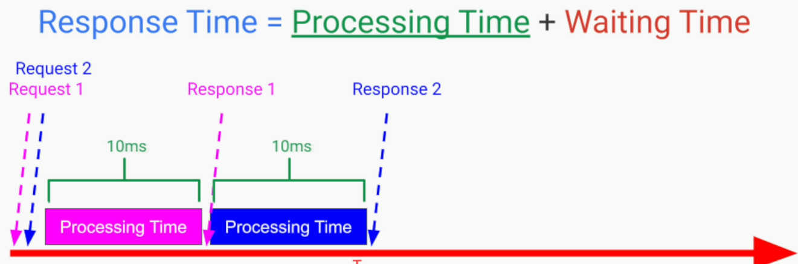
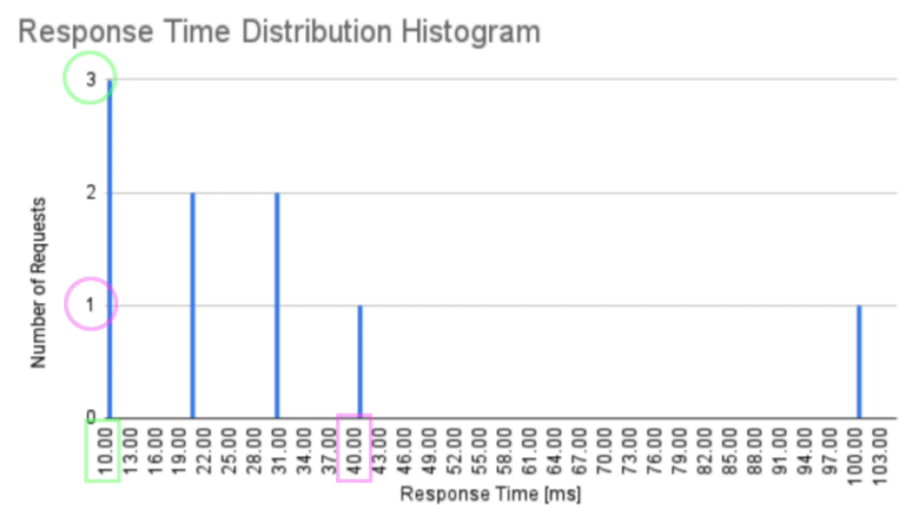
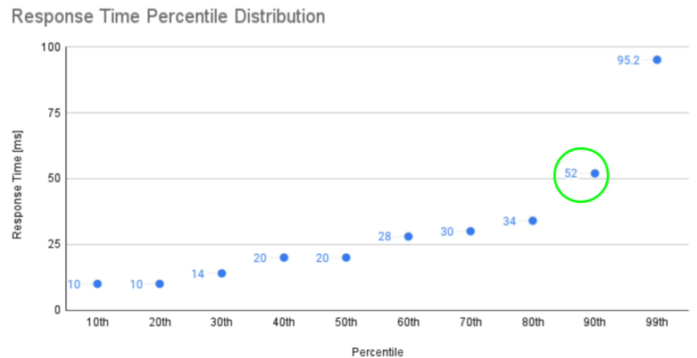
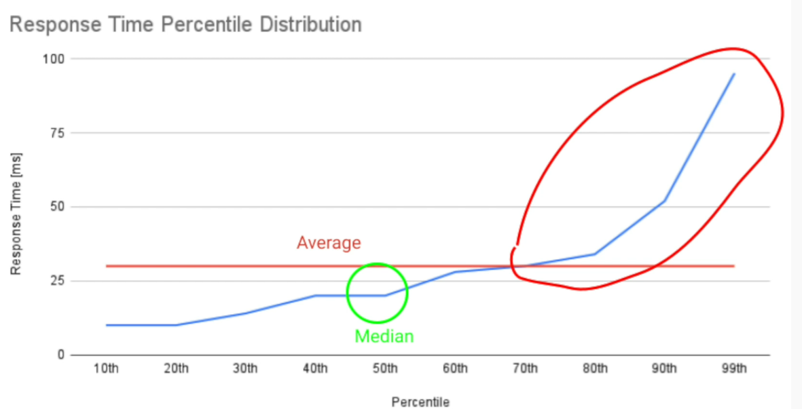
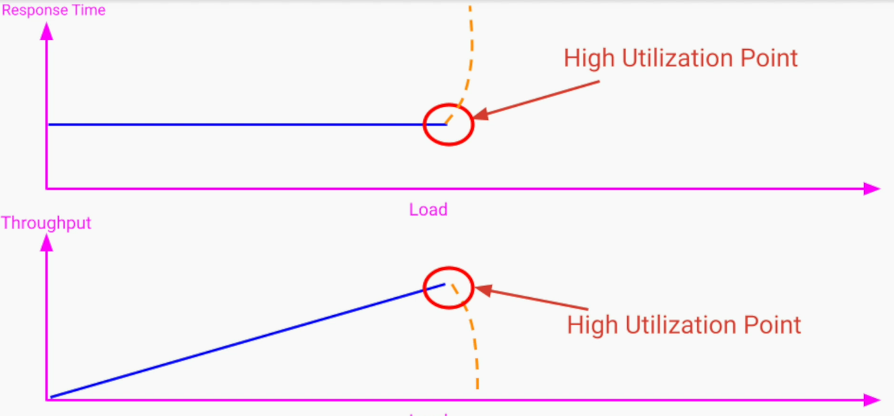
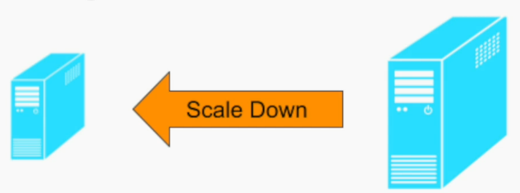
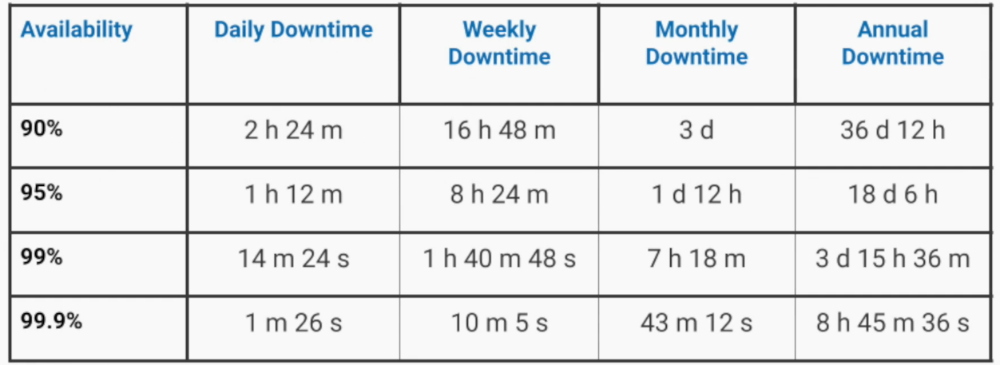

## Performance
### Performance Metrics
#### 1. Response Time
Response Time (End to end Latency) = Processing Time + Waiting Time (Latency)

- **Processing Time** - Time spent in our system to actively process the request and building / sending the response 
- **Waiting Time** - Duration of time request/response spends inactively in our system. Time spent in transit (networks / wires / switches / gateways / software queues / etc).

#### 2. Throughput
Can be measured as;
1. Amount of work performed by our system per unit of time
- Measured in tasks / second

2. Amount of data processed by our system per unit of time
-  Measured in bits / second, bytes / second, Mbytes / second

### Important Considerations
1. Measure Waiting Time - measuring just processing time can reflect incorrect insights

If our system is processing 1 thread at a time, and if we only measure processing time for the response time;
- for request one, user will have to wait for 10ms
- for request two, user will have to wait for 20ms

This will be a poor UX.

2. Response Time Distribution
Create histogram to reflect number of requests by response time.

From the histogram - the "xth percentile" is the value below which x% of the values can be found. 

Following reflects that 90% of the requests were served below 52ms.

If just take average or median and don't consider percential, we wouldn't know that some percentage of our users faced high response time (also called **tail latency**). 

**Tail latency** The small percentage of response times from a system, that take the longest in comparison to the resf of the values. **Shorter Tail -> Better**

#### Notes
- **Define response time goals using percentile, and not using average response time**
Exmple; 95th percentile of our response time will be less than 30ms
- **Measure and compare to our goals using percentile distribution**

3. Identify Performance Degradation Point
Signifies high CPU utilization or high memory consumption or too many connections / IO in network / OS or message queue at capacity

## Scalability
The measure of a system's ability to handle a growing number amount of work, in an easy and cost effective way, by adding resources to the system

### Types of Scalability
#### 1. Vertical Scalability /  Scaling up
Adding resources or upgrading the existing resources on a single computer, to allow our system to handle higher traffic or load

**Pros**
- Any application can benefit from it - no code changes required
- The migration between machines is very easy - helps us save cost particularly if we are renting our hardware from cloud service provider

**Cons**
- Scope to upgrade is limited
- We are locked to a centralized system which cannot provide high availability and fault tolerance

#### 2. Horizontal Scalability / Scaling out
Adding more resources in form of new instances running on different machines, to allow our system to handle higher traffic or load

**Pros**
- No limit on scalability
- Easy to add / remove machines
- If designed correctly, can provide high availability and fault tolerance 

**Cons**
- Initial code changes may be required 
- Increased complexity, coordination overhead

#### 3. Team / Organization Scalability
Ability to increase productivity while hiring more engineers into the team

## Availability
The fraction of time / probability that our service is operationally functional and accessible to the user

**Uptime** - time that our system is operationally functional and accessible to the user
**Downtime** - time that our system is unavailable to the user

**Availability (in%) = Uptime / (Uptime + Downtime)**

Detectability and fast recovery can help achieve high availability. 

### Availability vs Downtime

99.9% is  3 nines
99.99% is 4 nines

### What prevents us from achieving HA?
Three sources of failures
#### 1. Human Error
1. Pushing a faulty config to prod 
2. Running the wrong command / script
3. Deploying an incompletely tested  new version of software

#### 2. Software Errors
1. Long garbage collections
2. OOM exceptions
3. Null pointer exceptions
4. Segmentation faults

#### 3. Hardware Failures
1. Servers/routers/storage devices breaking down due to limited shelf-life
2. Power outages due to natural disasters
3. Network failures because of
- Infra issues
- General congestion

**We cannot avoid the failures completely. The best way to achieve HA is through fault tolerance**

### Fault Tolerance
**Fault Tolerance** enables our system to remain operational and available to the users despite failures within one or multiple of its components. 

When failure happens, a fault tolerant system will;
- continue to function at the same /reduced level of performance
- prevent system from becoming unavailable

#### Tactics to achieve Fault Tolerance
##### 1. Failure Prevention
- Eliminate single point of failures through replication and redundancy

##### 2. Failure Detection and Isolation
- Leverage Monitoring service

##### 3. Recovery
- Stop sending traffic / workload to faulty instance
- attempt to restart the host to make the problem go away
- rollback - going back to a version that was stable and correct

## SLA, SLO, SLI
These terms aggregate the promises that we make to our users in regards to the quality attributes of the system.

### SLA - Service Level Agreement  
1. It is a legal contract of the promises that we make to our clients / users. It represents our quality service such as;
- Availability
- Performance
- Data durability
- Time to respond to system failures
- ...

2. It states the penalties and financial consequences, if we breach the contract. The penalties include
- full / partial refunds
- subscription / license extensions
- service credits

3. SLA aggregates multiple SLOs in a single legal document

### SLO - Service Level Objections
1. Individual goals that we set for our system
2. Each SLO represents a target value / range that our service needs to meet. For example;
- Availability SLO of 3 nines
- Response time SLO of less than 100ms at the 90th percentile
- Issue resolution time SLO of between 24 and 48 hrs
3. Even if a system doesn't have SLA, it must have SLOs

### SLI - Service Level Indicators
1. Quantitative measure of our compliance with a service-level objective
2. It is the actual numbers;
- measured using monitoring system
- calculated from our logs
3. Compared later to our SLOs
4. Examples
- Percentage of user requests served successfully can be used as SLI for availability. Later it can be compared to our 3 nines SLO for availability

### Important Considerations
1. We shouldn't take every SLI that we can measure in our system and define a SLO associated with it. Instead focus on SLOs that users would care the most about.
2. Promising few SLOs is better
3. Set realistic goals with a budget for error
4. Create a recovery plan for when the SLIs show that we are not meeting our SLOs

