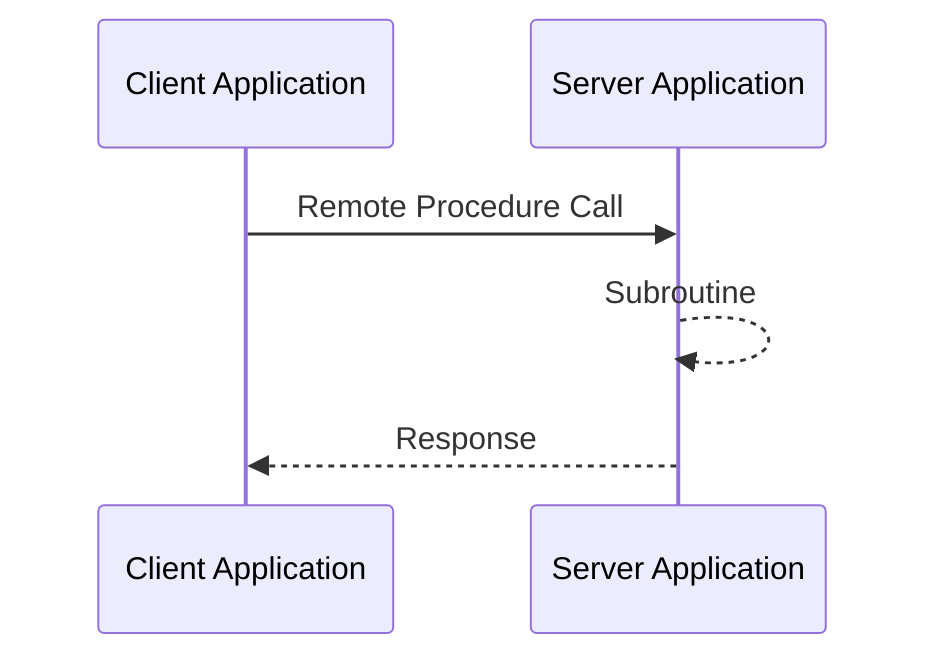
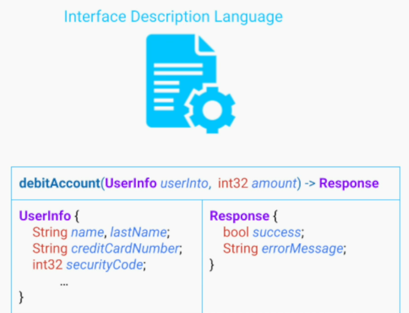
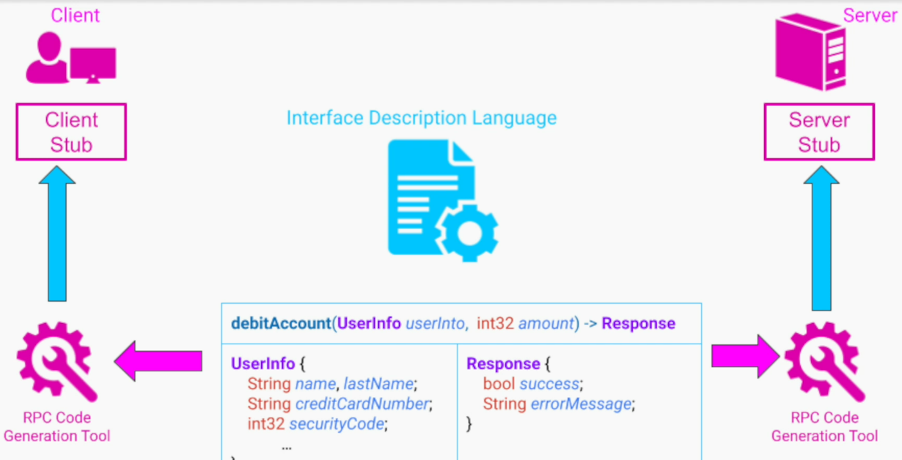
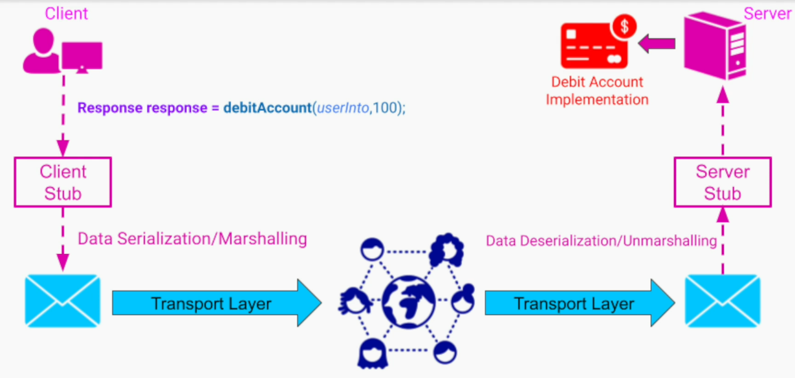
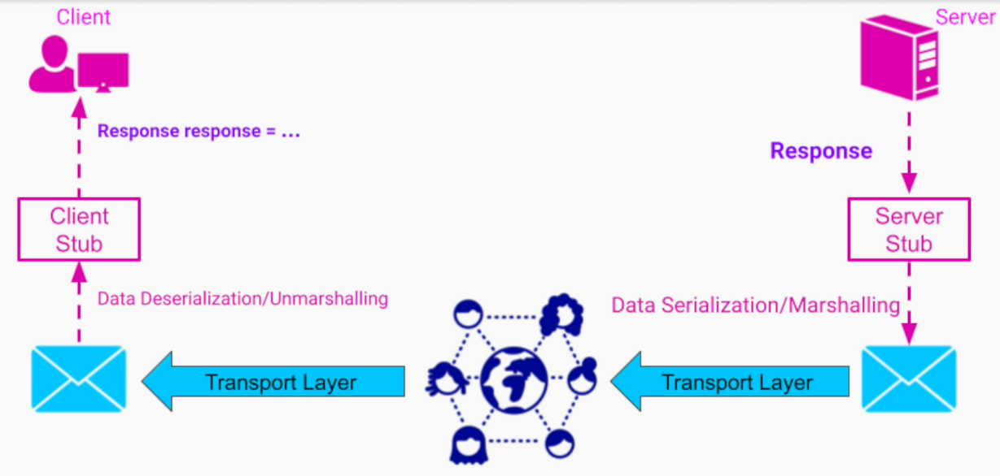

## RPC

### Unique Features of RPC
1. The remote method invocation looks like calling a normal local method in terms of the developer code - this feature is referred as **location transparency**. Because to the developer of the client application, a method executed locally or remotely looks the same

2. Most RPC frameworks support multiple programming languages - applications written in different programming languages can talk to each other using RPC

### How RPC Works?
1. Schema definition is created using Interface Description Language

2. A special compiler or code generation tool, that is part of the RPC framework, generates 2 separate implementation of the API method - one for the server app (server stub) and other for the client app (client stub).

The generated code also contains DTOs (Data Transfer Objects) as per the IDL.

**At runtime**

The concept of implementing an API using an RPC has been around for decades. The only thing that changes over time are;
- the frameworks
- the details of their implementation
- their efficiency

### RPC and Developers
1. Our job as API developer is;
- To pick an appropriate framework
- Define the API and the relevant data types using IDL
- Publish that description

### Benefits of RPC
1. Convenience to the developers of the client apps
- they can communicate with our system by calling methods on objects similar to calling normal, local methods
- the details of communication establishment or data transfer between client to server are abstracted away from the developers
- failures in comms with sever result in an error or exception depending on the programming language

### Drawbacks of RPC
1. The client never knows how long those remote method invocations can take - slowness can be addressed by introducing asynchronous versions for slow methods
2. Unreliability due to network comms - carelessness in designing the API can introduce confusing situations for the client application developers. This is specifically important for non idempotent ops.

### When to use RPC?
1. Comms between 2 backend systems 
- APIs provided to a different company instead of an end user app/webpage
- comms between different components withing a large system

RPC approach won't be a good fit;
- where we don't want to abstract the network comms away
- when we want to take direct advantage of HTTP cookies or headers

### Important Notes
1. RPC revolves more around actions and less around data / resources

2. In RPC, every action is a new method with a different name and signature. We can define many methods / actions without limitation

### Popular RPC Frameworks & Technologies
#### gRPC
gRPC is a modern open source high performance Remote Procedure Call (RPC) framework. It was originally developed by Google in 2015 as the next generation of its own internal RPC infrastructure.

It uses HTTP/2 as its transport protocol and Protocol Buffers as its Interface Description Language.
gRPC currently supports the multiple languages.

    
#### Apache Thrift
Thrift is a lightweight, language-independent software stack for point-to-point RPC.

Thrift makes it easy for programs written in different programming languages to share data and call remote procedures since it supports more than 28 languages, including C++, Java, Python, Go, Scala, Swift, PHP, Ruby, Perl, C#, JavaScript, Node.js, and other languages.

Thrift was created at Facebook for "scalable cross-language services development". It uses its own Interface Description Language called Thrift interface description language.

### Java Remote Method Invocation (RMI)

RPC framework that allows one Java virtual machine to invoke methods on an object running in another Java virtual machine.

RMI uses Java as the Interface Description Language.

