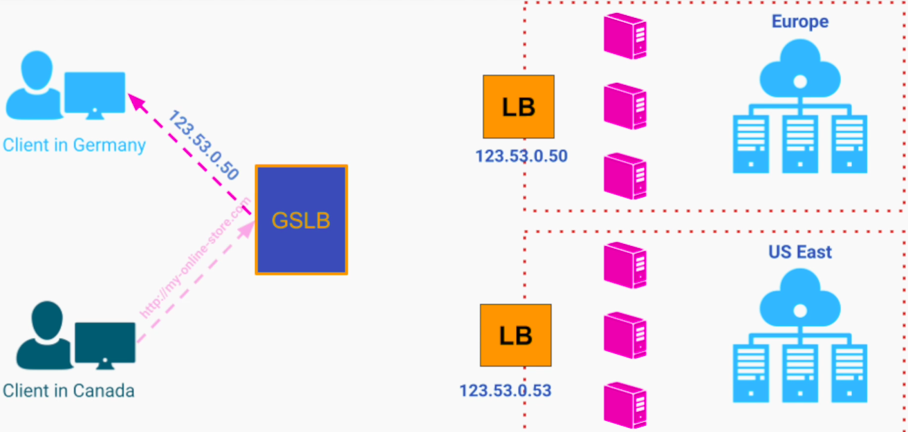
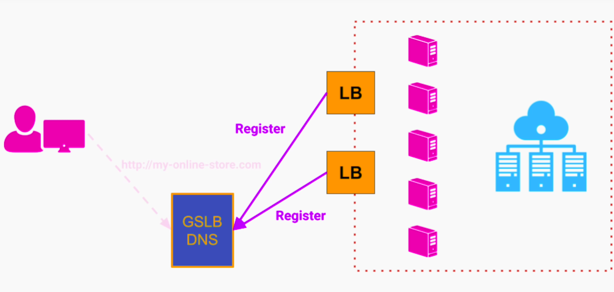

## Load Balancers
Balance load among group of servers.

It provides abstraction between a client app and our group of servers. It makes our system look like a single server. 

### Quality Attributes
1. Scalability
- Allows scaling out and scaling in - auto-scaling
2. High Availability
- Using monitoring system, the LB can balance the load only among the healthy servers
3. Performance (Throughput)
- LB may add little bit of latency but it is an acceptable trade-off for increased throughput
4. Maintainability
- Helps maintenance and prod roll-out without disruption to the users

### Types of Load Balancers
#### 1. DNS Load Balancer
1. Domain Name System (DNS) is part of the internet infra that maps human-friendly URLs to IP addresses
2. They can be used by network routers to route requests to individual computers on the web
3. It is a phone book of the internet
4. DNS name resolution returns one or multiple IP addresses for given domain name. A client app typically picks the first IP from the list and send the request. DNS rotates the IP addresses in round robin fashion so a client app will pick different IP everytime - thus balancing a load on our servers. 

**Advantages**
1. Simple
2. Cheap (comes for free by purchasing a domain name)

**Drawbacks**
1. DNS doesn't monitor the health of our servers
2. Supports only simple round-robin strategy
3. The client app gets the direct IP addresses of all our servers - less secure, prone to DoS

#### 2. Hardware Load Balancing
1. Run on dedicated devices designed and optimized specifically for load balancing

#### 3. Software Load Balancing
1. Programs that can run on a general purpose computer and perform a load balancing function
2. Hardware and software load balancers
- Hides our server IPs from client - only LB IP is known to client
- Multiple load balancing strategies supported - weighted round robin, IP hash based (sticky session), least connections, etc
- Auto-scaling through monitoring
- Are co-located with the group of servers that they are going to load balance
- Can be used for internal separation - in front of individual micro-services. Allows to scale each service independently and transparently to other services

#### 4. Global Server Load Balancing
1. GSLB is a hybrid between
- DNS service
- Hardware / Software LB

**DNS Service**

**In addition, it can make more intelligent routing decisions based on client location based on the origin IP in the incoming request**

**It also has typical monitoring capabilities like software /hardware LB** 

**Typical Large Scale Deployment**
Monitors LBs of individual region

Returns an IP address of the nearest LB

From that point on, user will use the IP address of the nearest LB.

2. Since they are in constant communication with our data centers, they can be configured to route users based on;
- current traffic
- cpu load in each data center
- best estimated response time
- bandwidth between user and the data center

3. Helpful in disaster recovery scenario by routing users to different location

4. To avoid LB of region being single point of failure, we can have multiple LBs in a region and register their IPs with GSLB DNS service or any other DNS service.

