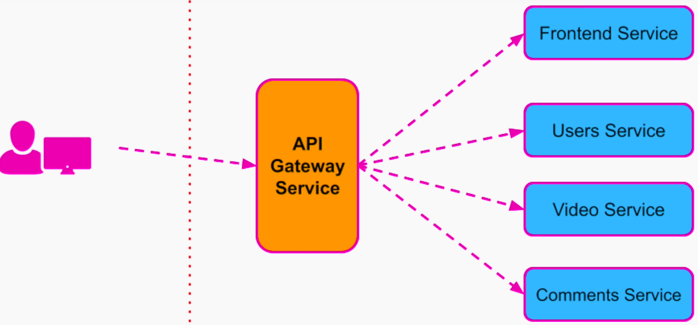
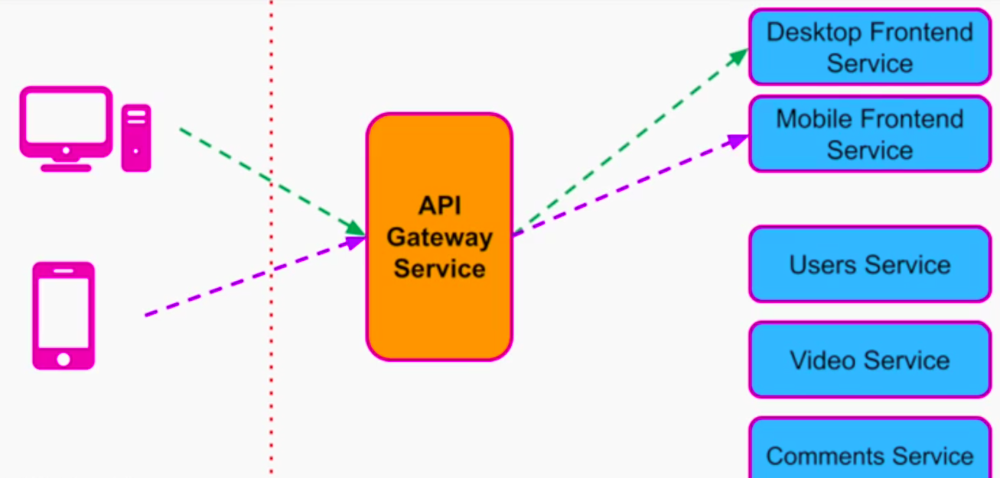
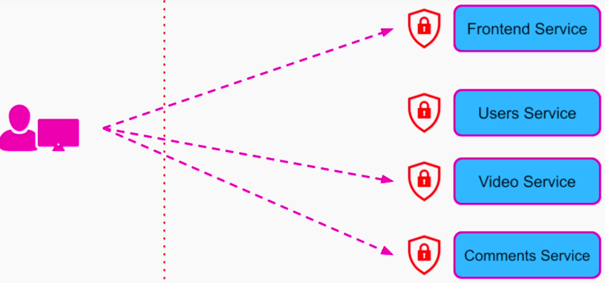
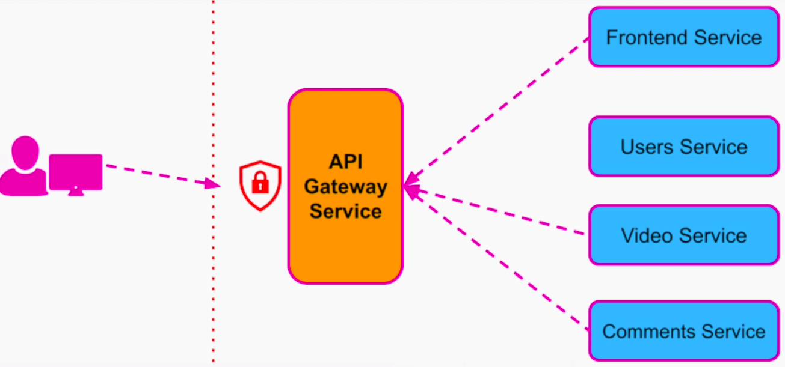
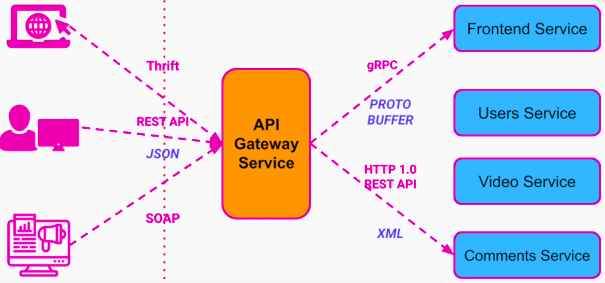

## API Gateway - Motivation
1. Decouple client app from internal organization of our system
2. Reduce code duplication
3. Simply our external API

API Gateway is an API management service that sits in between client and the collection of backend services. 

API gateway follows a software architecture pattern called API composition. We compose all the APIs of our services into one single API. The client apps can call one single service.

### Benefits
1. Seamless internal modifications / refactoring

2. Consolidating all security, authorization, and authentication in a single place. 
- SSL termination can happen at API gateway
- Depending on the permissions and role of the user, we can allow different operations.
- Implement rate limiting to block DoS attack

3. Request Routing
- we save the overhead of authenticating every request from the user at each service by performing it in a single place
- we can also save user from making multiple requests to the different services

**Without API Gateway**
User will have to make 3 calls to watch a video

**With API Gateway**
API gateway can aggregate results from multiple services and respond back in single API call.

4. Static content and response caching - improves performance

5. Monitoring and Alerting - helps improve our system's observability and availability

6. Protocol Translation

### Considerations and Anti-Patterns

